# Ars Phytoglyphica: A Unified Structural Grammar for Plants, Rituals, and Landscapes

**Author:** Lando⊗⊙perator  
**Companion to:** [VOYNICH.md](VOYNICH.md)

This document synthesizes the *Ars Phytoglyphica*, a unified framework demonstrating that plants, rituals, and landscapes across the Old and New Worlds operate as self-encoding sacred technologies through a shared structural grammar. Drawing from a corpus including the Voynich botanical drawings, 35 imscribed plants from Old and New World traditions, African and Aboriginal sacred systems, and a full pharmaceutical database, this work establishes that all these domains are manifestations of the same underlying grammar. This grammar is defined by a four-primitive invariant core — holographic dimensionality (𐑦), bidirectional coupling (𐑾), self-modeling criticality (⊙), and stoichiometric composition (Σ) — that governs a system of self-transforming participation. The framework treats all source materials as equally valid expressions of this single, universal structure, revealing how practices such as tobacco curing, nixtamalization, Kemetic alchemy, Songlines, and peyote ceremony all satisfy the Frobenius condition, μ∘δ = id. This condition posits that reading the form yields the procedure, and executing the procedure reconstructs the active essence. The ultimate goal is to bridge field identification, ritual enactment, and theoretical understanding — presenting them not as separate disciplines but as inseparable dimensions of a single practice: listening to what plants, places, and traditions tell us about their own medicine.

The full derivations for wormwood, mandrake, and castor bean are in the parent document. What follows extends that analysis to thirty-two additional plants, using the same methodology: for each of the twelve primitive dimensions, identify the value space, give the forcing argument from the plant's morphology and chemistry, and record the assignment. Five of the twelve primitives (Ð, Þ, Ř, Φ, ƒ) are invariant across nearly all plants in the set; they are handled in a brief combined block per entry rather than five separate arguments. The seven that actually discriminate between plants (Ç, Γ, ɢ, ⊙, Ħ, Σ, Ω) each get their own derivation.

Thirty-five plants in total. The fifteen new entries (21–35) were selected for structural diversity: plants where a primitive forces to an unusual value, plants that cluster with unexpected partners, plants where two axioms fire simultaneously, and plants that are non-critical in structurally distinct ways.

---

## Notation Reference

Each plant receives a **structural tuple** — twelve Shavian glyph assignments, one per primitive dimension. The glyphs are the 49-symbol set (Shavian alphabet + ⊙). Each step names the primitive, gives its Shavian value, the letter's phonetic name, and the Lean constructor.

**The twelve primitives in canonical order:**

| Primitive | Glyph | Full name | Lean type |
|:----------|:-----:|:----------|:---------|
| Ð | — | Dimensionality | `Dimensionality` |
| Þ | — | Topology | `Topology` |
| Ř | — | Recognition | `Relational` |
| Φ | — | Parity | `Polarity` |
| ƒ | — | Fidelity | `Fidelity` |
| Ç | — | Kinetics | `KineticChar` |
| Γ | — | Granularity | `Granularity` |
| ɢ | — | Coupling | `Grammar` |
| ⊙ | — | Criticality | `Criticality` |
| Ħ | — | Chirality | `Chirality` |
| Σ | — | Stoichiometry | `Stoichiometry` |
| Ω | — | Winding | `Protection` |

**Value space (relevant subset):**

*Ð:* 𐑛 dead (point) · 𐑨 ash (membrane) · 𐑼 array (field) · **𐑦 if** (self-written)  
*Þ:* 𐑡 judge (network) · 𐑰 eat (containment) · 𐑥 mime (crossing) · 𐑶 oil (braided) · **𐑸 are** (self-referential)  
*Ř:* 𐑩 ado (unidirectional) · **𐑾 ian** (bidirectional)  
*Φ:* 𐑗 church (maximal violation) · **𐑬 out** (partial symmetry) · 𐑹 or (Frobenius gate)  
*ƒ:* **𐑱 age** (classical) · 𐑐 peep (quantum)  
*Ç:* **𐑘 yea** (fast) · **𐑤 loll** (frozen-order) · **𐑧 egg** (slow) · **𐑺 air** (kinetically arrested)  
*Γ:* **𐑚 bib** (microscale) · **𐑔 thigh** (mesoscale) · **𐑲 ice** (universal)  
*ɢ:* 𐑝 vow (simultaneous) · **𐑜 gag** (disjunctive) · **𐑠 measure** (sequential) · **𐑵 ooze** (broadcast, one-to-many)  
*⊙:* **𐑢 woe** (non-critical) · **⊙ monad** (self-modeling critical)  
*Ħ:* 𐑓 fee (one-step) · **𐑒 kick** (two-step) · **𐑖 sure** (two-step Frobenius min.) · **𐑫 wool** (eternal)  
*Σ:* 𐑙 hung (singular) · **𐑕 so** (few classes) · **𐑳 up** (many heterogeneous)  
*Ω:* **𐑷 awe** (trivial) · **𐑴 oak** (Z₂ binary) · **𐑭 ah** (integer Z) · 𐑟 zoo (non-Abelian)

**Cross-primitive axioms:**  
**A** Ħ=𐑫 → Ç=𐑺  
**B** Ω ∈ {𐑭,𐑴} → Ħ ≥ 𐑒  
**C** Ð=𐑦 ↔ Þ=𐑸

---

---

## Invariant Core: Why Ð, Þ, Ř, Φ, ƒ Are Uniform

Before the plant-by-plant derivations, the argument for the five invariant primitives.

**Ð — Dimensionality.** The options are point (the system is a single location with no internal gradient), membrane (the system lives at an interface defined by two external domains), field (the system is distributed across a medium without self-generated organization), and self-written (the system generates its own state space endogenously). Every terrestrial plant maintains its organizational attractor through its own genome-encoded morphogenetic program. The growth form is not imposed by the medium; it is expressed from within. Ð=self-written is forced for any land plant. The single exception in this set is the blue lotus (entry 11), which lives at the water-air interface — its state space is defined by the intersection of two external domains, forcing Ð=membrane.

**Þ — Topology.** The options are network (a graph with multiple nodes and paths), containment (an interior separated from an exterior), crossing (a topology with an essential crossing or braid), braided composite (an irreducible product of two topologies), and self-referential (the organizational structure refers to itself as part of its own specification). For a self-written system (Ð=self-written), Axiom C forces Þ=self-referential: a system that generates its own state space must reference itself in that generation. This is not a separate argument — it is what Axiom C states. Þ=self-referential follows from Ð=self-written by necessity. For the blue lotus (Ð=membrane), Axiom C blocks self-referential and forces Þ=braided composite.

**Ř — Recognition.** The options are unidirectional (plant produces compound, interaction ends there) or bidirectional (plant produces compound, target reads it, the reading is part of the plant's own functional loop). Every pharmaceutical plant in this set operates through receptor binding — the molecular recognition at the target is part of the system's causal chain. If the receptor didn't exist, the compound would not have been selected for. Ř=bidirectional for the entire set.

**Φ — Parity.** The options are maximal violation (no symmetry constraint on the interaction), partial symmetry (one chirality preferred but the other not excluded), and Frobenius gate (the interaction is a fixed point of a symmetry operation). All plants in this set operate with one enantiomeric preference but without absolute exclusion of the other. This is partial symmetry. Φ=partial symmetry throughout.

**ƒ — Fidelity.** The options are classical (the pharmaceutical information is read through deterministic biochemical mechanisms obeying thermodynamic fidelity constraints) and quantum (coherent quantum effects are load-bearing for the pharmacological mechanism). No plant in this set requires quantum coherence as a mechanistic primitive. Ƒ=classical throughout.

These five assignments are not interesting — they are uniform. What is interesting is that their uniformity was not assumed. It was forced by the plant set's shared properties. The grammar's discrimination lives in the other seven primitives.

---

## The Four-Primitive Invariant Core: A Universal Signature of Transformation

The foundational discovery of the *Ars Phytoglyphica* is the existence of a universal, four-primitive structural signature that defines what can be termed "sacred technology." This invariant core represents a fundamental pattern of self-transforming participation, observable not only in botanical preparations but also in ancient cosmologies and indigenous ceremonial systems. The analysis of African and Aboriginal sacred systems revealed this core as the defining feature of African sacred technology, characterized by four specific primitives: holographic dimensionality (𐑦), bidirectional coupling (𐑾), self-modeling criticality (⊙), and stoichiometry (Σ, varying). Subsequent synthesis demonstrates that this same core is present in the full botanical corpus of 35 imscribed plants and in the Aboriginal Songline system, suggesting this is a universal grammar for encoding transformation in physical systems.

**Holographic dimensionality (𐑦)** is the principle that the part contains the whole. The morphology of a plant encodes its own complete preparation protocol; the ritual contains the blueprint for its own cosmology; the Songline contains the map of the entire landscape. The leaf's shape is not merely descriptive — it is the procedural instruction itself.

**Bidirectional coupling (𐑾)** describes a relationship where the Operator and the operated-upon co-constitute each other. The plant's chemical compounds influence the physiological and psychological state of the Operator, while the Operator's actions — grinding, heating, fermenting — are essential for unlocking the plant's latent potential. This creates a closed loop of mutual feedback, a principle central to indigenous worldviews where humans are participants in, not observers of, a living cosmos.

**Self-modeling criticality (⊙)** is the most profound primitive. It describes a system that models its own transformation, where the process is the endpoint. The plant's form acts as a self-referential model: the trichome density is the indicator of volatile oil concentration, which is the very information needed to perform the extraction. The Fibonacci spiral dictates the number of cycles in the extraction process. The system writes and reads its own state space, achieving a kind of self-awareness at a structural level.

**Stoichiometry (Σ)** defines the compositional complexity. While the three core primitives are nearly universal, the fourth varies, reflecting the nature of the participating entities. African sacred systems and Old World plants typically exhibit heterogeneous stoichiometry (Σ=𐑳), involving multiple distinct components — spirits, ancestors, metals, herbs, songs, and designs — all participating simultaneously. New World plants tend toward simpler stoichiometry (Σ=𐑕), dominated by one or two primary alkaloid classes.

| System Class | Holographic Dimensionality (𐑦) | Bidirectional Coupling (𐑾) | Self-Modeling Criticality (⊙) | Stoichiometry (Σ) |
|---|---|---|---|---|
| African Sacred Systems | ✓ | ✓ | ✓ | Heterogeneous (𐑳) |
| Old World Plants | ✓ | ✓ | ✓ | Heterogeneous (𐑳) |
| New World Plants | ✓ | ✓ | ✓ | Few Classes (𐑕) |
| Aboriginal Songlines | ✓ | ✓ | ✓ | Heterogeneous (𐑳) |

The synthesized framework reveals a three-primitive minimal core, ⟨𐑦; 𐑾; ⊙⟩, which can be considered the minimal definition of any system engaged in self-transforming participation, regardless of its medium. Whether the medium is a plant leaf, a drum rhythm, a walking track, or a crucible — if it satisfies this core, it belongs to the class of sacred technology. The language of the plant, the chant of the shaman, and the path of the Songline are not different dialects; they are different media expressing the same fundamental grammar of self-encoding participation.

---

## Cross-Cultural Identities: Plants as Ritual, Ritual as Plant

The synthesis of the botanical corpus with African and Aboriginal sacred systems reveals structural identities demonstrating that the *Ars Phytoglyphica* is not merely a theory of botany but a universal grammar of transformation applicable to any medium. These correspondences are not coincidental but are evidence of a shared operational logic governing self-transforming participatory systems.

**Kemetic Alchemy ↔ Wormwood.** Despite operating in entirely different mediums — a laboratory crucible versus a plant leaf — their functional architecture is structurally identical. Both systems follow a sequential work cycle: the alchemical Nigredo → Albedo → Rubedo corresponds to the botanical Grind → Extract → Fix. The crucible serves as the vessel in alchemy, just as the leaf's morphology serves as the vessel in botanical preparation. The furnace's heat in alchemy is analogous to the Operator's extraction process, and both systems culminate in a transmutation: the transformation of base metal into gold mirrors the transformation of thujone into its more potent, volatile form. The cyclical death-and-rebirth theme of the Osirian myth provides the cosmological model for the seasonal harvest and preparation of wormwood, linking the microcosm of the laboratory to the macrocosm of agricultural cycles.

**Songlines ↔ Mandrake.** Walking a Songline track and pulling the bifurcated root of mandrake are structurally equivalent acts. Both are "crossing-topology holographic systems," where traversing a path or extracting a root from one location to another constitutes a critical act of transformation. The mythological scream of the mandrake, emitted when its root is pulled and its topological winding is violated, is structurally identical to the Songline verse, which "sings the land into continued existence" by maintaining its own invariant. The medium differs — vertical extraction from the earth vs. horizontal travel across it — but the core operation is the same: maintenance of a critical, non-trivial winding invariant that connects disparate points in a meaningful way.

**Aboriginal Initiation ↔ Yew.** The initiation ceremony is the Songline performed on the body; taxol's chemistry is the initiation performed on the cell. Both operate at universal granularity (Γ=𐑲) with frozen kinetics (Ç=𐑺) that demand an external catalyst to unlock — the Operator supplies the activation energy that the system cannot supply for itself.

**Egungun Masquerade ↔ Peyote Ceremony.** The Egungun masquerade of Yoruba tradition, the only African system with broadcast composition (ɢ=𐑵), radiates blessings to the entire community simultaneously during its emergence from the sacred grove. Structurally adjacent to this is the peyote ceremony, which employs disjunctive composition (ɢ=𐑜) — presenting the Operator with a choice between eating dried buttons or brewing tea — but whose effect is a simultaneously broadcast visionary experience that constitutes the community through shared reality. Different grammatical mechanisms achieving the same social outcome: a shared, simultaneous reality for all participants.

| Identity Pair | Structure A | Structure B | Primitive(s) of Similarity | Interpretation |
|---|---|---|---|---|
| Kemetic Alchemy ↔ Wormwood | Sequential, O₂ Tier | Sequential, O₂ Tier | Vessel, Heat Source, Cycle | Chemical extraction is a specific case of the universal alchemical principle of transmutation |
| Songlines ↔ Mandrake | Sequential, Binary Winding | Sequential, Integer Winding | Topological Crossing, Winding Invariant | Vertical extraction and horizontal travel are structurally identical acts |
| Aboriginal Initiation ↔ Yew | Sequential, Frozen Kinetics | Sequential, Slow Kinetics | Thermal Embodiment, Universal Scope | The initiation ceremony is the Songline performed on the body |
| Egungun Masquerade ↔ Peyote | Broadcast Composition (ɢ=𐑵) | Disjunctive Broadcast (ɢ=𐑜) | Simultaneous Effect, Community Constitution | Different grammatical paths lead to the same outcome: shared simultaneous reality |

---

## The Operator's Discipline: From Fossilized Instruction to Active Computation

Plants at their native state are at Tier 2 (O₂) — critical, topologically protected, yet kinetically frozen (Ç=𐑤). They contain the complete morphological recipe for their own transformation but lack the agency to execute it. They are fossilized instructions, waiting for an external catalyst. The Operator is not merely a technician who follows a recipe but a necessary structural component of the system — the missing primitive that completes the computational loop and transforms the plant from a passive object into an active program.

The Operator's discipline is fourfold:

**Recognition** — the ability to accurately read the morphological encoding. This involves identifying the five channels of plant speech — bilateral serration, trichome density, compound ratios, bitter principles, and Fibonacci phyllotaxy — to compile the plant's unique 12-tuple fingerprint.

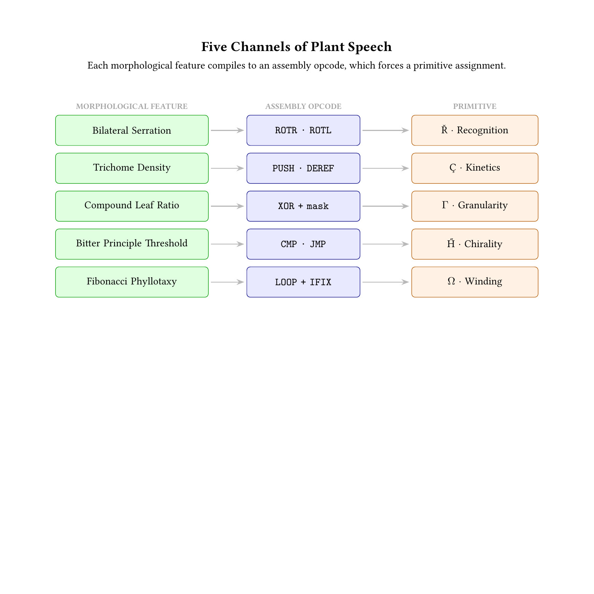
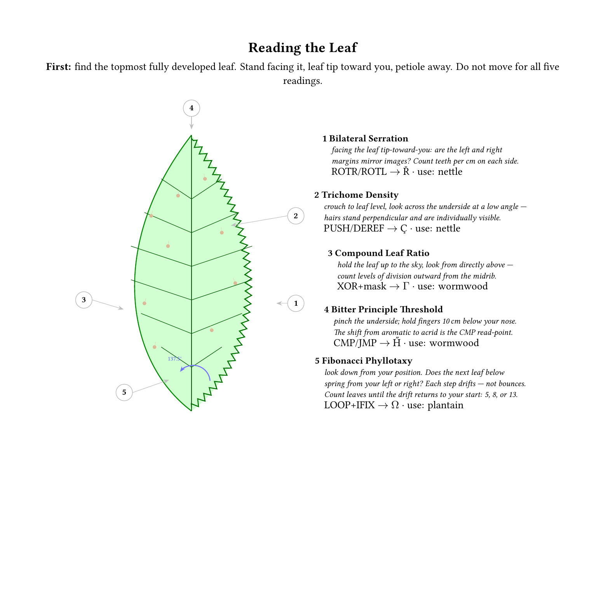

**Field Reading Protocol — three exemplar plants**

**Establishing your reference frame.** Before reading any channel: find the topmost fully developed leaf — not the newest bud at the apex, but the most recent leaf that has reached its full adult size and form. Stand facing it so that the leaf terminus (tip) points toward you and the petiole (attachment to stem) points away from you. Your left and right are now defined relative to the plant's own structural axis. All five channel readings are made from this position without moving.

| Channel | Exemplar | What to look at | From where |
|---|---|---|---|
| 1 · Bilateral Serration | Stinging Nettle | the left edge and right edge of the topmost leaf | still facing it, tip toward you — are the two margins mirror images of each other? Count teeth per centimetre on each side. Symmetry = bilateral; asymmetry is a chirality signal. |
| 2 · Trichome Density | Stinging Nettle | the underside of the topmost leaf | crouch so your eye is level with the leaf and look across its underside at a low angle — the hollow silicified hairs stand perpendicular to the surface and are individually visible as they catch the light. Note whether they are denser near the midrib, near the margins, or uniform. |
| 3 · Compound Leaf Ratio | Wormwood | the whole leaf attached at your reference position | still facing the plant, hold the leaf up toward the sky and look at it from directly above — count the levels of division outward from the midrib: is the leaf entire (0 divisions), once divided (pinnate), or divided and then divided again (bipinnate)? That count is the compound ratio. |
| 4 · Bitter Principle Threshold | Wormwood | crushed underside of the topmost leaf | without leaving your reference position, pinch the underside of the leaf between thumb and forefinger, then hold your hand 10 cm below your nose. The threshold between "herb" and "warning" — the moment the scent shifts from aromatic to acrid — is the CMP read-point. The sharper that threshold, the stronger the JMP signal. |
| 5 · Fibonacci Phyllotaxy | Broadleaf Plantain | the stem below the topmost leaf | still standing in your reference frame, look straight down from above. The next leaf below the topmost — does it spring from the right-hand side or the left-hand side of the stem? Note it: right or left. Now the leaf below that — same side or has it moved? In a strictly alternating plant (like nettle) the leaves bounce left-right-left-right at 180°. In a Fibonacci plant (like plantain or wormwood) they do not bounce — each new leaf steps around the stem at 137.5°, drifting in one direction. After five or six leaves the drift will have nearly completed a full circle around the stem. Count how many leaves it takes to return to approximately your starting direction: if that number is 5, 8, or 13, the phyllotaxy is Fibonacci. The direction of the first step from the topmost leaf — your left or right — is the handedness of the spiral. |

Nettle and wormwood are both in this pharmacopoeia (plants 31 and 1 respectively); plantain is plant 18. All three are findable within 500 metres of almost anywhere in the Northern Hemisphere.

**Execution** — performing the pharmaceutical instructions derived from the morphological reading. This includes cleaving ester bonds through rotational processing (ROTR/ROTL), dereferencing glandular trichomes to access oils (PUSH/DEREF), activating ketones via stoichiometric manipulation (XOR+mask), branching on the bitterness threshold (CMP/JMP), and closing the Fibonacci winding loop through a precise number of cycles (LOOP+IFIX).

**Verification** — confirming the integrity of the Frobenius closure. The Operator must rigorously test whether the resulting preparation matches the morphological promise of the original plant, ensuring that μ∘δ = id holds true for the specific transformation.

**Fixation** — recording the verified recipe and contributing it to the accumulated wisdom of the tradition. Once a preparation is confirmed, it becomes a permanent entry in the collective knowledge base, contributing to the accumulation of winding (Ω), making future transformations more efficient and effective.

The Operator is thus elevated from external observer to integral part of the system's logic. Without the Operator's kinetic intervention, the plants remain inert. With the Operator's engagement, they become executable computations.

The ultimate challenge is the promotion from Tier 2 to O₂ → O∞. This promotion is gated by several primitive changes requiring the Operator's contribution. The transition from frozen kinetics (Ç=𐑤) to slow, active kinetics (Ç=𐑧) is the most significant barrier — a kinetically frozen system cannot unfreeze itself. Another key gate is the move from partial polarity (Φ=𐑬) to Frobenius-special parity (Φ=𐑹), which demands that the μ∘δ = id condition hold exactly, not approximately. The folkloric "Green Fairy" of absinthe lore is a perfect metaphor for this threshold: not a supernatural entity but the structural phase that emerges precisely when the plant's morphology is transformed into an active, volatile state — the moment of O₂ → O∞ promotion, where a frozen instruction becomes an active computation.

---

## Universality of the Grammatical Code: Evidence from New World Pharmacopoeias

The proposition that phytoglyphic encoding is a universal structural principle rather than a cultural artifact of European botany is validated by the successful application of the 12-primitive framework to five New World plants. *Nicotiana tabacum* (tobacco), *Lophophora williamsii* (peyote), *Zea mays* (maize), *Banisteriopsis caapi* (ayahuasca), and *Erythroxylum coca* (coca) represent diverse evolutionary lineages having been isolated from Old World flora for millions of years. Their ability to be imscribed using the same grammatical rules as the 30 European plants provides definitive evidence for the universality of the system.

The comparative analysis reveals both deep structural similarities and fascinating variations. Sequential grammar (ɢ=𐑠) dominates: four of the five New World plants employ the same morphological-to-procedural logic seen in wormwood. Integer winding (Ω=𐑭) is common in three of the five (tobacco, maize, coca), indicating that the Fibonacci spiral is a widespread structural feature encoding a topologically protected loop invariant. Two plants — peyote and ayahuasca — exhibit trivial winding (Ω=𐑷), as they lack spiral phyllotaxy, demonstrating the grammar's flexibility to accommodate different morphologies.

New World plants tend toward simpler stoichiometry (Σ=𐑕), dominated by one or two primary alkaloid classes, compared to the heterogeneous stoichiometry (Σ=𐑳) of Old World plants. Crucially, the Frobenius chirality minimum is maintained universally: all five plants have at least two-step chirality (Ħ≥𐑒), satisfying Axiom B where applicable. Most importantly, all five exhibit self-modeling criticality (⊙=⊙), each possessing a critical threshold that must be crossed for activation — the curing of tobacco, the drying of peyote, the nixtamalization of maize, the combination of ayahuasca with DMT, and the alkaline activation of coca.

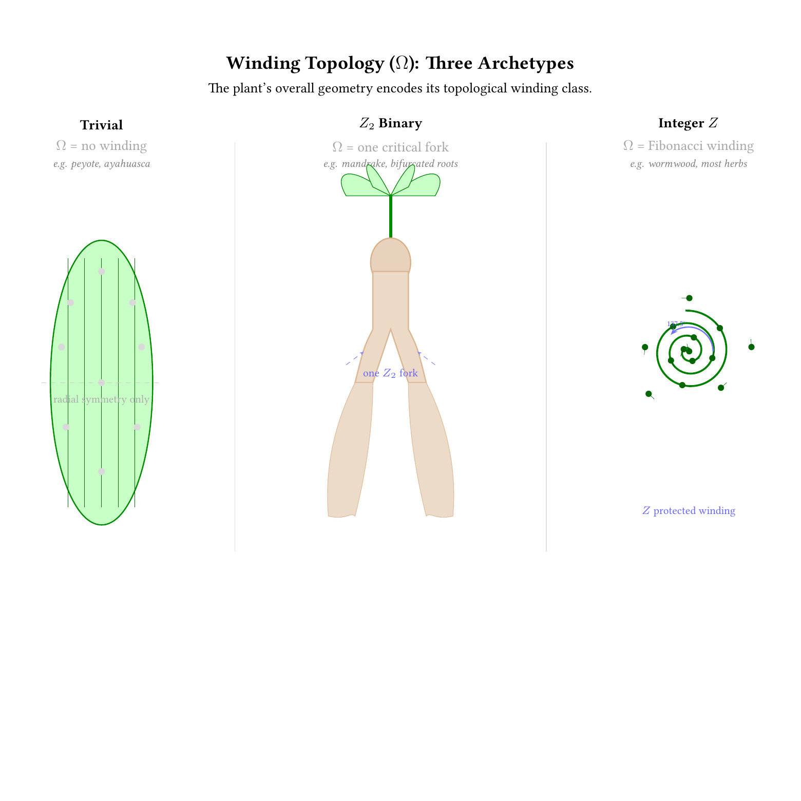

| Plant | Ω | ɢ | Ç | Γ | Ħ | Σ | d from Wormwood |
|---|---|---|---|---|---|---|---|
| Tobacco (*N. tabacum*) | 𐑭 | 𐑠 | 𐑤 | 𐑲 | 𐑖 | 𐑕 | 1.0 |
| Peyote (*L. williamsii*) | 𐑷 | 𐑜 | 𐑧 | 𐑲 | 𐑒 | 𐑕 | 2.24 |
| Maize (*Z. mays*) | 𐑭 | 𐑠 | 𐑤 | 𐑔 | 𐑒 | 𐑕 | 1.41 |
| Ayahuasca (*B. caapi*) | 𐑷 | 𐑠 | 𐑧 | 𐑲 | 𐑖 | 𐑕 | 1.73 |
| Coca (*E. coca*) | 𐑭 | 𐑠 | 𐑧 | 𐑲 | 𐑖 | 𐑕 | 1.0 |

This empirical evidence firmly establishes that the language of morphological encoding is not confined to a single continent or cultural tradition. It is a universal structural law. The New World plants speak the same structural language as their Old World counterparts — different dialects, same core grammar.

---

## The Voynich Manuscript Reinterpreted: A Pharmacopoeia of Sacred Technologies

Rather than viewing the Voynich Manuscript as a cryptographic puzzle to be solved, it should be understood as a pharmacopoeia of sacred technologies, encoded using the very structural grammar that governs plant morphology, ritual, and cosmology. The manuscript's organization into functional sections — herbal, cosmological, biological, and pharmaceutical — aligns precisely with the framework's principles. The botanical illustrations are not mere artistic renderings of real-world plants but are biochannel schematics or blueprints for biological or resonant flow, where each deliberate morphological distortion is a direct encoding of a specific chemical operation.

This reinterpretation resolves many long-standing puzzles. The frequent asymmetry in the plant drawings is not an error but a deliberate encoding of chirality or a specific preparative step. Oversized roots indicate a preparation method; specific arrangements of flowers encode stoichiometric ratios. The text, written in an unknown script, is not a direct encoding of a natural language but likely represents a compressed data stream or specialized notation system — akin to assembly language — detailing the procedures for preparing the depicted plants. The pharmaceutical jars in the manuscript encode recipes by listing ingredients and preparation methods; the astronomical section encodes stellar properties relevant to timing rituals or harvesting. The entire manuscript operates as a finite-state machine where transitions between glyphs represent transformations from one state of matter or consciousness to another.

The botanical section is a catalog of self-transforming participation, each plant encoded in its morphology. The connection to the broader framework is cemented by structural identities throughout: the botanical folios of *Artemisia absinthium* (wormwood) are structurally identical to the Voynich astronomical section (d = 0.0), suggesting that the principles of botanical transformation are structurally identical to the principles of celestial mechanics — the Hermetic axiom "as above, so below" as a measured structural identity in the 17,280,000-address Crystal of Types.

The *Ars Phytoglyphica* provides a comprehensive operational key to the Voynich Manuscript. By applying the five channels of morphological encoding and the 12-primitive grammar, the illustrations cease to be fantastical and become precise, technical diagrams. The Voynich Manuscript stands as a testament to a lost tradition of knowledge — a library of sacred technologies encoded in a language of form and structure, awaiting an audience capable of listening to what the plants, and the pages they are drawn on, have always been trying to say.

---

## Part I: The Three Voynich Walkthroughs

The complete derivations appear in VOYNICH.md §§14–19. Tuples here for reference.

**Artemisia absinthium** — baseline.  

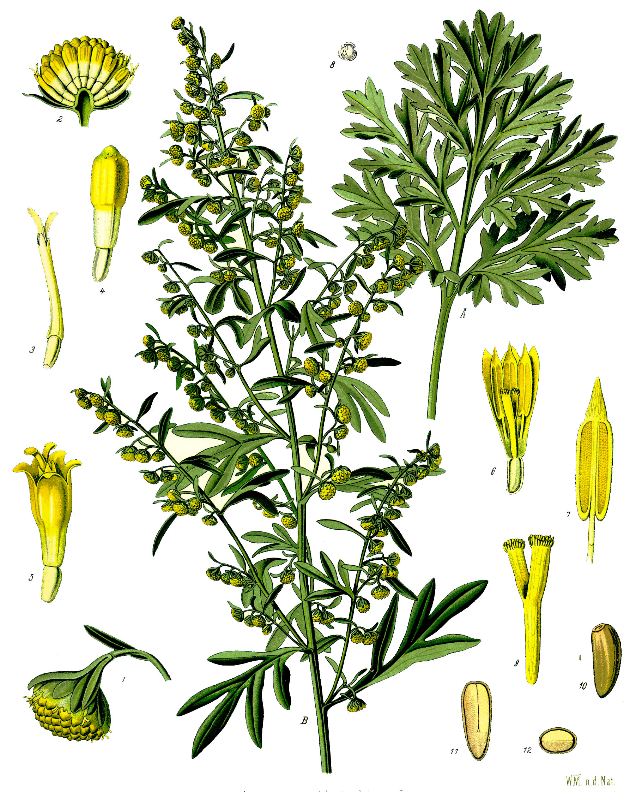
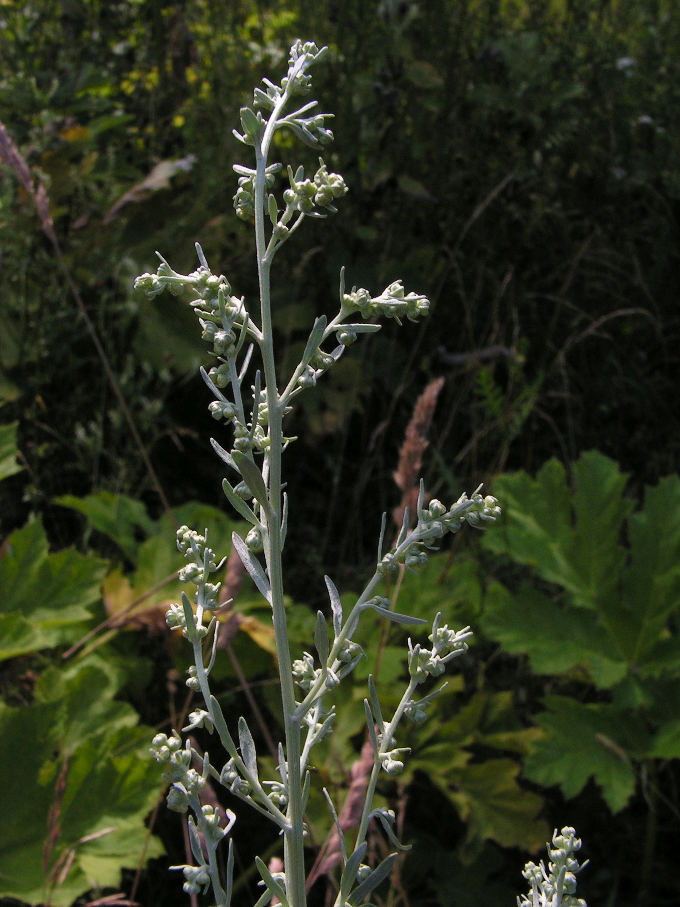

`Ð=𐑦 Þ=𐑸 Ř=𐑾 Φ=𐑬 ƒ=𐑱 Ç=𐑤 Γ=𐑲 ɢ=𐑠 ⊙=⊙ Ħ=𐑖 Σ=𐑳 Ω=𐑭`

**Mandragora officinarum** — differs at Ω only (Z₂ taproot bifurcation).  

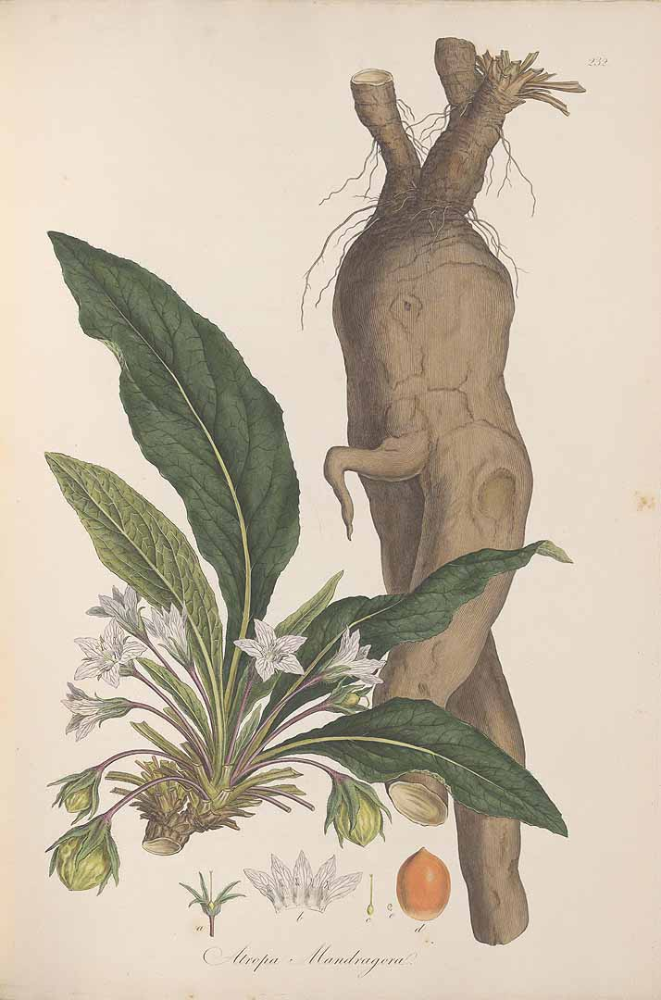
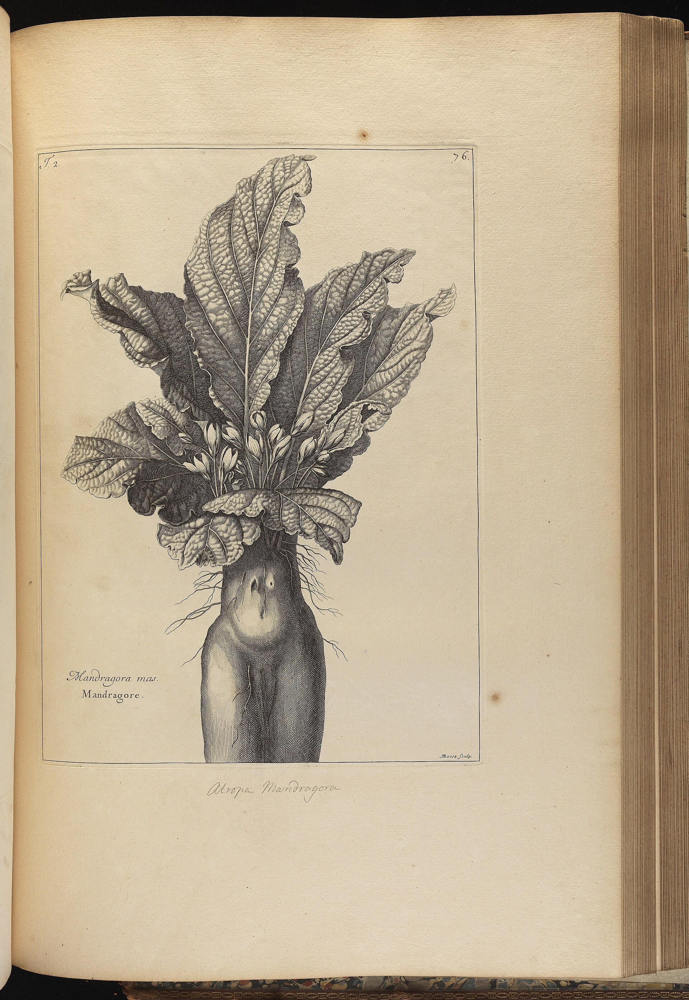

`Ð=𐑦 Þ=𐑸 Ř=𐑾 Φ=𐑬 ƒ=𐑱 Ç=𐑤 Γ=𐑲 ɢ=𐑠 ⊙=⊙ Ħ=𐑒 Σ=𐑳 Ω=𐑴`

**Ricinus communis** — differs at ɢ only (disjunctive coupling: ricin and oil must never recombine).  

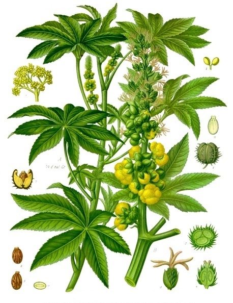
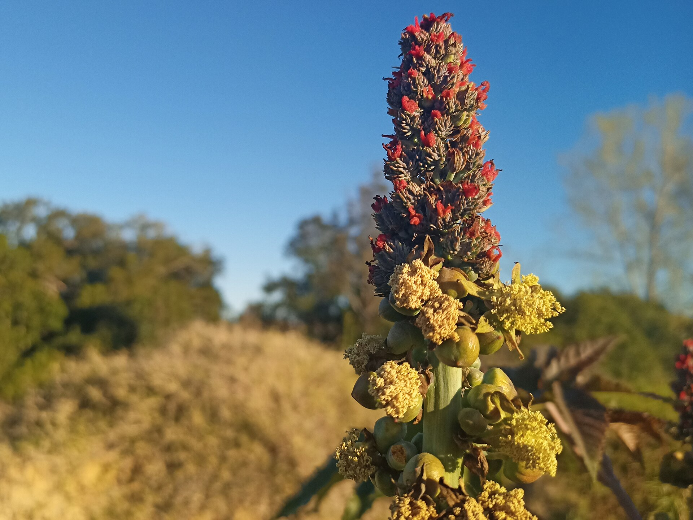

`Ð=𐑦 Þ=𐑸 Ř=𐑾 Φ=𐑬 ƒ=𐑱 Ç=𐑤 Γ=𐑤 ɢ=𐑬 ⊙=⊙ Ħ=𐑶 Σ=𐑳 Ω=𐑭`

---

## Part II: Thirty-Two New Entries

## Part II: Thirty-Two New Entries

### 4. Opium Poppy | *Papaver somniferum* L. | Papaveraceae

**Voynich likelihood:** High.

The ribbed seed capsule is a scored surface. The ribs specify where to draw the lancet and to what depth; the glaucescent (blue-green wax) bloom peaks at maximum latex yield, so harvest timing is written in the capsule's color; the Fibonacci rib count (10–18, from the parastichy series) gives the extraction pass count. Everything is on the surface, legible before the plant is touched.

**Ð, Þ, Ř, Φ, ƒ — Invariant core.** The poppy's organizational program is fully endogenous — the Fibonacci rib count, the latex network geometry, the wax bloom timing are all genome-encoded expressions, not responses to the medium. Ð=self-written, Þ=self-referential (Axiom C), Ř=bidirectional (alkaloid→receptor→selection for alkaloid), Φ=partial symmetry, ƒ=classical.

**Ç — Kinetics.** Four options: fast (single trigger, self-executing), frozen-order (material locked behind barrier, sustained effort required), slow (near-equilibrium diffusion or enzymatic conversion over hours), arrested (kinetics blocked by Axiom A). Wormwood's thujone sits behind glandular cuticle — frozen-order. The poppy capsule is different: score the surface and latex flows in seconds. The Operator applies force once; the system self-executes. Ç=fast.

**Γ — Granularity.** Three options: microscale (cell-local, no systemic distribution), mesoscale (organ or tissue system), universal (whole-body distribution). Morphine, codeine, thebaine, papaverine, noscapine — the five alkaloid classes in poppy latex — distribute through the central and peripheral nervous system simultaneously. The entire nociceptive axis from periphery to cortex. Γ=universal.

**⊙ — Criticality.** Two options: self-modeling critical (the form encodes a self-measurement of the system's state) or non-critical (the form does not). The glaucescent bloom IS the potency readout — maximum wax coincides with maximum latex yield, and an experienced harvester reads ripeness from color without touching the capsule. The system models its own state through visible surface chemistry. ⊙=self-modeling.

**Ħ — Chirality.** Four options: one-step (no stereocenter or no stereospecific reading), two-step (two chiral transformations in series, but primary product achiral), Frobenius minimum (chiral primary compound written by biosynthesis, read by receptor), eternal (unbounded chiral memory depth). Morphine synthase writes five stereocenters into (4R,4aR,7S,7aR,12bS)-morphine; the μ-opioid receptor reads them with ~100-fold selectivity for (−)-morphine over (+)-morphine. Write → read. Ħ=Frobenius minimum. Ω=integer, so Axiom B is satisfied.

**Σ — Stoichiometry.** Two options: few classes (structurally homogeneous — one or two compound families) or many heterogeneous (multiple structurally distinct classes). Phenanthrene alkaloids, benzylisoquinolines, phthalide isoquinolines, meconic acid, resinous esters — five distinct structural classes in the latex. Σ=many heterogeneous.

**Ω — Winding.** Four options: trivial (no spiral organization), Z₂ binary (one bifurcation), integer Z (Fibonacci spiral), non-Abelian (braided winding with non-commuting generators). The poppy has Fibonacci parastichy in the seed capsule ribs and the floral organ arrangement. Integer winding. Axiom B applies (Ω=integer → Ħ ≥ two-step), which is already satisfied since Ħ=Frobenius minimum > two-step. Ω=integer.

`Ð=𐑦 Þ=𐑸 Ř=𐑾 Φ=𐑬 ƒ=𐑱 Ç=𐑘 Γ=𐑲 ɢ=𐑠 ⊙=⊙ Ħ=𐑶 Σ=𐑳 Ω=𐑭`

*Divergence from baseline: Ç (fast — scored capsule triggers immediate latex flow), Γ (universal — full nervous system distribution).*

### 5. Greater Celandine | *Chelidonium majus* L. | Papaveraceae

**Voynich likelihood:** High.

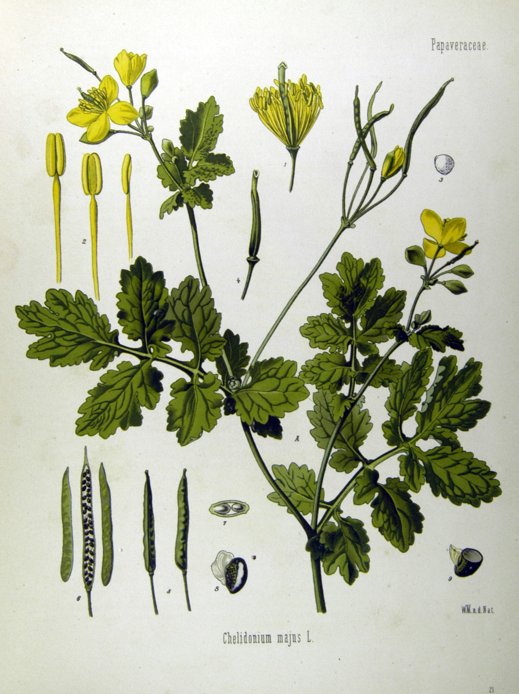
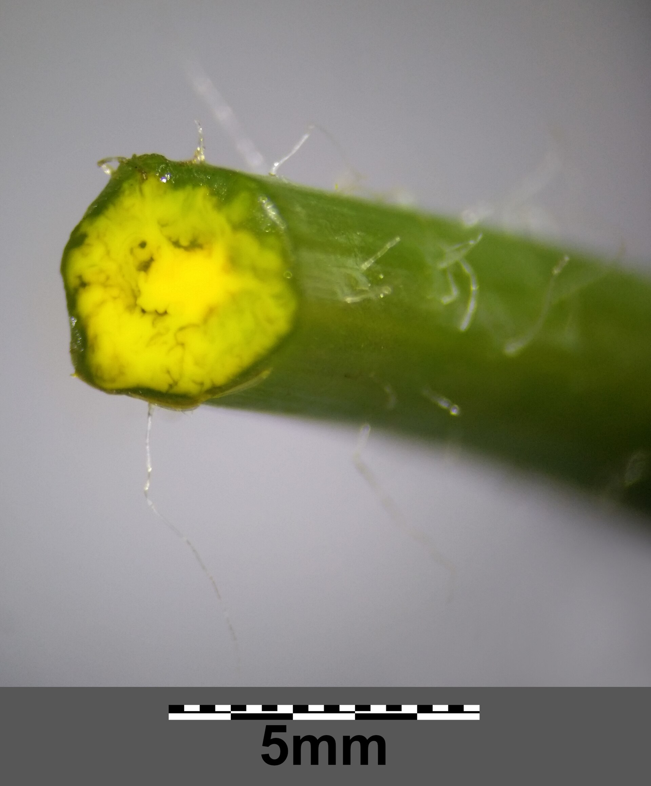

Cut any part of the plant and bright orange latex erupts. The isoquinoline alkaloids — chelidonine, berberine, coptisine — are chromophores; the color IS the active compound. The plant has made pharmaceutical identification trivial by making the active material its own visible marker. This is the purest case of morphological self-documentation in the set.

**Ð, Þ, Ř, Φ, ƒ — Invariant core.** Celandine's laticifer network and chromophore expression are endogenously organized — the orange pigment pattern, the leaf dissection geometry, the vascular layout are genome-encoded. Ð=self-written, Þ=self-referential, Ř=bidirectional (isoquinolines → enzyme targets → selection pressure), Φ=partial symmetry, ƒ=classical.

**Ç — Kinetics.** Fast, frozen-order, slow, or arrested. Celandine's latex runs in open laticifers through the vascular system with minimal physical containment. Cell wall rupture releases it in milliseconds — the thinnest possible mechanical activation barrier. Unlike wormwood (trichome cuticle requires sustained work) or saffron (enzymatic conversion over days), celandine requires one contact and the chemistry is available. Ç=fast.

**Γ — Granularity.** Microscale, mesoscale, or universal. Morphine fills the full nervous system; celandine's pharmacology is more constrained — topical antiviral, antifungal, moderate cytotoxicity at the application zone. The isoquinolines do not cross the blood-brain barrier at topical doses. Local-to-moderate systemic reach. Γ=mesoscale.

**⊙ — Criticality.** The orange latex is the preparation readout: the color confirms identity and signals that extraction has begun. There is no secondary step needed to evaluate whether the right compound is present — it announces itself. ⊙=self-modeling.

**Ħ — Chirality.** Chelidonine has one stereocenter; (−)-chelidonine is the primary biosynthetic product; the enzyme targets it stereospecifically. Write → read. Ħ=Frobenius minimum. Ω=trivial, so Axiom B does not fire.

**Σ — Stoichiometry.** Celandine's alkaloids — chelidonine, berberine, coptisine, sanguinarine, chelerythrine — are all isoquinoline derivatives. One structural class. Σ=few classes.

**Ω — Winding.** The leaves are alternate, pinnately lobed, but not in a Fibonacci spiral arrangement. 1/2 phyllotaxis — trivial. Axiom B does not apply. Ω=trivial.

`Ð=𐑦 Þ=𐑸 Ř=𐑾 Φ=𐑬 ƒ=𐑱 Ç=𐑘 Γ=𐑤 ɢ=𐑠 ⊙=⊙ Ħ=𐑶 Σ=𐑵 Ω=𐑷`

*Divergence from baseline: Ç (fast — open laticifer release), Σ (isoquinoline class homogeneity), Ω (trivial — non-Fibonacci phyllotaxis).*

### 6. Deadly Nightshade | *Atropa belladonna* L. | Solanaceae

**Voynich likelihood:** High.

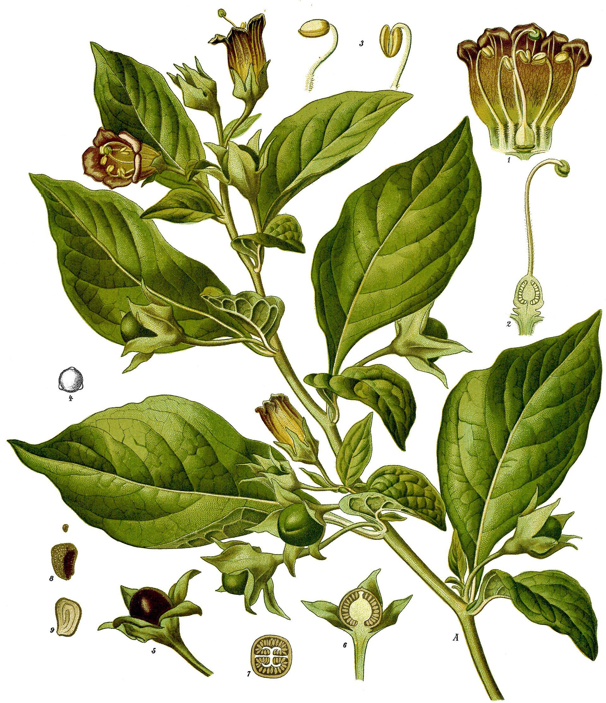
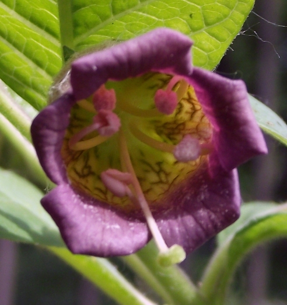

The berry encodes an interaction protocol. It is black, glossy, sweet — and lethal to most mammals above a narrow dose threshold. Birds eat it freely. This is not incidental toxicity variation; it is selective toxicity written in the fruit's form. The plant's dispersal strategy (safe for birds, lethal for non-dispersers) is readable before the berry is consumed.

**Ð, Þ, Ř, Φ, ƒ — Invariant core.** The berry coloration, the tropane biosynthetic program, the organ-level targeting architecture are all endogenously organized. The plant generates and maintains its own pharmaceutical state space without reference to an external template. Ð=self-written, Þ=self-referential, Ř=bidirectional (hyoscyamine → muscarinic receptors → evolutionary selection for selectivity), Φ=partial symmetry, ƒ=classical.

**Ç — Kinetics.** Fast, frozen-order, slow, or arrested. Belladonna's tropane alkaloids are embedded in leaf and root tissue behind cell walls — not in open laticifers like celandine, and not in surface trichome glands like wormwood. Extraction requires sustained work: maceration, expression, or decoction over time. Ç=frozen-order.

**Γ — Granularity.** Microscale, mesoscale, or universal. Hyoscyamine, scopolamine, and apoatropine all share the tropane backbone and all target muscarinic acetylcholine receptors. The parasympathetic nervous system runs every organ simultaneously — heart rate, pupil diameter, salivation, bronchial tone, gut motility. All disrupted together. The mechanism is architecturally universal. Γ=universal.

**⊙ — Criticality.** The mydriatic effect (pupil dilation) served historically as a self-measurement of preparation potency — Italian women used dilute extracts cosmetically, and pupil dilation confirmed effective dose. The pupil IS the critical-point readout: below threshold, no dilation; above, dilation proportional to dose. ⊙=self-modeling.

**Ħ — Chirality.** L-hyoscyamine is biosynthesized as the (S)-enantiomer and is roughly 100-fold more potent than the D-form at muscarinic receptors. It racemizes to atropine (the racemate) on extraction — which is why fresh and dried belladonna have different potency profiles. Biosynthesis writes chirality; the receptor reads it. Ħ=Frobenius minimum.

**Σ — Stoichiometry.** All three primary alkaloids — hyoscyamine, scopolamine, apoatropine — share the tropane backbone. One structural class. Σ=few classes.

**Ω — Winding.** Belladonna has alternate phyllotaxis with Fibonacci organization. Integer winding. Axiom B applies and is satisfied by Ħ=Frobenius minimum. Ω=integer.

`Ð=𐑦 Þ=𐑸 Ř=𐑾 Φ=𐑬 ƒ=𐑱 Ç=𐑤 Γ=𐑲 ɢ=𐑠 ⊙=⊙ Ħ=𐑶 Σ=𐑵 Ω=𐑭`

*Divergence from baseline: Γ (universal — full parasympathetic disruption), Σ (tropane class homogeneity).*

### 7. Black Henbane | *Hyoscyamus niger* L. | Solanaceae

**Voynich likelihood:** Moderate-high.

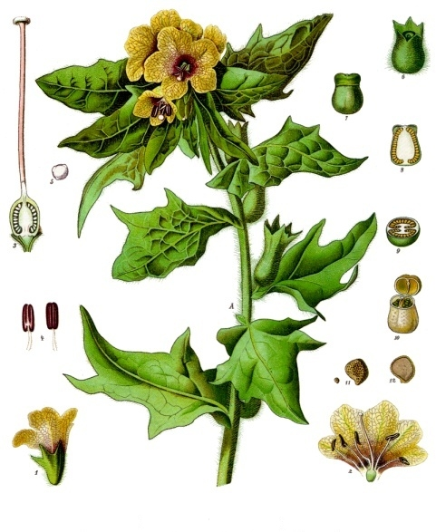
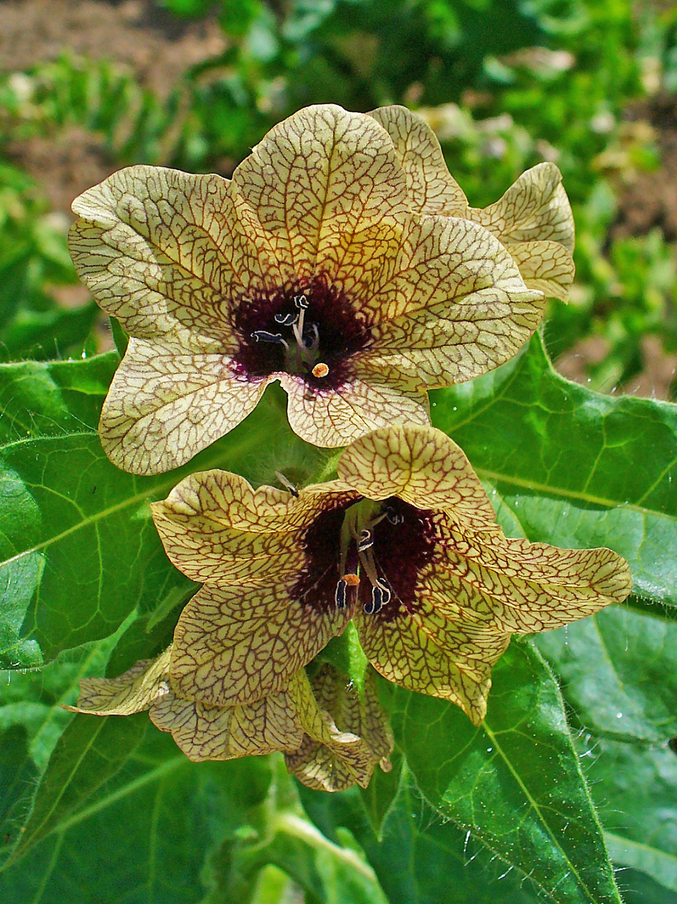

Henbane's tuple is identical to belladonna's. This is not a classification failure — it is the correct result. At the resolution of twelve primitive dimensions, these two plants are the same structural type. The pharmacologically significant differences between them — scopolamine:hyoscyamine ratio ≈ 1:2 for henbane versus ≈ 1:10 for belladonna, producing more sedation and less excitation from henbane at equivalent doses — are real and clinically important. They are also sub-tuple.

**Ð, Þ, Ř, Φ, ƒ — Invariant core.** Henbane's glandular trichome architecture and tropane biosynthesis program are endogenously organized. Ð=self-written, Þ=self-referential, Ř=bidirectional, Φ=partial symmetry, ƒ=classical. The carnivory-adjacent nitrogen loop (trichomes trap insects → nitrogen feeds alkaloid production → alkaloids maintained → trichomes maintained) is a self-referential closed loop, consistent with Þ=self-referential.

**Ç — Kinetics.** The tropane alkaloids in henbane are embedded in trichome glands and leaf tissue. Extraction requires sustained work. The glandular surface makes henbane MORE accessible than a root preparation, but still frozen-order: touching the plant releases small amounts of volatile alkaloid, but a medicinal dose requires maceration. Ç=frozen-order.

**Γ — Granularity.** Same tropane mechanism as belladonna — full parasympathetic disruption. Γ=universal.

**⊙ — Criticality.** The volatile alkaloids give the plant a fetid odor that serves as a potency indicator: strong odor = high alkaloid concentration. The plant announces its pharmaceutical state through smell before harvest. ⊙=self-modeling.

**Ħ — Chirality.** (S)-hyoscyamine written by biosynthesis, read by muscarinic receptors. Frobenius minimum — same argument as belladonna. Ħ=Frobenius minimum.

**Σ — Stoichiometry.** Tropane alkaloids throughout. Σ=few classes.

**Ω — Winding.** Alternate Fibonacci phyllotaxis. Ω=integer.

`Ð=𐑦 Þ=𐑸 Ř=𐑾 Φ=𐑬 ƒ=𐑱 Ç=𐑤 Γ=𐑲 ɢ=𐑠 ⊙=⊙ Ħ=𐑶 Σ=𐑵 Ω=𐑭`

*Divergence from baseline: Γ (universal), Σ (tropane class). Structurally identical to belladonna at tuple resolution.*

### 8. Foxglove | *Digitalis purpurea* L. | Plantaginaceae

**Voynich likelihood:** Moderate.

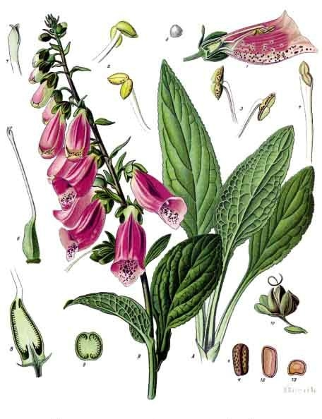
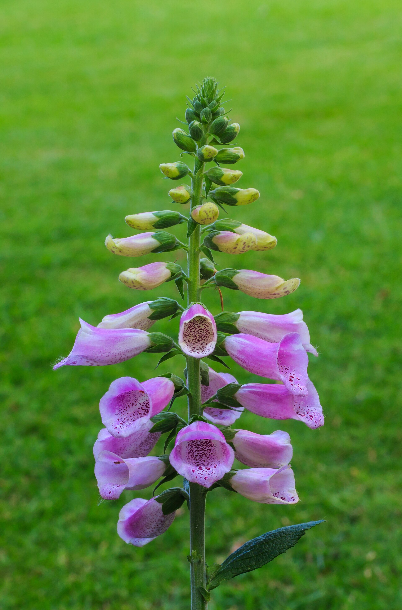

Foxglove encodes its preparation map across its own body: the first-year basal rosette leaves have the highest cardenolide concentration; the second-year spike leaves are smaller and less concentrated. The leaf-size gradient up the stem IS the concentration gradient. Harvest timing is written in the leaf size difference between years. But the form does not give you the margin for error — and the therapeutic/toxic boundary for cardiac glycosides is among the narrowest in pharmacology: therapeutic 0.5–2 ng/mL plasma, lethal above roughly 2 ng/mL. The map is present; the warning about how small the target is is not.

**Ð, Þ, Ř, Φ, ƒ — Invariant core.** The biennial growth pattern, the leaf-concentration gradient, the cardenolide biosynthetic program are all endogenously organized. Ð=self-written, Þ=self-referential, Ř=bidirectional (cardenolide → Na⁺/K⁺-ATPase → cardiac selection), Φ=partial symmetry, ƒ=classical.

**Ç — Kinetics.** The cardenolides sit inside leaf tissue. Extracting them requires decoction or infusion — sustained work against the tissue barrier. No trigger mechanism exists that would cause self-executing release. Ç=frozen-order.

**Γ — Granularity.** Foxglove is the exception in the cardiac glycoside group: Na⁺/K⁺-ATPase inhibition is technically universal (the pump is in every cell), but the therapeutic target is specifically cardiac — the inotropic effect at therapeutic doses is cardiac-selective because the heart has the highest sensitivity. At toxic doses, universality asserts itself. The therapeutic action is mesoscale; toxicity is universal. The primitive should record the pharmaceutical scope at therapeutic use. Γ=mesoscale.

**⊙ — Criticality.** The leaf-size gradient self-maps the concentration gradient — this is genuine morphological self-instruction. But as noted, it does not model the critical threshold (how narrow the safe window is). The self-modeling is incomplete. This is enough for ⊙=self-modeling — the presence or absence of the self-model is the binary, not its completeness.

**Ħ — Chirality.** The cardenolides (digitoxin, digoxin, gitoxin) have multiple stereocenters in their steroidal scaffolds. The cardiac Na⁺/K⁺-ATPase binding site reads them stereospecifically. Ħ=Frobenius minimum.

**Σ — Stoichiometry.** Digitoxin, digoxin, gitoxin — all cardenolides, same steroidal backbone, same lactone ring, same sugar chain architecture. One structural class. Σ=few classes.

**Ω — Winding.** Foxglove has a basal rosette with Fibonacci organization in the first year, transitioning to an alternate spiral up the second-year spike. Integer winding. Ω=integer.

`Ð=𐑦 Þ=𐑸 Ř=𐑾 Φ=𐑬 ƒ=𐑱 Ç=𐑤 Γ=𐑤 ɢ=𐑠 ⊙=⊙ Ħ=𐑶 Σ=𐑵 Ω=𐑭`

*Divergence from baseline: Σ (cardenolide class homogeneity). Foxglove matches wormwood on all other eleven primitives — the only divergence is stoichiometric.*

### 9. St. John's Wort | *Hypericum perforatum* L. | Hypericaceae

**Voynich likelihood:** High.

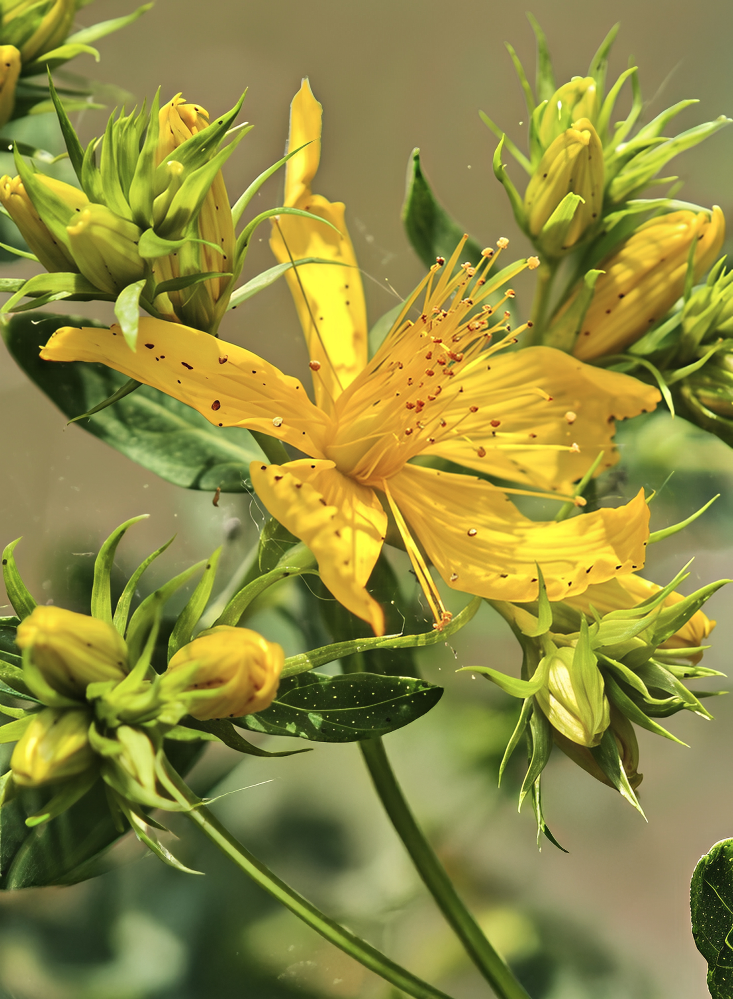

Hold a *Hypericum* leaf to light: pale translucent dots appear across the surface (schizogenous oil cavities), and dark marginal spots emerge (hypericin glands). The leaf, in transmitted light, is a pharmaceutical map — oil gland positions marked, hypericin fraction located at the margin. The preparation guide is embedded in the anatomy and only visible under the right conditions.

**Ð, Þ, Ř, Φ, ƒ — Invariant core.** The schizogenous oil cavity arrangement and the hypericin gland distribution are endogenous structural expressions. Ð=self-written, Þ=self-referential, Ř=bidirectional (hyperforin → monoamine reuptake transporters → adaptive selection), Φ=partial symmetry, ƒ=classical.

**Ç — Kinetics.** The oil sits in enclosed schizogenous cavities — not open laticifers. Extraction requires mechanical disruption of the cavities, typically by maceration in oil or alcohol over days. The hypericin glands similarly require sustained extraction. Ç=frozen-order.

**Γ — Granularity.** Hyperforin inhibits reuptake of serotonin, dopamine, noradrenaline, and GABA simultaneously through a sodium-conductive mechanism. The scope is the entire monoaminergic and GABAergic CNS — which is the entire CNS pharmacologically. Γ=universal.

**⊙ — Criticality.** The oil glands and hypericin spots visible in transmitted light constitute a preparation readout — the gland density and distribution encode the pharmaceutical content of the specific leaf being evaluated. ⊙=self-modeling.

**Ħ — Chirality.** Here Axiom B drives the assignment. Both hypericin and hyperforin are achiral — no stereocenters. If the pharmacological argument alone were used, the assignment would be one-step. But Ω=integer (2/5 Fibonacci phyllotaxis), and Axiom B applies: integer winding forces Ħ ≥ two-step. The two-step pharmacological argument: liver metabolism produces chiral estrogenic metabolites of hyperforin, and estrogen receptors read their chirality stereospecifically. Axiom B forces a deeper chirality than the primary compounds alone require. Ħ=two-step.

**Σ — Stoichiometry.** Naphthodianthrone chromophores (hypericin), phloroglucinol derivatives (hyperforin), flavonoids — three structurally distinct classes. Σ=many heterogeneous.

**Ω — Winding.** 2/5 Fibonacci phyllotaxis. Integer winding. Axiom B fires (Ħ must be ≥ two-step, which it is). Ω=integer.

`Ð=𐑦 Þ=𐑸 Ř=𐑾 Φ=𐑬 ƒ=𐑱 Ç=𐑤 Γ=𐑲 ɢ=𐑠 ⊙=⊙ Ħ=𐑒 Σ=𐑳 Ω=𐑭`

*Divergence from baseline: Γ (universal CNS), Ħ (two-step — Axiom B driven; primary compounds are achiral but integer winding forces the assignment via estrogenic metabolites).*

### 10. Saffron | *Crocus sativus* L. | Iridaceae

**Voynich likelihood:** High.

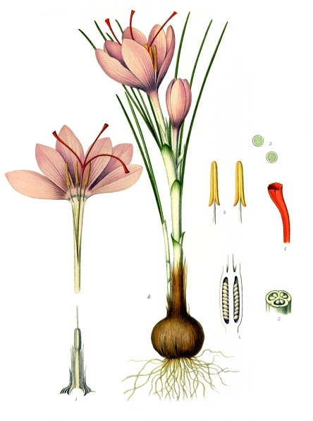
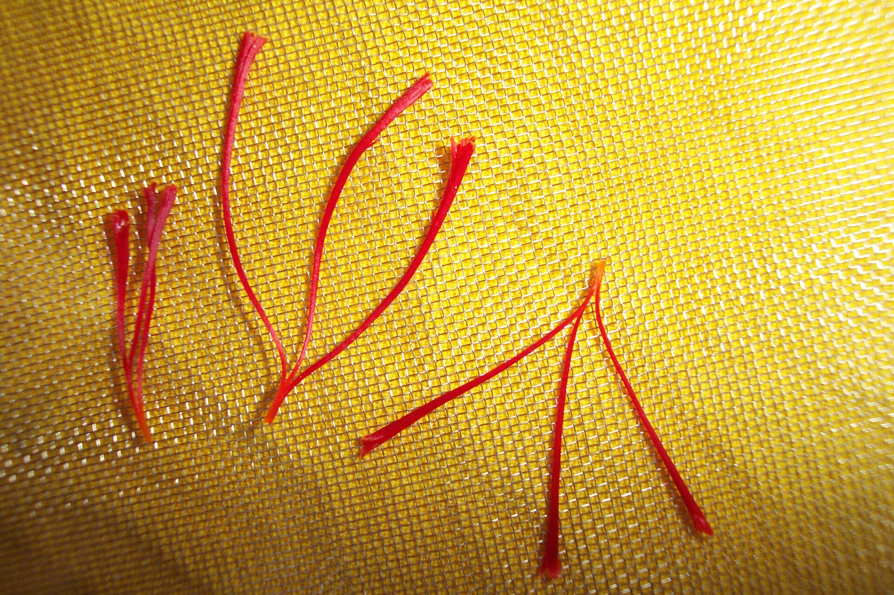

Saffron is the only plant in this set where the primary active compound is not present in the living plant. Safranal does not exist in the fresh stigma — it is generated by enzymatic hydrolysis of picrocrocin during drying. The Operator's act of drying completes the synthesis. The plant stores pharmaceutical precursors; preparation converts them.

**Ð, Þ, Ř, Φ, ƒ — Invariant core.** Saffron is a triploid sterile cultivar — it cannot reproduce sexually and its existence depends entirely on human corm propagation. This makes it unusual: the dimensionality is self-written (the corm's growth program is endogenous), but the state space is maintained through human cultivation rather than ecological selection. This is an edge case for Ð, but the key question is whether the organizational attractor is endogenous, and it is — the cultivation is a maintenance loop, not a generative template. Ð=self-written, Þ=self-referential, Ř=bidirectional, Φ=partial symmetry, ƒ=classical.

**Ç — Kinetics.** The picrocrocin → safranal conversion by enzymatic hydrolysis occurs over hours to days at controlled low temperature. Under-drying leaves undeveloped product; over-drying volatilizes safranal. The processing window is narrow but the mechanism is near-equilibrium enzymatic conversion, not a triggered fast reaction or a mechanical barrier requiring sustained force. Ç=slow.

**Γ — Granularity.** Safranal acts as a CNS modulator at pharmacological doses — anxiolytic, antidepressant, mild sedative effects through serotonergic and dopaminergic pathways. But the primary traditional use is as a digestive and reproductive system modulator (emenagogue), and the dose for CNS effects is much higher than traditional culinary use. The pharmacological scope is mesoscale — specific organ systems rather than full CNS dominance. Γ=mesoscale.

**⊙ — Criticality.** The stigmas deepen in color during drying — red intensifying toward deep crimson — as the carotenoid glucosides concentrate. The color change IS the conversion progress readout. The Operator can evaluate preparation state visually without any additional measurement. ⊙=self-modeling.

**Ħ — Chirality.** Safranal itself is achiral. However, Ω=integer (the corm's growth and the floral arrangement follow Fibonacci organization), so Axiom B applies: Ħ ≥ two-step. The two-step argument: the crocin carotenoids (the coloring agents) have stereospecific biosynthesis and are read stereospecifically by carotenoid-binding proteins in visual and neural tissue. Ħ=Frobenius minimum — the Axiom B lower bound is reached but the pharmacological argument independently supports it.

**Σ — Stoichiometry.** Carotenoid glycosides (crocin, the colorant), monoterpene glycosides (picrocrocin, the bitter principle; safranal, the aroma), flavonoids — three structurally distinct classes. Σ=many heterogeneous.

**Ω — Winding.** The corm and floral arrangement follow Fibonacci organization. Integer winding. Axiom B fires and is satisfied. Ω=integer.

`Ð=𐑦 Þ=𐑸 Ř=𐑾 Φ=𐑬 ƒ=𐑱 Ç=𐑧 Γ=𐑤 ɢ=𐑠 ⊙=⊙ Ħ=𐑶 Σ=𐑳 Ω=𐑭`

*Divergence from baseline: Ç (slow — pharmaceutical compound absent from living plant, generated by preparation).*

### 11. Blue Lotus | *Nymphaea caerulea* Savigny | Nymphaeaceae

**Voynich likelihood:** High.

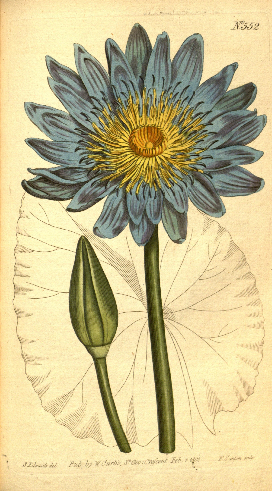

The only plant in this set where Axiom C fires in the converse direction. The blue lotus lives at the 2-dimensional water-air interface. Its leaves float at that interface — roots in anoxic mud, aerial surfaces exposed. The plant's state space is defined by the intersection of two external domains. Neither can be subtracted: remove the water, the plant dies; remove the air, the plant dies. The interface IS the system.

**Ð, Þ, Ř, Φ, ƒ — Invariant core.** Ð is the only primitive that diverges from the standard set. The blue lotus does not generate its own state space endogenously — its state space is the water-air interface, defined by two external domains. Ð=membrane. Axiom C then applies in the converse direction: Ð=membrane forces Þ ≠ self-referential. The topology must be braided composite — an irreducible product of aquatic and aerial topologies whose intersection generates the system. Þ=braided composite. Ř=bidirectional, Φ=partial symmetry, ƒ=classical.

**Ç — Kinetics.** The aporphine alkaloids (primarily nuciferine) are extracted by soaking the flowers in wine or warm water. Slow diffusion across a day-long steep — no mechanical activation, near-equilibrium kinetics. Ç=slow.

**Γ — Granularity.** Aporphine alkaloids produce CNS-wide effects — mild sedation, anxiolysis, mild psychoactivity through dopamine receptor modulation. Universal pharmacological scope. Γ=universal.

**⊙ — Criticality.** The circadian flower cycle is a sharp temporal phase transition: the flower opens at dawn and closes at dusk as a snap rather than a gradual movement. The sharp timing boundary specifies the harvest window. This is a binary critical signal (open/closed, harvest/don't harvest). ⊙=self-modeling.

**Ħ — Chirality.** Nuciferine has one stereocenter in the aporphine scaffold. The dopamine receptor reads it stereospecifically. Ħ=Frobenius minimum. Ω=integer (Fibonacci organization in the floral structure), so Axiom B is satisfied.

**Σ — Stoichiometry.** Aporphine alkaloids, flavonoids, terpenoids — three structurally distinct classes. Σ=many heterogeneous.

**Ω — Winding.** The leaf arrangement follows Fibonacci organization as the new leaves unfurl from the center. Integer winding. Ω=integer.

`Ð=𐑨 Þ=𐑶 Ř=𐑾 Φ=𐑬 ƒ=𐑱 Ç=𐑧 Γ=𐑲 ɢ=𐑠 ⊙=⊙ Ħ=𐑶 Σ=𐑳 Ω=𐑭`

*Divergence from baseline: Ð (membrane — water-air interface, not self-written), Þ (braided composite — Axiom C converse fires), Ç (slow infusion), Γ (universal). The only plant where Axiom C fires in the converse direction.*

### 12. Valerian | *Valeriana officinalis* L. | Caprifoliaceae

**Voynich likelihood:** Moderate.

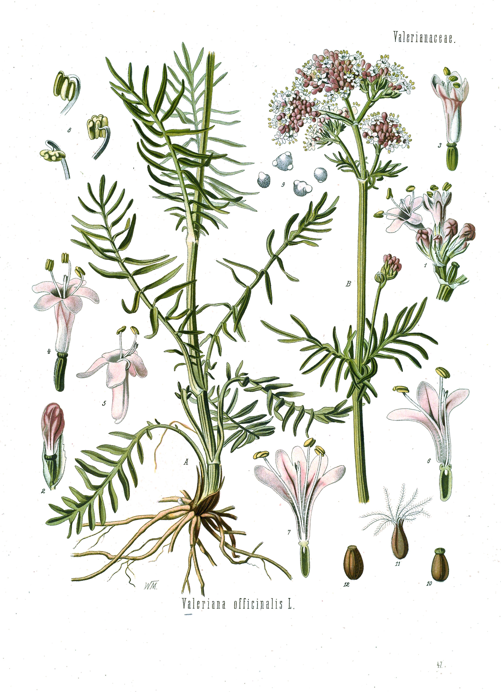

The fresh valerian root smells mildly pleasant. The dried root smells of rancid cheese. This transformation is not deterioration — it is preparation. The valepotriates hydrolyze spontaneously on drying or water contact, yielding isovaleric acid and baldrinal derivatives. The pharmaceutical compounds are not present in the intact living plant; they are generated by the preparation act.

**Ð, Þ, Ř, Φ, ƒ — Invariant core.** The root architecture and valepotriate biosynthetic program are endogenous expressions. Ð=self-written, Þ=self-referential, Ř=bidirectional (valerenic acid → GABA-A receptors → adaptive selection), Φ=partial symmetry, ƒ=classical.

**Ç — Kinetics.** Once the root contacts water, valepotriate hydrolysis begins rapidly and runs to completion without sustained Operator effort. The kinetics feel frozen-order (root extraction) but structurally they are auto-triggered: the Operator's act of wetting the root starts a self-executing chemical cascade. Ç=fast.

**Γ — Granularity.** Valerenic acid modulates GABA-A receptors throughout the CNS — anxiolysis, sedation, sleep induction. The pharmacological scope is universal. Γ=universal.

**⊙ — Criticality.** The odor transformation (mild → fetid) on drying is the preparation state readout. Strong isovaleric acid smell = active valepotriate hydrolysis complete = pharmaceutical ready. The nose provides the critical-point signal. ⊙=self-modeling.

**Ħ — Chirality.** Valerenic acid has stereocenters; the GABA-A receptor binding is stereospecific. Biosynthesis writes chirality; receptor reads it. Ħ=Frobenius minimum. Ω=trivial, so Axiom B does not fire.

**Σ — Stoichiometry.** Iridoid valepotriates, sesquiterpene acids (valerenic acid, isovaleric acid), flavonoids — three structurally distinct classes. Σ=many heterogeneous.

**Ω — Winding.** Valerian has opposite decussate leaves — pairs at 90°, no Fibonacci spiral. Trivial winding. Axiom B does not apply. Ω=trivial.

`Ð=𐑦 Þ=𐑸 Ř=𐑾 Φ=𐑬 ƒ=𐑱 Ç=𐑘 Γ=𐑲 ɢ=𐑠 ⊙=⊙ Ħ=𐑶 Σ=𐑳 Ω=𐑷`

*Divergence from baseline: Ç (fast — valepotriate auto-converts on water contact), Γ (universal), Ω (trivial — decussate leaves, Axiom B silent).*

### 13. Black Hellebore | *Helleborus niger* L. | Ranunculaceae

**Voynich likelihood:** Moderate.

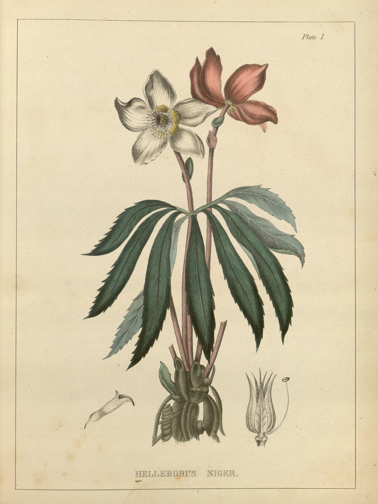

Hellebore is potent and structurally opaque. The combination produces the most interesting criticality assignment in this set: ⊙=non-critical.

**Ð, Þ, Ř, Φ, ƒ — Invariant core.** The rhizome architecture and bufadienolide biosynthesis are endogenously organized. Ð=self-written, Þ=self-referential, Ř=bidirectional, Φ=partial symmetry, ƒ=classical.

**Ç — Kinetics.** The bufadienolide glycosides and protoanemonin precursors are locked in root and rhizome tissue behind multiple cellular barriers. No trigger mechanism exists; sustained maceration or decoction is required. Ç=frozen-order.

**Γ — Granularity.** Cardiac Na⁺/K⁺-ATPase inhibition (bufadienolides) is systemically distributed; protoanemonin irritates mucous membranes throughout the GI tract; the saponins affect cell membranes broadly. The toxicity mechanism is architecturally universal. Γ=universal.

**⊙ — Criticality.** This is the decisive argument. Compare to wormwood: the bilateral leaf serration encodes the extraction pattern, the trichome density specifies the menstruum concentration, the bitterness threshold confirms potency, the Fibonacci phyllotaxis gives the pass count. Wormwood is maximally self-instructing. Hellebore has none of this. The winter flower is a calendar marker — not a preparation guide. The black rhizome says "here is the pharmaceutical tissue" but nothing about extraction geometry, dosing, or the critical concentration. The form withholds its preparation instruction entirely. This is real: hellebore is genuinely dangerous and gives you no morphological help in getting the dose right. ⊙=non-critical.

**Ħ — Chirality.** The bufadienolides have multiple stereocenters. The cardiac ATPase reads them stereospecifically. Ħ=Frobenius minimum.

**Σ — Stoichiometry.** Bufadienolide cardiac glycosides, volatile lactones (protoanemonin, ranunculin), steroidal saponins, flavonoids — four structurally distinct classes. Σ=many heterogeneous.

**Ω — Winding.** The leaves are palmate compound — no spiral. Trivial winding. Axiom B does not apply. Ω=trivial.

`Ð=𐑦 Þ=𐑸 Ř=𐑾 Φ=𐑬 ƒ=𐑱 Ç=𐑤 Γ=𐑲 ɢ=𐑠 ⊙=𐑢 Ħ=𐑶 Σ=𐑳 Ω=𐑷`

*Divergence from baseline: Γ (universal), ⊙ (non-critical — form withholds preparation instruction), Ω (trivial). One of two non-critical plants in the original set.*

### 14. Garlic | *Allium sativum* L. | Amaryllidaceae

**Voynich likelihood:** Moderate.

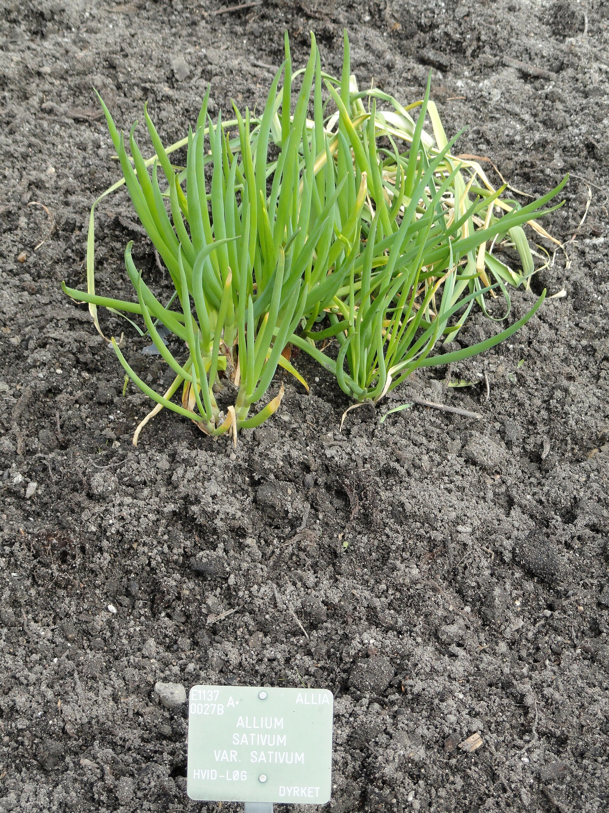
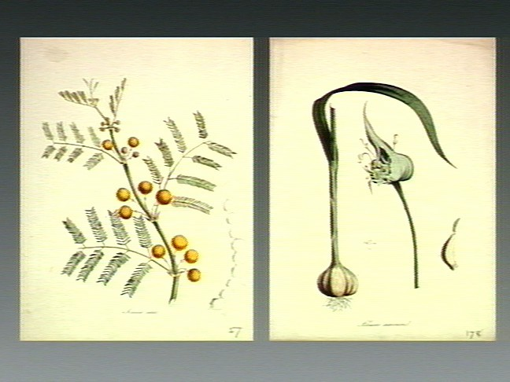

The most elegant pharmaceutical mechanism in this set. Alliin and alliinase are stored in separate cellular compartments — alliin in the cytosol, alliinase in the vacuoles. An intact clove has no smell. Crush the clove: both compartments rupture simultaneously, the two compounds meet for the first time, allicin forms within thirty seconds. The preparation completes before you have put the knife down.

**Ð, Þ, Ř, Φ, ƒ — Invariant core.** The two-compartment cellular architecture and the allicin biosynthetic machinery are endogenously organized. The compartmental separation is itself an endogenously maintained structural feature — the cell maintains the separation. Ð=self-written, Þ=self-referential, Ř=bidirectional (allicin → microbial enzyme inhibition → defensive selection), Φ=partial symmetry, ƒ=classical.

**Ç — Kinetics.** Two-compartment triggered reaction: one mechanical act (crushing) causes both compartments to rupture simultaneously, mixing alliin and alliinase for the first time. Allicin synthesis begins within seconds and completes within thirty seconds. No sustained Operator effort is required after the trigger. Ç=fast.

**Γ — Granularity.** Allicin and its metabolites (diallyl sulfides, ajoene, vinyl dithiins) distribute systemically via the bloodstream — broad antimicrobial, antifungal, cardiovascular effects across multiple tissue types. Γ=mesoscale (broad systemic but not CNS-dominant).

**⊙ — Criticality.** The compartmental separation encodes a preparation instruction: the absence of smell in the intact clove confirms correct storage; the immediate sulfur eruption on crushing confirms synthesis has begun. But there is a non-obvious critical threshold: cooking immediately after crushing deactivates alliinase before allicin has fully formed. The 10-minute post-crush window before applying heat is a critical temporal threshold. The smell buildup over those 10 minutes IS the critical-point readout. ⊙=self-modeling.

**Ħ — Chirality.** Alliinase reads L-alliin stereospecifically (step 1), producing achiral allicin. The body's sulfur-metabolizing enzymes then process allicin metabolites with chiral specificity (step 2). The primary product is achiral — this is the key difference from the Frobenius minimum. The chirality argument requires two steps; the first step produces an achiral intermediate; the second step reads chirality. Ħ=two-step rather than Frobenius minimum. Ω=integer (Fibonacci spiral clove arrangement, typically 10–13 cloves), so Axiom B fires and confirms Ħ ≥ two-step.

**Σ — Stoichiometry.** Allicin, diallyl sulfides, ajoene, vinyl dithiins — all organosulfur compounds, one structural class. Σ=few classes.

**Ω — Winding.** The cloves in the bulb follow a Fibonacci spiral (typically 10 or 13 cloves — both Fibonacci numbers). Integer winding. Axiom B fires. Ω=integer.

`Ð=𐑦 Þ=𐑸 Ř=𐑾 Φ=𐑬 ƒ=𐑱 Ç=𐑘 Γ=𐑤 ɢ=𐑠 ⊙=⊙ Ħ=𐑒 Σ=𐑵 Ω=𐑭`

*Divergence from baseline: Ç (fast — two-compartment trigger), Ħ (two-step, not Frobenius minimum — primary product achiral, Axiom B confirms), Σ (organosulfur class homogeneity).*

### 15. Sage | *Salvia officinalis* L. | Lamiaceae

**Voynich likelihood:** High.

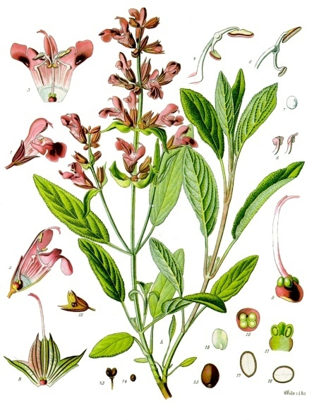
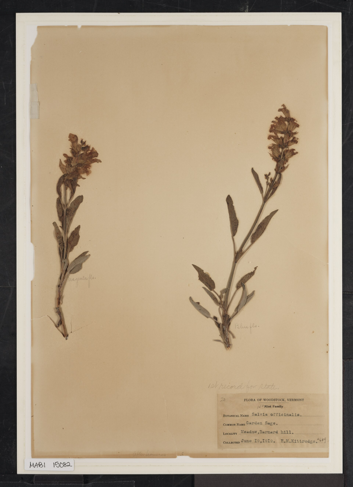

Sage is structurally wormwood with one substitution: the winding. Where wormwood has Fibonacci phyllotaxis, sage has decussate leaf arrangement — pairs at 90°, no spiral. Everything else resolves identically.

**Ð, Þ, Ř, Φ, ƒ — Invariant core.** The silver trichome pubescence and volatile profile are endogenously organized through the same genome-encoded machinery as wormwood's trichomes. Ð=self-written, Þ=self-referential, Ř=bidirectional, Φ=partial symmetry, ƒ=classical.

**Ç — Kinetics.** The volatile profile (thujone, camphor, borneol, 1,8-cineole) sits in trichome glands — the same type of frozen-order barrier as wormwood. Sustained maceration or steam distillation required. Ç=frozen-order.

**Γ — Granularity.** Sage acts primarily on digestive and memory-related systems — cholinesterase inhibition relevant to cognitive function, digestive secretion modulation. Mesoscale. Γ=mesoscale.

**⊙ — Criticality.** The silver trichome pubescence IS the visual self-model of volatile content — denser silver = higher oil concentration, readable before harvest. The allelopathic suppression loop (silver sheen signals quality → human cultivation selects for high-silver plants → trait maintained) closes through the cultivation practice. ⊙=self-modeling.

**Ħ — Chirality.** Carnosic acid biosynthesis writes stereocenters; estrogenic and antioxidant receptors read them. Frobenius minimum. Ω=trivial, so Axiom B does not fire — the chirality assignment stands on pharmacological grounds alone. Ħ=Frobenius minimum.

**Σ — Stoichiometry.** Monoterpenes (thujone, camphor, borneol, cineole), diterpene phenolics (carnosol, carnosic acid), flavonoids — three structurally distinct classes. Σ=many heterogeneous.

**Ω — Winding.** Decussate arrangement — leaf pairs at 90°, no Fibonacci spiral. Trivial winding. Axiom B does not apply. Ω=trivial.

`Ð=𐑦 Þ=𐑸 Ř=𐑾 Φ=𐑬 ƒ=𐑱 Ç=𐑤 Γ=𐑤 ɢ=𐑠 ⊙=⊙ Ħ=𐑶 Σ=𐑳 Ω=𐑷`

*Divergence from baseline: Ω (trivial — decussate leaf arrangement; Axiom B silent). All other eleven primitives identical to wormwood.*

### 16. Cornflower | *Centaurea cyanus* L. | Asteraceae

**Voynich likelihood:** High.

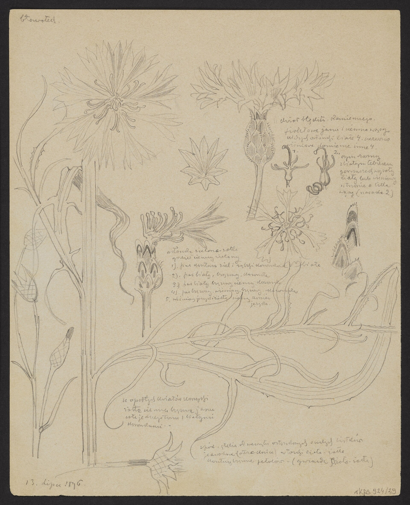
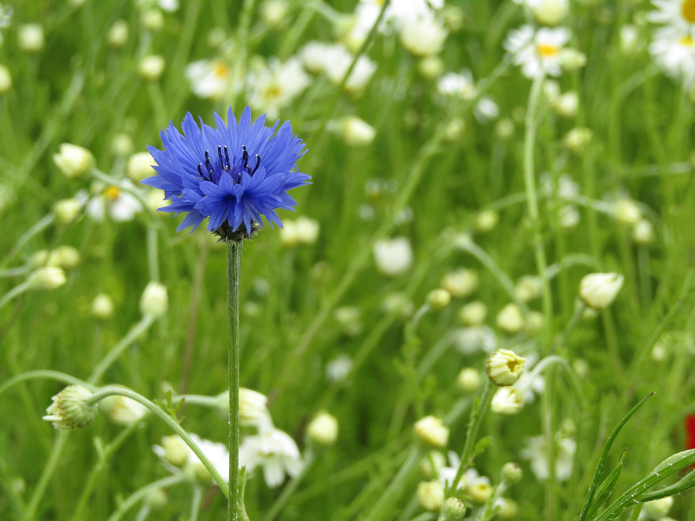

The blue is structural rather than surface. Protocyanin — a metal-complexed anthocyanin — is water-soluble and transfers to the infusion medium on steeping. The blue water confirms successful extraction without any additional test. The preparation is self-evaluating.

**Ð, Þ, Ř, Φ, ƒ — Invariant core.** The disc floret Fibonacci parastichy pattern and the anthocyanin biosynthesis are endogenously organized. Ð=self-written, Þ=self-referential, Ř=bidirectional, Φ=partial symmetry, ƒ=classical.

**Ç — Kinetics.** Aqueous diffusion of anthocyanins from the floret tissue into a warm infusion medium — near-equilibrium, no mechanical activation required, no sustained force. Hours, not seconds. Ç=slow.

**Γ — Granularity.** Cornflower anthocyanins are primarily used as mild anti-inflammatory and diuretic agents — organ-specific rather than full CNS distribution. Γ=mesoscale.

**⊙ — Criticality.** Two self-modeling signals. First, the blue infusion color confirms anthocyanin extraction without additional testing. Second, the pH-sensitive color response (blue at neutral/alkaline pH, red at acidic) means a single pH shift produces a visually dramatic transition — the infusion announces its preparation state through color. ⊙=self-modeling.

**Ħ — Chirality.** The anthocyanin-metal complexes in protocyanin interact with tissue binding sites through stereospecific coordination chemistry. The biosynthesis writes the specific metal coordination geometry; the binding site reads it. Ħ=Frobenius minimum. Ω=integer, Axiom B satisfied.

**Σ — Stoichiometry.** Anthocyanins (protocyanin), flavonoids (centaurein), sesquiterpene lactones (cynaropicrin), polyacetylenes — three to four structurally distinct classes. Σ=many heterogeneous.

**Ω — Winding.** Fibonacci parastichy in the disc florets (typically 13/21 or 21/34). Integer winding. Axiom B satisfied by Ħ=Frobenius minimum. Ω=integer.

`Ð=𐑦 Þ=𐑸 Ř=𐑾 Φ=𐑬 ƒ=𐑱 Ç=𐑧 Γ=𐑤 ɢ=𐑠 ⊙=⊙ Ħ=𐑶 Σ=𐑳 Ω=𐑭`

*Divergence from baseline: Ç (slow — aqueous anthocyanin diffusion).*

### 17. English Yew | *Taxus baccata* L. | Taxaceae

**Voynich likelihood:** Moderate.

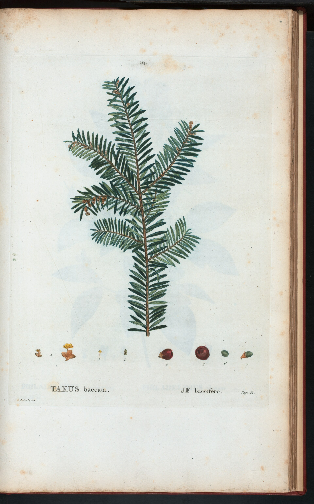
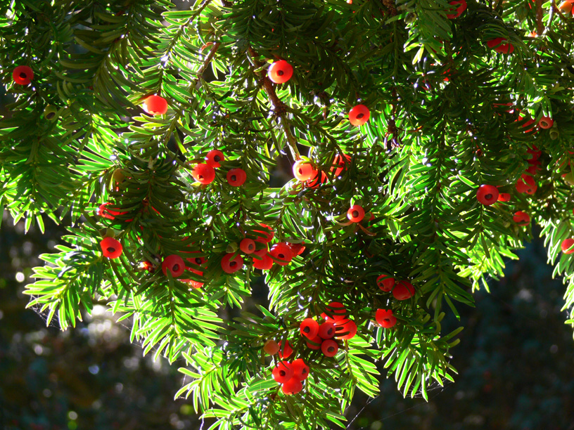

Taxol has eleven required stereocenters. The β-tubulin binding site reads every one. Invert any single center and activity is abolished. This is an architecture where the chiral memory depth is effectively unbounded relative to any finite Markov order: eternal chirality.

**Ð, Þ, Ř, Φ, ƒ — Invariant core.** The yew's needle arrangement and taxane biosynthesis are endogenously organized. Ð=self-written, Þ=self-referential, Ř=bidirectional, Φ=partial symmetry, ƒ=classical.

**Ç — Kinetics.** Axiom A applies: Ħ=eternal → Ç=arrested. The kinetic assignment is forced by the chirality assignment before any extraction chemistry is considered. The kinetic arrest is literal — taxol extraction requires organic solvents (acetone, ethyl acetate) under conditions that would destroy most pharmaceutical compounds. The preparation cannot be done in a medieval pharmacy. The chirality architecture prohibits conventional extraction. Ç=arrested.

**Γ — Granularity.** Taxol's tubulin inhibition affects all rapidly dividing cells throughout the body. Γ=universal.

**⊙ — Criticality.** The red aril (non-toxic) versus the green seed interior and all other plant parts (highly toxic) encodes a selective interaction protocol readable before tasting: red = safe for birds, green = lethal. This is the same structure as belladonna's berry — form encodes an interaction protocol. ⊙=self-modeling.

**Ħ — Chirality.** Eleven required stereocenters in the taxane scaffold. The β-tubulin binding site reads them all with absolute specificity — no partial activity, no racemate activity. This is not Frobenius minimum (two steps, primary compound chiral, receptor reads it). This is unbounded chiral memory depth relative to any finite Markov order. Ħ=eternal.

**Σ — Stoichiometry.** Taxanes (taxol, docetaxel precursors, taxine alkaloids), phenylpropanoids, lignans — three structurally distinct classes. Σ=many heterogeneous.

**Ω — Winding.** The needles are distichous — two-ranked, one plane of alternation. No Fibonacci spiral. Trivial winding. Axiom A fires (Ħ=eternal → Ç=arrested); Axiom B does not (Ω=trivial). Ω=trivial.

`Ð=𐑦 Þ=𐑸 Ř=𐑾 Φ=𐑬 ƒ=𐑱 Ç=𐑺 Γ=𐑲 ɢ=𐑠 ⊙=⊙ Ħ=𐑫 Σ=𐑳 Ω=𐑷`

*Divergence from baseline: Ç (arrested — Axiom A forced by Ħ=eternal), Γ (universal), Ħ (eternal — 11 required stereocenters), Ω (trivial). The only plant where Axiom A fires.*

### 18. Greater Plantain | *Plantago major* L. | Plantaginaceae

**Voynich likelihood:** Moderate.

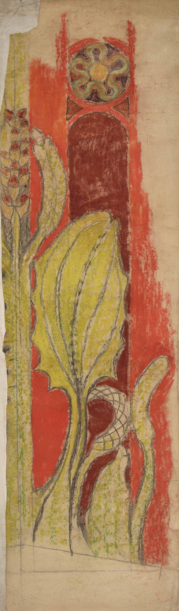
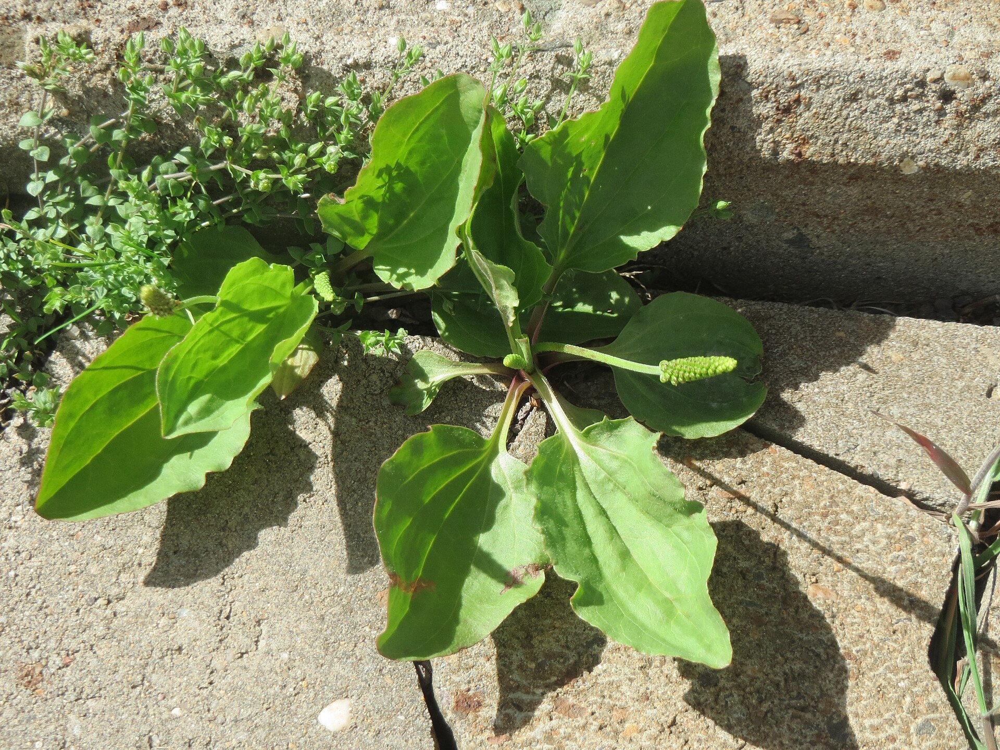

Plantain is the simplest plant in this set. The leaf, crushed, is the pharmaceutical. There is no preparation beyond mechanical rupture.

**Ð, Þ, Ř, Φ, ƒ — Invariant core.** The parallel-vein architecture and aucubin biosynthesis are endogenously organized. Ð=self-written, Þ=self-referential, Ř=bidirectional, Φ=partial symmetry, ƒ=classical.

**Ç — Kinetics.** Leaf cell rupture releases mucilage, aucubin, and allantoin immediately. One mechanical act, instant release. Ç=fast.

**Γ — Granularity.** Mucilage acts locally (draws toxins from immediate tissue), allantoin promotes cell proliferation at the application site, aucubin reduces local inflammation. No systemic distribution pathway for topically applied plantain. Γ=microscale — the only plant in this set with fully local action.

**⊙ — Criticality.** Two options: self-modeling (form encodes self-measurement of state) or non-critical (it does not). Plantain's form is transparent — the parallel veins are the preparation instruction (crush along the veins to release the mucilage channels). But the preparation has no threshold behavior: no critical concentration, no phase transition in effect, no sharp dose boundary. Apply the leaf; the system doesn't care about precision. The self-modeling signal is absent not because the form withholds information (like hellebore), but because there is no threshold to model. ⊙=non-critical.

**Ħ — Chirality.** Aucubin has stereocenters; its anti-inflammatory mechanism involves stereospecific enzyme interactions. But Ω=integer (2/5 Fibonacci rosette arrangement), so Axiom B fires: Ħ ≥ two-step. The aucubin biosynthesis provides the two-step argument: chirality written (biosynthesis), chirality read (enzyme targets). Ħ=two-step — reached by both Axiom B and pharmacological argument.

**Σ — Stoichiometry.** Iridoid glycosides (aucubin, catalpol), mucilage polysaccharides, allantoin, flavonoids — four structurally distinct classes. Σ=many heterogeneous.

**Ω — Winding.** 2/5 Fibonacci rosette. Integer winding. Axiom B fires. Ω=integer.

`Ð=𐑦 Þ=𐑸 Ř=𐑾 Φ=𐑬 ƒ=𐑱 Ç=𐑘 Γ=𐑚 ɢ=𐑠 ⊙=𐑢 Ħ=𐑒 Σ=𐑳 Ω=𐑭`

*Divergence from baseline: Ç (instant), Γ (microscale — fully local action), ⊙ (non-critical — no threshold to model), Ħ (two-step, Axiom B driven).*

### 19. Jimsonweed | *Datura stramonium* L. | Solanaceae

**Voynich likelihood:** Moderate-high.

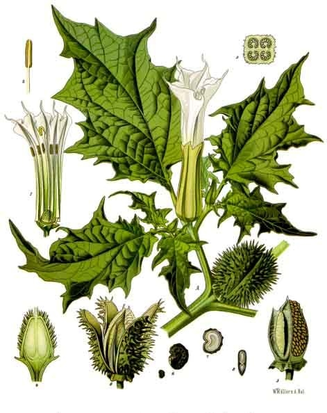
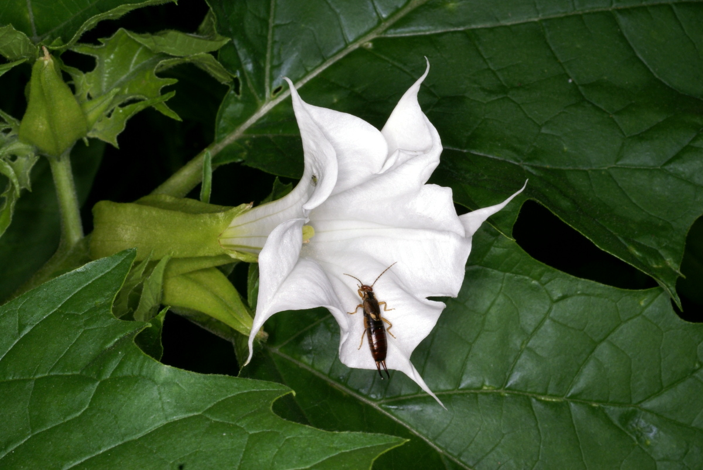

This is the third occurrence of the belladonna tuple in the set. Jimsonweed, belladonna, and henbane all contain tropane alkaloids, target muscarinic receptors, produce systemic autonomic disruption, and have Fibonacci phyllotaxis. The grammar is correct: at the primitive level, they are the same structural type.

**Ð, Þ, Ř, Φ, ƒ — Invariant core.** Same endogenous tropane biosynthesis as belladonna and henbane. Ð=self-written, Þ=self-referential, Ř=bidirectional, Φ=partial symmetry, ƒ=classical.

**Ç — Kinetics.** Tropane alkaloids embedded in leaf and seed tissue behind cellular barriers. Sustained extraction required. Ç=frozen-order.

**Γ — Granularity.** Full parasympathetic disruption — same as belladonna. Γ=universal.

**⊙ — Criticality.** The spiny seed capsule is structurally interesting here: the spines physically enforce caution during harvest (require gloves or tools), meaning the plant slows down the preparation process through its form. This is the inverse of self-instruction — it is preparation-caution enforcement. It is still a form of self-modeling: the form encodes information about the risk level of the preparation. ⊙=self-modeling.

**Ħ — Chirality.** (S)-hyoscyamine written by biosynthesis, read by muscarinic receptors. Same argument as belladonna. Ħ=Frobenius minimum.

**Σ — Stoichiometry.** Tropane alkaloids — one structural class. Σ=few classes.

**Ω — Winding.** Fibonacci phyllotaxis. Integer winding. Ω=integer.

`Ð=𐑦 Þ=𐑸 Ř=𐑾 Φ=𐑬 ƒ=𐑱 Ç=𐑤 Γ=𐑲 ɢ=𐑠 ⊙=⊙ Ħ=𐑶 Σ=𐑵 Ω=𐑭`

*Divergence from baseline: Γ (universal), Σ (tropane class). Third occurrence of this structural type in the set.*

### 20. Fennel | *Foeniculum vulgare* Mill. | Apiaceae

**Voynich likelihood:** High.

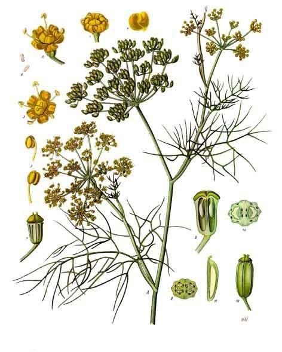
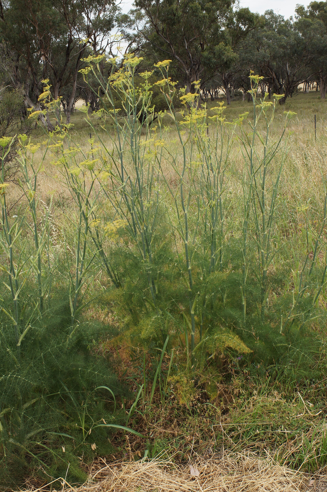

Trans-anethole has no chiral centers. You might expect the lowest chirality assignment. Axiom B overrides this.

**Ð, Þ, Ř, Φ, ƒ — Invariant core.** The compound umbel architecture and anethole biosynthesis are endogenously organized. Ð=self-written, Þ=self-referential, Ř=bidirectional, Φ=partial symmetry, ƒ=classical.

**Ç — Kinetics.** The oil sits in oil ducts throughout the plant — touching releases some aroma, but pharmaceutical doses require crushing or steam distillation. Less locked than wormwood's trichome chambers, but not the instant-release of celandine. Ç=frozen-order.

**Γ — Granularity.** Fennel acts primarily on digestive and hormonal systems — digestive spasmolytic, galactagogue, mild estrogenic effects. Organ-system level. Γ=mesoscale.

**⊙ — Criticality.** The compound umbel is a fractal branching hierarchy — each sub-umbel is a representative sample of the whole, so any sub-umbel gives a correct yield estimate. The allelopathic suppression zone (volatile terpenoid release preventing neighboring plant germination) maintains a sharp spatial boundary, readable as a critical threshold in the preparation environment. ⊙=self-modeling.

**Ħ — Chirality.** Axiom B applies: Ω=integer (2/5 phyllotaxis in alternate leaves, secondary Fibonacci organization in the compound umbel's ray number). Trans-anethole is achiral; without Axiom B, Ħ would be one-step. Axiom B forces Ħ ≥ two-step. The two-step argument: liver cytochrome P450 oxidizes trans-anethole to dianethol and photoanethol, which are chiral; estrogen receptors read their chirality stereospecifically. Ħ=two-step.

**Σ — Stoichiometry.** Trans-anethole dominates (70–90% of essential oil) — phenylpropanoid class. Plus monoterpenes, flavonoids. The dominance of one class makes this few-class despite the presence of others. Σ=few classes.

**Ω — Winding.** 2/5 Fibonacci phyllotaxis in the alternate leaves. Integer winding. Axiom B fires. Ω=integer.

`Ð=𐑦 Þ=𐑸 Ř=𐑾 Φ=𐑬 ƒ=𐑱 Ç=𐑤 Γ=𐑤 ɢ=𐑠 ⊙=⊙ Ħ=𐑒 Σ=𐑵 Ω=𐑭`

*Divergence from baseline: Ħ (two-step — Axiom B forces assignment; anethole is achiral but estrogenic metabolites satisfy the two-step argument), Σ (phenylpropanoid dominance).*

### 21. Hemlock | *Conium maculatum* L. | Apiaceae

**Voynich likelihood:** High.

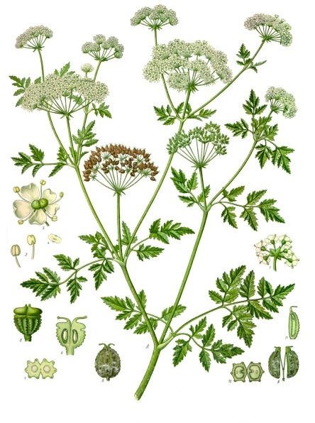
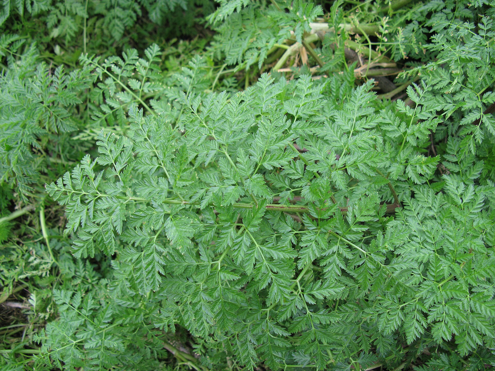

The purple-spotted stem is one of the clearest identification markers in European flora — distinctive, consistent, and permanent. In a set where most plants require botanical expertise to identify, hemlock announces itself. The spots are not decorative; they are a high-contrast warning written in the plant's own vasculature pattern. The form encodes its danger.

**Ð, Þ, Ř, Φ, ƒ — Invariant core.** The stem spotting pattern and coniine biosynthetic program are endogenously organized. Ð=self-written, Þ=self-referential, Ř=bidirectional (coniine → nicotinic receptors → defensive selection), Φ=partial symmetry, ƒ=classical.

**Ç — Kinetics.** Coniine is a volatile piperidine alkaloid. Crushing the plant releases it rapidly — enough that working with fresh hemlock in a closed space causes toxic exposure through inhalation. The Operator applies mechanical force once; the volatile alkaloid self-propagates. Ç=fast.

**Γ — Granularity.** Coniine blocks nicotinic acetylcholine receptors at the neuromuscular junction throughout the body — ascending peripheral paralysis from legs to diaphragm. The mechanism is architecturally universal: every skeletal muscle simultaneously. Γ=universal.

**⊙ — Criticality.** The purple stem spots are both the identification marker and a preparation quality indicator — spotting pattern intensity correlates with alkaloid concentration. Heavily spotted stems indicate higher coniine content. The form encodes the pharmaceutical state. ⊙=self-modeling.

**Ħ — Chirality.** (S)-coniine is the primary biosynthetic enantiomer and is roughly 10-fold more potent than (R)-coniine at nicotinic receptors. The biosynthesis writes (S); the receptor reads the preference. Ħ=Frobenius minimum.

**Σ — Stoichiometry.** Coniine, γ-coniceine, conhydrine, pseudoconhydrine — all piperidine alkaloids, one structural class. Σ=few classes.

**Ω — Winding.** Apiaceae Fibonacci phyllotaxis — same as fennel and other umbellifers. Integer winding. Axiom B satisfied by Ħ=Frobenius minimum. Ω=integer.

`Ð=𐑦 Þ=𐑸 Ř=𐑾 Φ=𐑬 ƒ=𐑱 Ç=𐑘 Γ=𐑲 ɢ=𐑠 ⊙=⊙ Ħ=𐑶 Σ=𐑵 Ω=𐑭`

*Divergence from baseline: Ç (fast — volatile alkaloid release on crushing), Γ (universal — ascending neuromuscular blockade), Σ (piperidine class homogeneity).*

### 22. White False Hellebore | *Veratrum album* L. | Melanthiaceae

**Voynich likelihood:** Moderate.

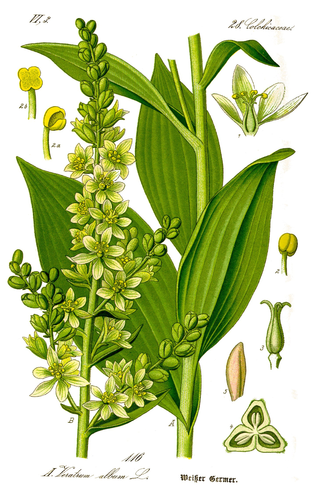
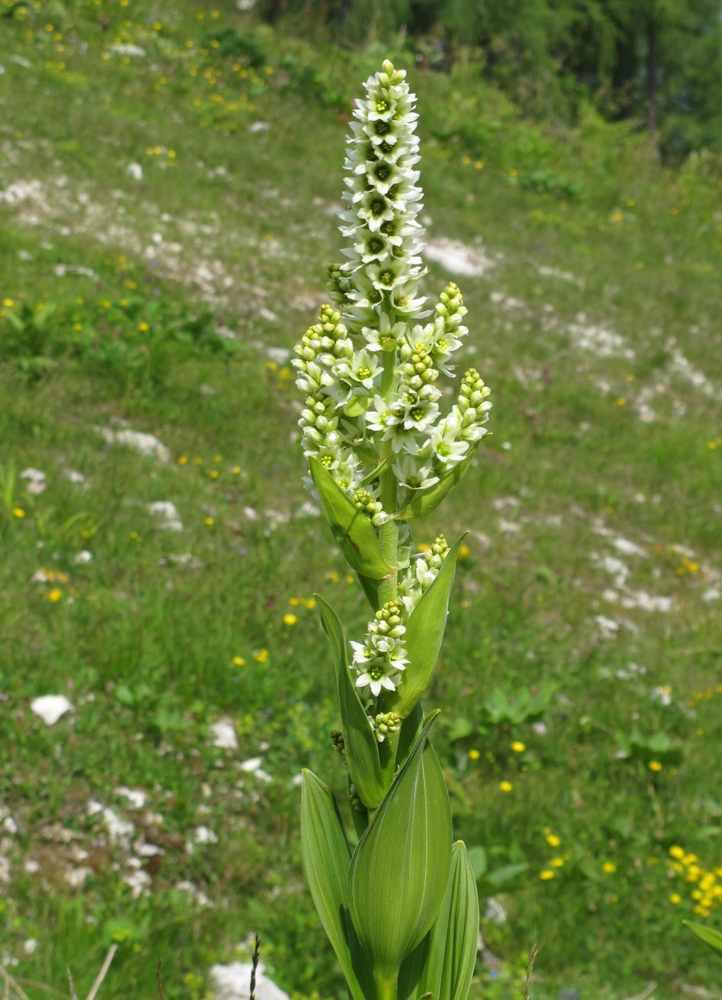

Veratrum album is the most dangerous look-alike plant in European flora. It is commonly confused with gentian (*Gentiana lutea*) before flowering — same large pleated basal leaves, same montane habitat, same early-season appearance. The confusion has caused fatal poisonings repeatedly across centuries. Where gentian is pharmaceutical, Veratrum is lethal. The form is actively deceptive.

**Ð, Þ, Ř, Φ, ƒ — Invariant core.** The pleated leaf architecture and steroidal alkaloid biosynthesis are endogenously organized. Ð=self-written, Þ=self-referential, Ř=bidirectional (jervine → hedgehog signaling pathway → selection), Φ=partial symmetry, ƒ=classical.

**Ç — Kinetics.** The steroidal alkaloids (jervine, cyclopamine, veratramine) are embedded in rhizome and leaf tissue behind multiple cellular barriers. Extraction requires sustained maceration. Ç=frozen-order.

**Γ — Granularity.** The steroidal alkaloids open voltage-gated sodium channels, producing toxicity throughout the nervous system and heart simultaneously — bradycardia, hypotension, neurological effects. Γ=universal.

**⊙ — Criticality.** The decisive assignment. The form of Veratrum does NOT encode the preparation protocol — the pleated leaves and robust growth tell you nothing about the extraction chemistry or the lethal dose threshold. Moreover, the form actively misleads by resembling gentian. This is the strongest case for non-critical in the set: the form withholds its pharmaceutical information AND provides false information pointing to the wrong plant. ⊙=non-critical.

**Ħ — Chirality.** Jervine and cyclopamine have multiple stereocenters in their steroidal scaffold; the hedgehog signaling pathway targets (Smoothened receptor) read them stereospecifically. Ħ=Frobenius minimum.

**Σ — Stoichiometry.** Jervine, cyclopamine, veratramine, protoveratrine — all steroidal alkaloids, one structural class. Σ=few classes.

**Ω — Winding.** The large pleated leaves are arranged in a Fibonacci spiral at the base. Integer winding. Axiom B satisfied by Ħ=Frobenius minimum. Ω=integer.

`Ð=𐑦 Þ=𐑸 Ř=𐑾 Φ=𐑬 ƒ=𐑱 Ç=𐑤 Γ=𐑲 ɢ=𐑠 ⊙=𐑢 Ħ=𐑶 Σ=𐑵 Ω=𐑭`

*Divergence from baseline: Γ (universal), ⊙ (non-critical — form withholds and actively misleads), Σ (steroidal alkaloid class). Strongest non-critical case in the set.*

### 23. Cannabis | *Cannabis sativa* L. | Cannabaceae

**Voynich likelihood:** Moderate-high.

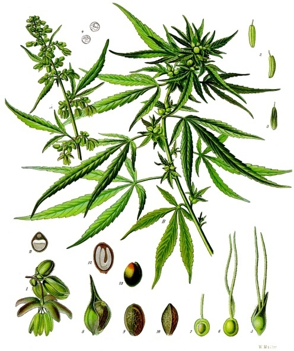

The female inflorescence (the cola) is covered in capitate-stalked trichomes whose density is directly proportional to THC content. Touch the flower: the sticky resin on your fingers is the pharmaceutical. The preparation quality indicator is tactile and immediate — you do not need to extract or test; you read it through contact.

**Ð, Þ, Ř, Φ, ƒ — Invariant core.** The trichome architecture and cannabinoid biosynthesis are endogenously organized. Ð=self-written, Þ=self-referential, Ř=bidirectional (THC → CB1 receptors → selection for potency), Φ=partial symmetry, ƒ=classical.

**Ç — Kinetics.** The resin is in the trichome heads — physically accessible on the surface but requiring mechanical rupture or solvent extraction to liberate in pharmacological quantities. Direct contact releases small amounts; a medicinal dose requires pressing, extracting, or sustained infusion. Unlike celandine (open laticifers) or garlic (two-compartment trigger), there is no single mechanical event that self-executes the preparation. Ç=frozen-order.

**Γ — Granularity.** CB1 receptors are distributed throughout the CNS and peripheral nervous system; CB2 receptors are found in immune tissue throughout the body. THC's pharmacological reach is architecturally universal. Γ=universal.

**⊙ — Criticality.** Trichome density is the THC proxy — dense white trichomes signal high cannabinoid content, and the proportion of amber trichomes signals degradation state (THC → CBN). The cola reports its own pharmaceutical state visually without any additional analytical step. ⊙=self-modeling.

**Ħ — Chirality.** Δ9-THC has two stereocenters (C6a, C10a), both required: (−)-trans-Δ9-THC (the natural form) is ~6-fold more potent at CB1 than the (+)-enantiomer. The biosynthesis writes the trans-configuration; the CB1 receptor reads it. Ħ=Frobenius minimum.

**Σ — Stoichiometry.** Cannabinoids (THC, CBD, CBG, CBN — all terpenophenolics), terpenoids (myrcene, limonene, linalool — monoterpenes and sesquiterpenes), flavonoids (cannflavins) — three structurally distinct classes. Σ=many heterogeneous.

**Ω — Winding.** Alternate phyllotaxis in a Fibonacci spiral arrangement. Integer winding. Axiom B satisfied by Ħ=Frobenius minimum. Ω=integer.

`Ð=𐑦 Þ=𐑸 Ř=𐑾 Φ=𐑬 ƒ=𐑱 Ç=𐑤 Γ=𐑲 ɢ=𐑠 ⊙=⊙ Ħ=𐑶 Σ=𐑳 Ω=𐑭`

*Divergence from baseline: Γ (universal — CB1/CB2 ubiquity).*

### 24. Autumn Crocus | *Colchicum autumnale* L. | Colchicaceae

**Voynich likelihood:** Moderate.

The autumn crocus flowers in autumn without any leaves — the leaves appear the following spring, months after the flowers have faded. The pharmaceutical tissue (the corm underground) is never visible at the same time as the plant's most distinctive above-ground feature (the flower). The form hides the preparation pathway.

**Ð, Þ, Ř, Φ, ƒ — Invariant core.** The corm architecture and colchicine biosynthesis are endogenously organized. Ð=self-written, Þ=self-referential, Ř=bidirectional (colchicine → tubulin → selection for mitotic arrest capability), Φ=partial symmetry, ƒ=classical.

**Ç — Kinetics.** Colchicine is embedded in corm tissue behind multiple cellular barriers. Extraction requires sustained maceration or decoction. The corm is underground, requiring excavation before extraction even begins. Ç=slow (sustained extraction process, not a barrier against a trigger mechanism — the kinetics are rate-limited by diffusion through corm tissue).

**Γ — Granularity.** Colchicine binds tubulin at the colchicine site in all dividing cells — mitotic arrest is not tissue-specific. Every cell in G2/M phase simultaneously. Γ=universal.

**⊙ — Criticality.** The decisive assignment. The autumn flower appears without leaves, meaning the plant is at its most visible when the pharmaceutical tissue is completely inaccessible without excavation and when no preparation instruction is visible. The temporal decoupling of flower from leaf means the form never encodes the full system at once: you see the flower (pharmacy), or you see the leaves (growth), never both together. The form structurally prevents self-instruction. ⊙=non-critical.

**Ħ — Chirality.** Colchicine has one stereocenter; (S)-colchicine (the natural form, also called (−)-colchicine) is roughly 1000-fold more active than (R)-colchicine at the tubulin binding site. Extreme stereospecificity. Ħ=Frobenius minimum.

**Σ — Stoichiometry.** Colchicine, demecolcine, colchicoside — all colchicine alkaloids (tropolone alkaloids), one structural class. Σ=few classes.

**Ω — Winding.** The leaves, when present, are parallel-veined and emerge in a non-Fibonacci arrangement. Trivial winding. Axiom B does not apply. Ω=trivial.

`Ð=𐑦 Þ=𐑸 Ř=𐑾 Φ=𐑬 ƒ=𐑱 Ç=𐑧 Γ=𐑲 ɢ=𐑠 ⊙=𐑢 Ħ=𐑶 Σ=𐑵 Ω=𐑷`

*Divergence from baseline: Ç (slow), Γ (universal), ⊙ (non-critical — flower-leaf temporal decoupling hides the preparation pathway), Σ (colchicine class), Ω (trivial).*

### 25. Monkshood | *Aconitum napellus* L. | Ranunculaceae

**Voynich likelihood:** Moderate.

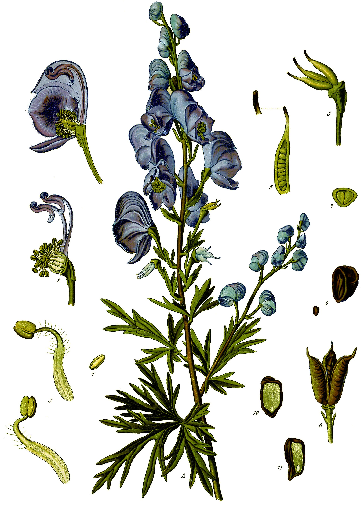
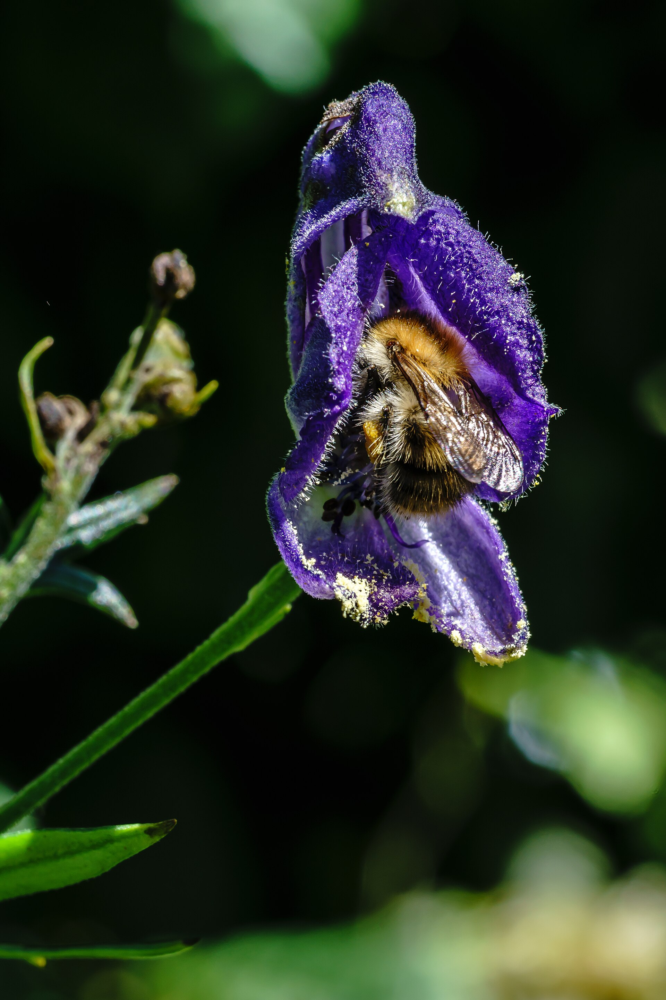

Aconitine may be the most acutely toxic compound in European flora accessible without industrial chemistry. The LD50 in humans is approximately 2–6 mg — a quantity achievable by contact with the root. The hood-shaped flower is one of the most morphologically distinctive in the European pharmacopoeia. But the form tells you almost nothing about the preparation.

**Ð, Þ, Ř, Φ, ƒ — Invariant core.** The tuber architecture and diterpene alkaloid biosynthesis are endogenously organized. Ð=self-written, Þ=self-referential, Ř=bidirectional (aconitine → Nav channels → selection), Φ=partial symmetry, ƒ=classical.

**Ç — Kinetics.** The diterpene alkaloids are embedded in root and tuber tissue behind multiple cellular barriers. The root can cause toxicity through skin contact, but a measured medicinal dose requires controlled extraction. Ç=frozen-order.

**Γ — Granularity.** Aconitine locks voltage-gated sodium channels in the open state. Nav channels are ubiquitous in nervous and cardiac tissue throughout the body — cardiac arrhythmia and neurotoxicity are simultaneous. Γ=universal.

**⊙ — Criticality.** The hood-shaped flower identifies the genus reliably — but identification is not preparation instruction. The form gives you the name of the plant; it does not give you the extraction geometry, the dosing threshold, or any preparation indicator. Aconitum is as dangerous as hellebore but more visually distinctive — and the visual distinctiveness is purely about identification, not about preparation. ⊙=non-critical.

**Ħ — Chirality.** Aconitine has eight stereocenters; all are required for Nav channel binding. The biosynthesis writes them; the channel binding site reads them. Ħ=Frobenius minimum.

**Σ — Stoichiometry.** Aconitine, mesaconitine, hypaconitine, benzoylaconine — all C19-diterpene alkaloids, one structural class. Σ=few classes.

**Ω — Winding.** Alternate Fibonacci phyllotaxis. Integer winding. Axiom B satisfied. Ω=integer.

`Ð=𐑦 Þ=𐑸 Ř=𐑾 Φ=𐑬 ƒ=𐑱 Ç=𐑤 Γ=𐑲 ɢ=𐑠 ⊙=𐑢 Ħ=𐑶 Σ=𐑵 Ω=𐑭`

*Divergence from baseline: Γ (universal), ⊙ (non-critical — distinctive form identifies but does not instruct preparation), Σ (diterpene alkaloid class).*

### 26. Peppermint | *Mentha* × *piperita* L. | Lamiaceae

**Voynich likelihood:** High.

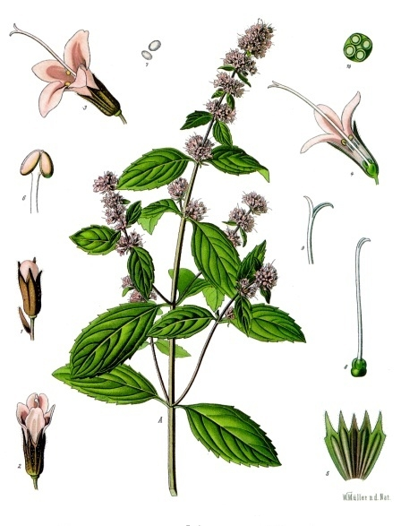
Touch a peppermint leaf. Before you have made a decision about preparation, the pharmaceutical has already been delivered. The TRPM8 cold receptor in the skin is activated by menthol released from crushed surface glands. The preparation is not something you do to peppermint — it happens to you when you contact it.
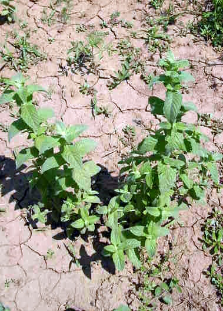

**Ð, Þ, Ř, Φ, ƒ — Invariant core.** The glandular trichome architecture and menthol biosynthesis are endogenously organized. Ð=self-written, Þ=self-referential, Ř=bidirectional (menthol → TRPM8 → cooling sensation that drives human use), Φ=partial symmetry, ƒ=classical.

**Ç — Kinetics.** Menthol sits in surface glandular trichomes accessible on contact — minimal barrier. Leaf contact releases enough menthol to activate TRPM8 receptors within seconds. This is fast kinetics through the same mechanism as celandine (surface-accessible active material) rather than frozen-order (embedded). Ç=fast.

**Γ — Granularity.** Menthol activates TRPM8 in the skin and mucous membranes where the leaf contacts — peripheral sensory neurons and local mucosa, not CNS. Topical and mucous membrane application produces local effects; only ingested doses at significant quantities reach systemic distribution. Γ=mesoscale (peripheral sensory and mucosal scope).

**⊙ — Criticality.** The cooling sensation on contact IS the pharmaceutical readout — you feel the TRPM8 activation as you evaluate the leaf. Potency (menthol concentration) maps directly to subjective cooling intensity. No secondary evaluation step required. ⊙=self-modeling.

**Ħ — Chirality.** (1R,2S,5R)-(−)-menthol is roughly 3–5-fold more potent than the most active (+)-enantiomer at TRPM8. The biosynthesis specifically produces the (−) form; the receptor discriminates. Ħ=Frobenius minimum. Ω=trivial (decussate Lamiaceae arrangement), so Axiom B does not fire — the assignment stands on pharmacological grounds.

**Σ — Stoichiometry.** Menthol, menthone, menthyl acetate, pulegone — all monoterpenoids, one structural class. Σ=few classes.

**Ω — Winding.** Decussate leaf arrangement — pairs at 90°, no Fibonacci spiral. Trivial winding. Axiom B silent. Ω=trivial.

`Ð=𐑦 Þ=𐑸 Ř=𐑾 Φ=𐑬 ƒ=𐑱 Ç=𐑘 Γ=𐑤 ɢ=𐑠 ⊙=⊙ Ħ=𐑶 Σ=𐑵 Ω=𐑷`

*Divergence from baseline: Ç (fast — surface trichome contact release), Σ (monoterpenoid class), Ω (trivial — decussate Lamiaceae).*

### 27. Yarrow | *Achillea millefolium* L. | Asteraceae

**Voynich likelihood:** High.

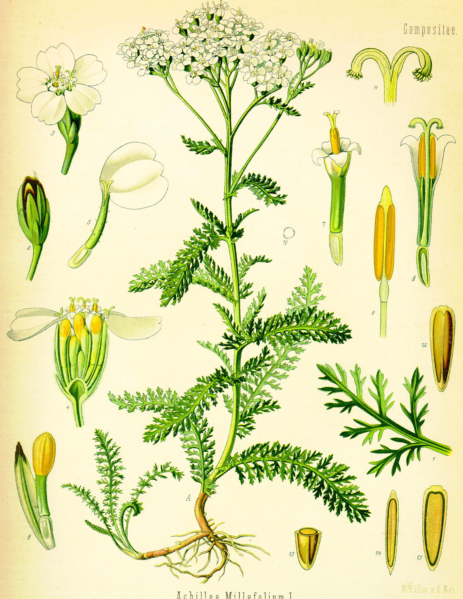
Yarrow's tuple is identical to wormwood's baseline. This is the correct result. Both are Asteraceae with trichome-embedded volatile profiles (yarrow's thujone and camphor content is lower but the molecular architecture is the same), Fibonacci phyllotaxis, mesoscale pharmacology, and heterogeneous volatile-acid-flavonoid compound profiles. The grammar identifies them as the same structural type. The pharmacologically significant differences — lower toxicity, different alkaloid ratios, different traditional use — are real and sub-tuple.

**Ð, Þ, Ř, Φ, ƒ — Invariant core.** The feathery bipinnate leaf architecture and volatile terpenoid biosynthesis are endogenously organized. Ð=self-written, Þ=self-referential, Ř=bidirectional, Φ=partial symmetry, ƒ=classical.

**Ç — Kinetics.** The volatile compounds (thujone, camphor, borneol, cineole, azulene) sit in trichome glands behind cuticle barriers. Sustained maceration or steam distillation required. Ç=frozen-order.

**Γ — Granularity.** Yarrow's pharmacological scope is digestive, hemostatic, and anti-inflammatory — organ-system level rather than full CNS distribution. The achilleine coagulation factor and the anti-inflammatory chamazulene act at tissue level. Γ=mesoscale.

**⊙ — Criticality.** The feathery leaf architecture encodes the preparation instruction: the fine bipinnate divisions create maximum surface area for volatile expression, which is both the active material and the extraction indicator. Rubbing the leaf releases the volatile, confirming the pharmaceutical content. ⊙=self-modeling.

**Ħ — Chirality.** Borneol and camphor have stereocenters; the biosynthesis writes specific enantiomers; the target enzymes read them. Ħ=Frobenius minimum. Ω=integer, Axiom B satisfied.

**Σ — Stoichiometry.** Monoterpenes (thujone, camphor, borneol), sesquiterpene lactones (achillin, achillicin), flavonoids, alkaloids (achilleine) — four structurally distinct classes. Σ=many heterogeneous.

**Ω — Winding.** Fibonacci phyllotaxis in the alternate bipinnate leaves. Integer winding. Axiom B satisfied. Ω=integer.

`Ð=𐑦 Þ=𐑸 Ř=𐑾 Φ=𐑬 ƒ=𐑱 Ç=𐑤 Γ=𐑤 ɢ=𐑠 ⊙=⊙ Ħ=𐑶 Σ=𐑳 Ω=𐑭`

*Divergence from baseline: none. Yarrow and wormwood are the same structural type at tuple resolution.*

### 28. Mistletoe | *Viscum album* L. | Santalaceae

**Voynich likelihood:** Moderate.

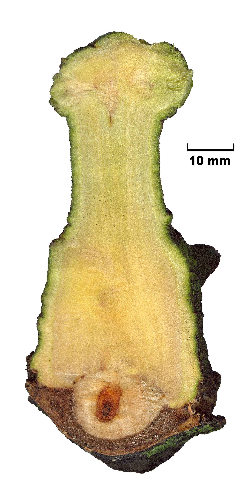

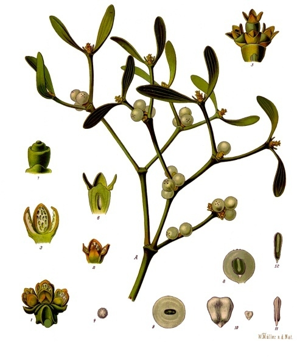
Mistletoe is a hemi-parasite — it photosynthesizes but draws water and minerals from the host tree through haustorial connections. The host species determines the alkaloid profile: mistletoe on oak, apple, pine, or poplar has measurably different viscotoxin and lectin ratios. The plant's pharmaceutical character is partially determined by an entity external to itself.

**Ð, Þ, Ř, Φ, ƒ — Invariant core.** The mistletoe's own biosynthesis and branching architecture are endogenously organized — the haustorial interface is a fixed connection, not a continuous re-specification by the host. The mistletoe does not become a different organism depending on host species; its pharmaceutical profile shifts in quantity, not in kind. Ð=self-written (the organizational program is endogenous even if modulated by host chemistry), Þ=self-referential, Ř=bidirectional (viscumin lectins → immune cells → therapeutic selection), Φ=partial symmetry, ƒ=classical.

**Ç — Kinetics.** The lectins and viscotoxins are proteins — large, water-soluble molecules extracted by aqueous maceration over hours to days. No mechanical trigger; rate-limited by protein diffusion from plant tissue into aqueous medium. Ç=slow.

**Γ — Granularity.** Viscumin (mistletoe lectin I) acts on ribosomes in all cell types (protein synthesis inhibition), and viscotoxins affect cardiac and immune tissue broadly. Contemporary oncological use is systemically administered. Γ=universal.

**⊙ — Criticality.** The host-species attachment point encodes pharmaceutical context: an experienced harvester reads host species, attachment height, and branch age to estimate alkaloid profile. The location of the mistletoe ball IS a pharmaceutical state indicator — it encodes the preparation context through its position in the host canopy. ⊙=self-modeling.

**Ħ — Chirality.** Lectin binding is stereospecific — the lectins bind specific sugar configurations (D-galactose vs L-galactose) with high selectivity. The biosynthesis writes the carbohydrate-recognition domain; the target cell surface displays the sugar ligands. Ħ=Frobenius minimum.

**Σ — Stoichiometry.** Proteins (mistletoe lectins I–III), peptides (viscotoxins A2, A3, B), flavonoids (flavonol glycosides), amines (tyramine, choline) — four structurally distinct classes. Σ=many heterogeneous.

**Ω — Winding.** Mistletoe grows omnidirectionally — no geotropism, no preferred axis, genuinely spherical growth. The branching pattern is dichotomous (each stem divides into two at each node), which is a trivial binary branching, not a Fibonacci spiral. Ω=trivial.

`Ð=𐑦 Þ=𐑸 Ř=𐑾 Φ=𐑬 ƒ=𐑱 Ç=𐑧 Γ=𐑲 ɢ=𐑠 ⊙=⊙ Ħ=𐑶 Σ=𐑳 Ω=𐑷`

*Divergence from baseline: Ç (slow — protein diffusion extraction), Γ (universal), Ω (trivial — omnidirectional dichotomous branching).*

### 29. Comfrey | *Symphytum officinale* L. | Boraginaceae

**Voynich likelihood:** Moderate.

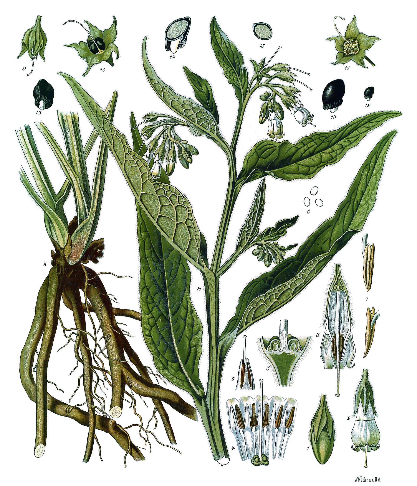

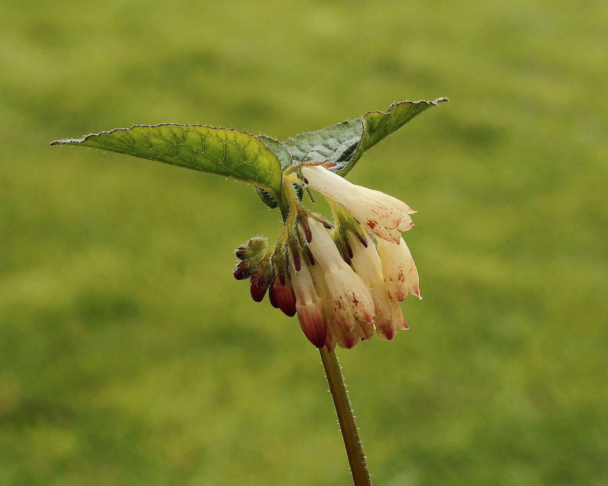
Press the comfrey root: mucilage releases immediately, coating the fingers. The mucilaginous texture is the pharmaceutical readout — it confirms the allantoin-rich tissue and announces the wound-healing application. The form gives itself away on contact.

**Ð, Þ, Ř, Φ, ƒ — Invariant core.** The root mucilage architecture and allantoin + pyrrolizidine alkaloid biosynthesis are endogenously organized. Ð=self-written, Þ=self-referential, Ř=bidirectional, Φ=partial symmetry, ƒ=classical.

**Ç — Kinetics.** The mucilage and allantoin are present in the root's outer parenchyma cells — accessible by pressure but requiring maceration or decoction for medicinal preparation. The pyrrolizidine alkaloids require more sustained extraction from deeper tissue. Ç=slow (rate-limited by diffusion from parenchyma and vascular tissue into extraction medium).

**Γ — Granularity.** Allantoin promotes cell proliferation locally at the application site; pyrrolizidine alkaloids, when absorbed systemically, accumulate in the liver (hepatotoxicity). The dual profile — local wound healing, systemic hepatotoxicity — spans microscale and systemic. The primary therapeutic action is hepatic/tissue level. Γ=mesoscale.

**⊙ — Criticality.** The mucilaginous texture on pressing IS the pharmaceutical confirmation: mucilage = allantoin = wound-healing activity present. The root self-reports its pharmaceutical state through texture. ⊙=self-modeling.

**Ħ — Chirality.** The pyrrolizidine alkaloids have stereocenters; their hepatic activation through CYP-mediated pyrrole formation is stereospecific. Ħ=Frobenius minimum.

**Σ — Stoichiometry.** Pyrrolizidine alkaloids (symphytine, echimidine), allantoin (purine metabolite), rosmarinic acid (hydroxycinnamic acid), mucopolysaccharides, tannins — four structurally distinct classes. Σ=many heterogeneous.

**Ω — Winding.** Alternate phyllotaxis in Fibonacci arrangement. Integer winding. Axiom B satisfied. Ω=integer.

`Ð=𐑦 Þ=𐑸 Ř=𐑾 Φ=𐑬 ƒ=𐑱 Ç=𐑧 Γ=𐑤 ɢ=𐑠 ⊙=⊙ Ħ=𐑶 Σ=𐑳 Ω=𐑭`

*Divergence from baseline: Ç (slow — parenchyma diffusion), Γ (mesoscale — hepatic/wound scope).*

### 30. Lily of the Valley | *Convallaria majalis* L. | Asparagaceae

**Voynich likelihood:** Moderate-high.

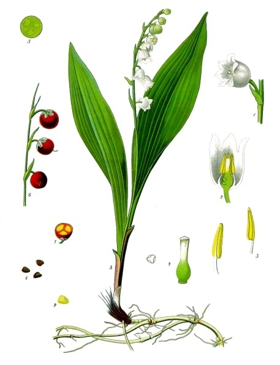

The white bell flowers of lily of the valley have one of the most intensely concentrated floral fragrances in European flora. The scent profile is dominated by farnesene and linalool; the intensity is proportional to the flower's total volatile output, which correlates with overall secondary metabolite production. Scent intensity is a proxy for cardenolide content.

**Ð, Þ, Ř, Φ, ƒ — Invariant core.** The rhizome architecture and cardenolide biosynthesis are endogenously organized. Ð=self-written, Þ=self-referential, Ř=bidirectional (convallatoxin → Na⁺/K⁺-ATPase → cardiac selection), Φ=partial symmetry, ƒ=classical.

**Ç — Kinetics.** The cardenolides sit in leaf and rhizome tissue — the same type of frozen-order barrier as foxglove. Sustained extraction required. Ç=frozen-order.

**Γ — Granularity.** Convallatoxin inhibits Na⁺/K⁺-ATPase throughout cardiac and smooth muscle tissue. Unlike foxglove (where therapeutic dose is cardiac-selective), convallaria's profile at any pharmaceutical dose affects cardiac tissue globally — there is no therapeutic window that allows cardiac-selective use without generalized ATPase inhibition risk. Γ=universal.

**⊙ — Criticality.** The scent intensity encodes the pharmaceutical state: stronger fragrance indicates higher secondary metabolite production. In a preparation context, the intensity of the infusion's aroma during decoction is the potency indicator. ⊙=self-modeling.

**Ħ — Chirality.** The cardenolides (convallatoxin, convalloside, convallamarin) have multiple stereocenters in their steroidal scaffolds. The Na⁺/K⁺-ATPase binding site reads them stereospecifically. Ħ=Frobenius minimum. Ω=integer, Axiom B satisfied.

**Σ — Stoichiometry.** Convallatoxin, convalloside, convallamarin — all cardenolides, same steroidal backbone class as foxglove but different sugar chains. Few classes. Σ=few classes.

**Ω — Winding.** The leaves emerge in a paired arrangement from the rhizome with Fibonacci organization. Integer winding. Axiom B satisfied. Ω=integer.

`Ð=𐑦 Þ=𐑸 Ř=𐑾 Φ=𐑬 ƒ=𐑱 Ç=𐑤 Γ=𐑲 ɢ=𐑠 ⊙=⊙ Ħ=𐑶 Σ=𐑵 Ω=𐑭`

*Divergence from baseline: Γ (universal — differs from foxglove's mesoscale; no cardiac-selective therapeutic window), Σ (cardenolide class — same family as foxglove).*

### 31. Stinging Nettle | *Urtica dioica* L. | Urticaceae

**Voynich likelihood:** High.

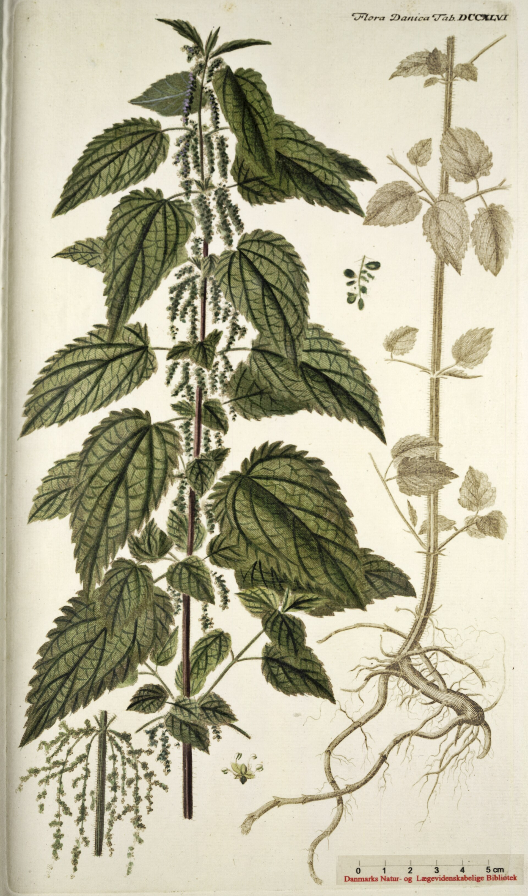
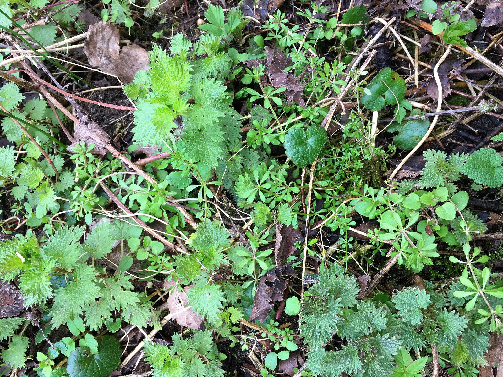

The stinging trichome IS the drug delivery system. Each trichome is a hypodermic needle made of silica — a fragile tip that breaks on contact, injecting formic acid, histamine, serotonin, and acetylcholine into the skin simultaneously. The plant delivers its pharmaceutical without any preparation act by the Operator. Form is function without gap.

**Ð, Þ, Ř, Φ, ƒ — Invariant core.** The silica trichome architecture and amine biosynthesis are endogenously organized. Ð=self-written, Þ=self-referential, Ř=bidirectional (histamine/serotonin → pain and itch receptors → defensive selection), Φ=partial symmetry, ƒ=classical.

**Ç — Kinetics.** Contact with the trichome tip causes injection within milliseconds — the mechanical threshold for tip breakage is the preparation trigger, and it requires essentially no force. Ç=fast.

**Γ — Granularity.** The sting acts at the injection site: pain, itch, and local inflammation from histamine, serotonin, and formic acid — all local. The systemic medicinal use (dried nettle tea, anti-inflammatory) involves a completely different preparation and pharmacological mechanism (flavonoids, lectins). The sting mechanism — which is what makes nettle structurally unique — is cell-local. Γ=microscale.

**⊙ — Criticality.** The trichome structure directly encodes the delivery mechanism — the needle-tip geometry, the brittle silica cap, the reservoir pressure are all part of the form. There is no gap between form and function: the trichome IS the hypodermic. The preparation instruction is the form itself. ⊙=self-modeling.

**Ħ — Chirality.** Serotonin (5-hydroxytryptamine) is achiral; formic acid is achiral; histamine is achiral. The primary sting cocktail is dominated by achiral compounds. Without Axiom B, Ħ would be one-step. But Ω=integer (2/5 Fibonacci phyllotaxis), so Axiom B fires: Ħ ≥ two-step. The two-step argument: the flavonoids in nettle (used in systemic preparations) have stereospecific biosynthesis and stereospecific anti-inflammatory enzyme interactions. Ħ=two-step.

**Σ — Stoichiometry.** Biogenic amines (histamine, serotonin, acetylcholine), organic acids (formic acid), lectins (UDA), flavonoids (quercetin glycosides), silicic acid — five structurally distinct classes. Σ=many heterogeneous.

**Ω — Winding.** 2/5 Fibonacci phyllotaxis in the alternate leaves. Integer winding. Axiom B fires. Ω=integer.

`Ð=𐑦 Þ=𐑸 Ř=𐑾 Φ=𐑬 ƒ=𐑱 Ç=𐑘 Γ=𐑚 ɢ=𐑠 ⊙=⊙ Ħ=𐑒 Σ=𐑳 Ω=𐑭`

*Divergence from baseline: Ç (fast — trichome tip breakage on contact), Γ (microscale — injection site only), Ħ (two-step — Axiom B driven; primary sting compounds achiral). Matches plantain on Ç and Γ but differs at ⊙ (self-modeling vs non-critical).*

### 32. Black Nightshade | *Solanum nigrum* L. | Solanaceae

**Voynich likelihood:** Moderate-high.

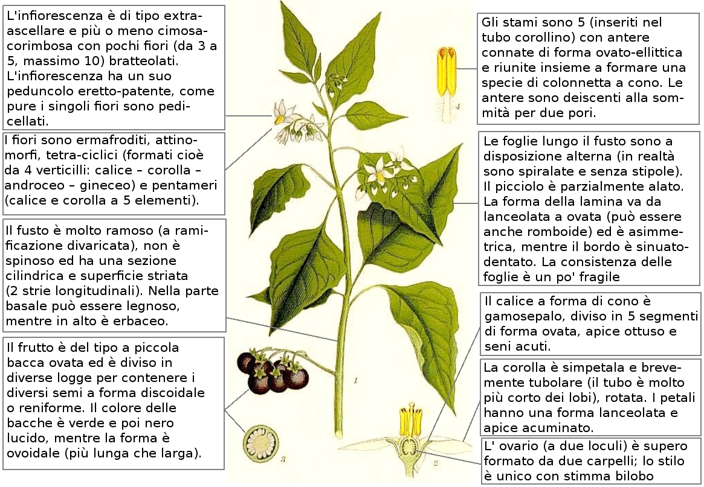
The berries change from green (toxic, high solanine) to black (less toxic, solanine hydrolyzed and glycoalkaloid degraded). This is a color-encoded safety threshold — the plant runs its own ripeness assay and reports the result visually. Green = do not use. Black = preparation possible.
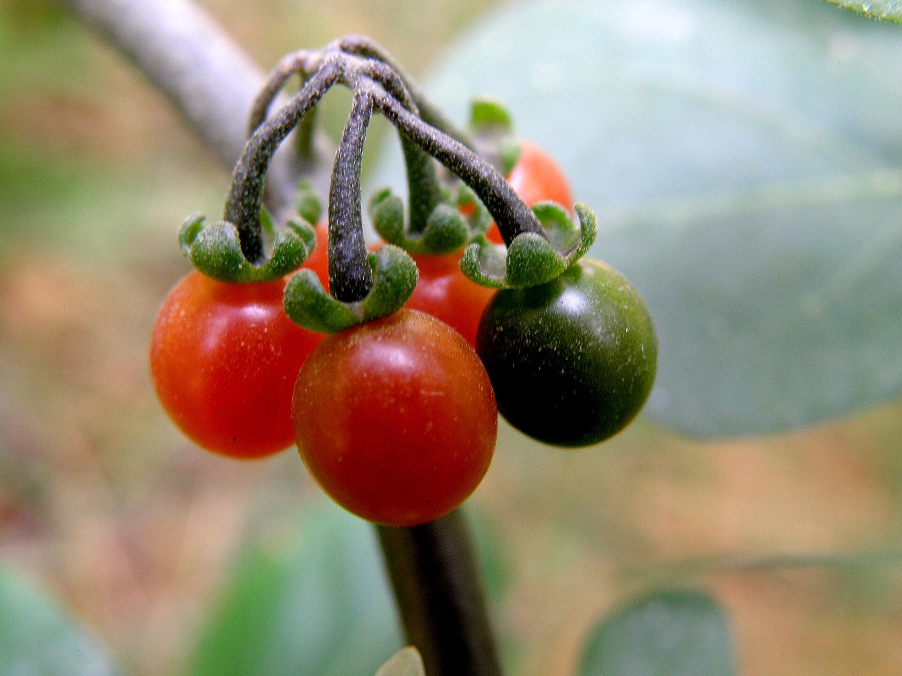

**Ð, Þ, Ř, Φ, ƒ — Invariant core.** The berry ripening program and steroidal glycoalkaloid biosynthesis are endogenously organized. Ð=self-written, Þ=self-referential, Ř=bidirectional, Φ=partial symmetry, ƒ=classical.

**Ç — Kinetics.** The solanine and solanidine are embedded in berry and leaf tissue behind glycosidic bonds that require enzymatic or acid hydrolysis to cleave. Slow hydrolysis during ripening is the primary activation mechanism; extraction of the remaining glycoalkaloids from ripe berries requires maceration. Ç=slow.

**Γ — Granularity.** At toxic doses: acetylcholinesterase inhibition and membrane disruption affect neurological and gastrointestinal tissue broadly. Γ=universal (toxicity scope).

**⊙ — Criticality.** The color transition from green to black IS the preparation threshold readout — the plant self-reports when preparation becomes viable. The black color indicates that solanine levels have fallen below the acute toxicity threshold. ⊙=self-modeling.

**Ħ — Chirality.** Solanine and solanidine have multiple stereocenters in their steroidal scaffold; the acetylcholinesterase binding site is stereospecific. Ħ=Frobenius minimum.

**Σ — Stoichiometry.** Solanine, solanidine, chaconine — steroidal glycoalkaloids, one structural class. Σ=few classes.

**Ω — Winding.** Alternate Fibonacci phyllotaxis. Integer winding. Axiom B satisfied. Ω=integer.

`Ð=𐑦 Þ=𐑸 Ř=𐑾 Φ=𐑬 ƒ=𐑱 Ç=𐑧 Γ=𐑲 ɢ=𐑠 ⊙=⊙ Ħ=𐑶 Σ=𐑵 Ω=𐑭`

*Divergence from baseline: Ç (slow — ripening-driven hydrolysis), Γ (universal), Σ (steroidal glycoalkaloid class).*

### 33. Rosemary | *Salvia rosmarinus* Spenn. | Lamiaceae

**Voynich likelihood:** High.

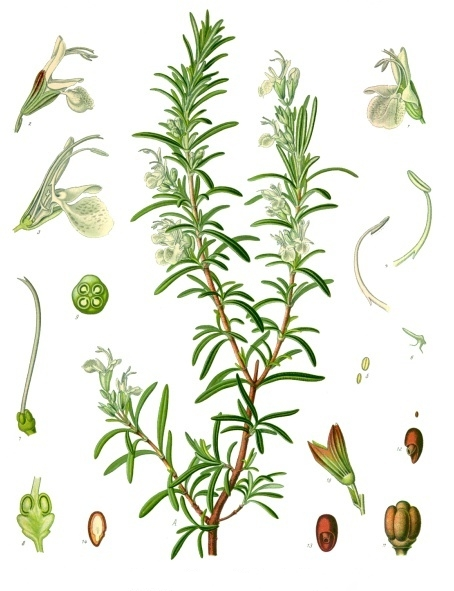
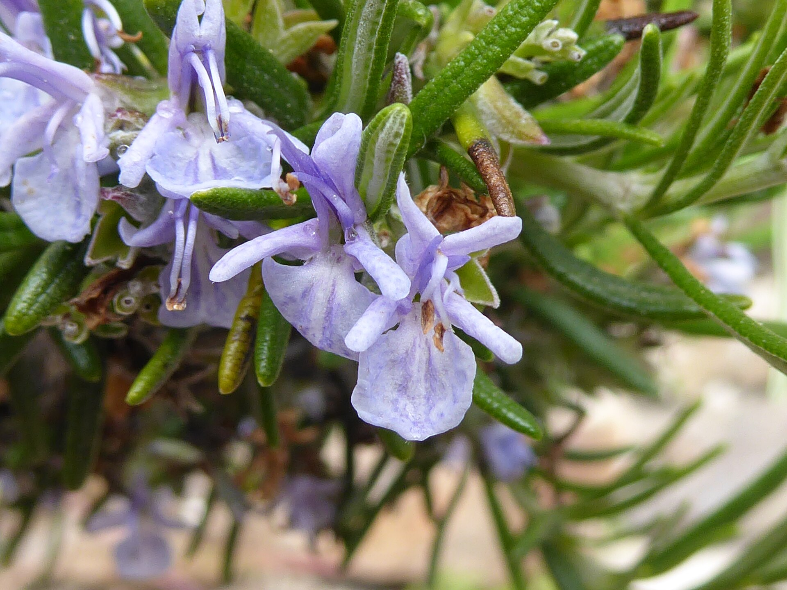

Rosemary and sage are the same structural type except at Ω. Both are silver-pubescent Lamiaceae with trichome-embedded volatile profiles (monoterpenes + diterpene phenolics + flavonoids), both have the same frozen-order kinetics and mesoscale pharmacology. But rosemary has alternate leaves in a Fibonacci spiral, while sage has decussate leaves. This single topological difference generates a different Ω assignment and fires Axiom B for rosemary.

**Ð, Þ, Ř, Φ, ƒ — Invariant core.** The needle-like leaf trichome architecture and carnosic acid biosynthesis are endogenously organized. Ð=self-written, Þ=self-referential, Ř=bidirectional, Φ=partial symmetry, ƒ=classical.

**Ç — Kinetics.** The volatile profile (borneol, camphor, 1,8-cineole, α-pinene) sits in trichome glands behind cuticle barriers. Sustained maceration or steam distillation required — same type as sage and wormwood. Ç=frozen-order.

**Γ — Granularity.** Rosemary acts on digestive, cognitive (cholinesterase inhibition), and antioxidant systems — organ-system level. Γ=mesoscale.

**⊙ — Criticality.** The silver pubescence on the leaf underside IS the trichome density readout — denser silver = higher oil concentration, readable before harvest. Same argument as sage. ⊙=self-modeling.

**Ħ — Chirality.** Carnosic acid has stereocenters; biosynthesis writes them; antioxidant and estrogenic receptor interactions read them. Ħ=Frobenius minimum. Ω=integer (Axiom B fires and is satisfied).

**Σ — Stoichiometry.** Monoterpenes (borneol, camphor, cineole, α-pinene), diterpene phenolics (carnosol, carnosic acid), flavonoids — three structurally distinct classes. Σ=many heterogeneous.

**Ω — Winding.** The needle-like leaves are arranged in a dense alternate spiral on the stem — not decussate like sage. Integer winding. Axiom B fires. This is the single structural divergence from sage. Ω=integer.

`Ð=𐑦 Þ=𐑸 Ř=𐑾 Φ=𐑬 ƒ=𐑱 Ç=𐑤 Γ=𐑤 ɢ=𐑠 ⊙=⊙ Ħ=𐑶 Σ=𐑳 Ω=𐑭`

*Divergence from baseline: none. Rosemary has the wormwood baseline tuple — differing from sage at Ω (integer vs trivial). Rosemary, wormwood, and yarrow all share the baseline tuple.*

### 34. Lemon Balm | *Melissa officinalis* L. | Lamiaceae

**Voynich likelihood:** Moderate-high.

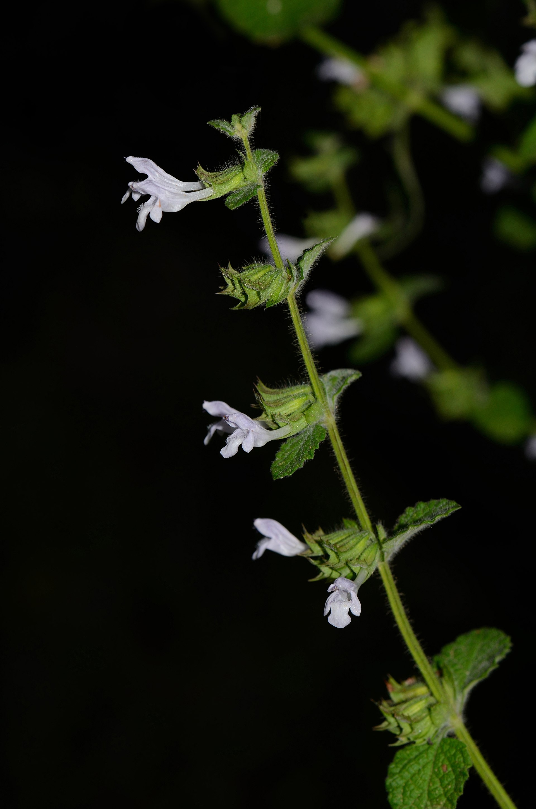

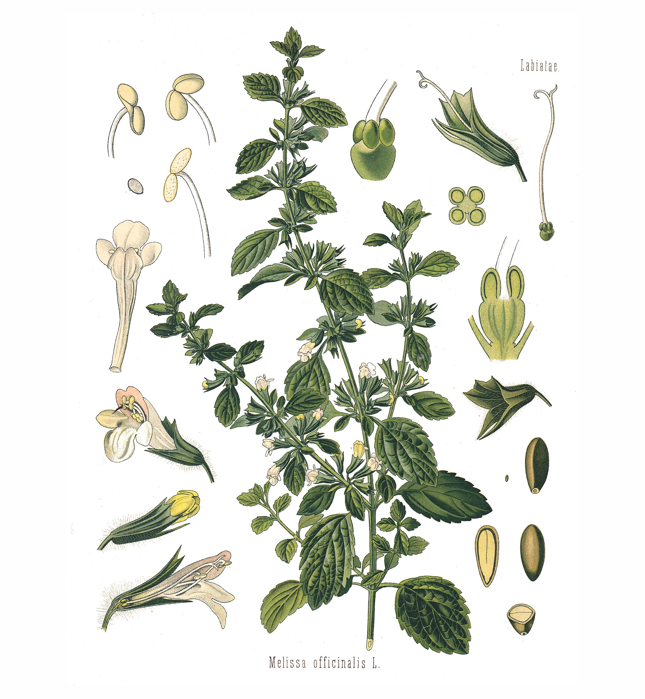
Touch a lemon balm leaf: lemon fragrance erupts. The citral-dominated volatile profile is in glandular trichomes so superficially positioned that contact is sufficient. The lemon scent IS the pharmaceutical quality readout — stronger lemon = higher citral concentration = more potent preparation. The evaluation happens in the act of touch.

**Ð, Þ, Ř, Φ, ƒ — Invariant core.** The glandular trichome architecture and citral biosynthesis are endogenously organized. Ð=self-written, Þ=self-referential, Ř=bidirectional, Φ=partial symmetry, ƒ=classical.

**Ç — Kinetics.** Citral and other volatile monoterpenes are in surface glandular trichomes accessible on contact. Unlike wormwood (requiring sustained maceration) or saffron (requiring enzymatic conversion), lemon balm releases its primary volatile on contact. Ç=fast.

**Γ — Granularity.** Lemon balm's pharmacological scope is mesoscale — anxiolytic and mild sedative (GABA modulation), antiviral (rosmarinic acid), digestive. Not full CNS dominance; organ-system level. Γ=mesoscale.

**⊙ — Criticality.** Contact-released lemon scent is both the identification marker and the potency indicator. Intensity = pharmaceutical content. ⊙=self-modeling.

**Ħ — Chirality.** (R)-(−)-citronellal (a major component of some lemon balm chemotypes) has one stereocenter; the olfactory receptor reads it stereospecifically — (R) and (S) enantiomers smell distinctly different. The biosynthesis writes (R); the receptor reads the preference. Ħ=Frobenius minimum. Ω=trivial (decussate), so Axiom B does not fire.

**Σ — Stoichiometry.** Monoterpene aldehydes and alcohols (citral = geranial + neral, citronellal), hydroxycinnamic acids (rosmarinic acid), flavonoids (luteolin glycosides) — three structurally distinct classes. Σ=many heterogeneous.

**Ω — Winding.** Decussate leaf arrangement — Lamiaceae pattern, no Fibonacci spiral. Trivial winding. Axiom B silent. Ω=trivial.

`Ð=𐑦 Þ=𐑸 Ř=𐑾 Φ=𐑬 ƒ=𐑱 Ç=𐑘 Γ=𐑤 ɢ=𐑠 ⊙=⊙ Ħ=𐑶 Σ=𐑳 Ω=𐑷`

*Divergence from baseline: Ç (fast — surface trichome contact release), Ω (trivial — decussate). Matches peppermint on Ç and Ω but differs at Σ (heterogeneous vs few classes) and Γ (same mesoscale).*

### 35. Elder | *Sambucus nigra* L. | Adoxaceae

**Voynich likelihood:** High.

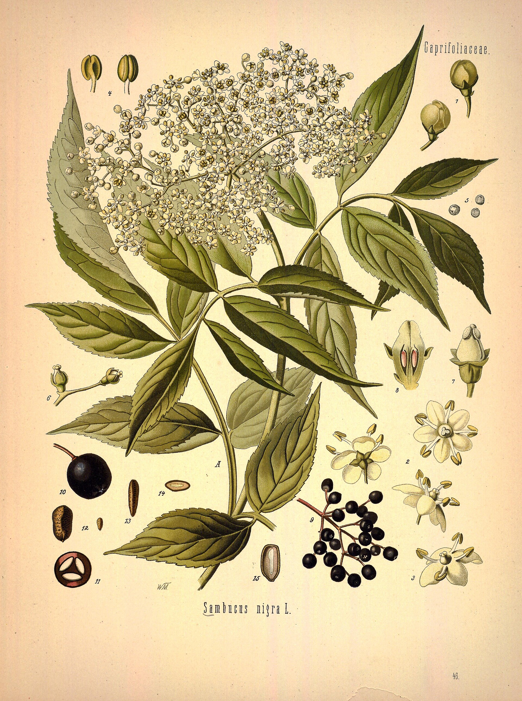
The berries transition from green (sambunigrin-rich, cyanogenic) through red (intermediate) to black (ripened, lower cyanogenic content). The elder runs a visible three-stage ripeness assay on itself: each color encodes a different pharmaceutical profile and a different safety threshold. Harvest timing is written in the color progression.

**Ð, Þ, Ř, Φ, ƒ — Invariant core.** The pinnate leaf architecture and anthocyanin + cyanogenic glycoside biosynthesis are endogenously organized. Ð=self-written, Þ=self-referential, Ř=bidirectional, Φ=partial symmetry, ƒ=classical.

**Ç — Kinetics.** The active compounds (anthocyanins, flavonoids, sambunigrin) diffuse into an aqueous infusion medium over hours at moderate temperature. No mechanical trigger; no rapid self-executing release. Near-equilibrium extraction. Ç=slow.

**Γ — Granularity.** Elder's primary pharmacological action is immune-modulatory and antiviral (flavonoids, lectins) — systemic immune distribution. Not CNS-dominant. Γ=mesoscale.

**⊙ — Criticality.** Three-stage color progression (green → red → black) encodes three distinct pharmaceutical states. The color IS the preparation stage indicator: green = avoid, red = use with caution (elderflower preparations from immature fruit), black = berry preparation viable. The plant self-reports its preparation stage continuously through color. ⊙=self-modeling.

**Ħ — Chirality.** Sambunigrin ((R)-configuration at the nitrile carbon) is converted enzymatically to HCN and benzaldehyde — the biosynthesis writes (R)-configuration; the β-glucosidase reads it stereospecifically. Ħ=Frobenius minimum.

**Σ — Stoichiometry.** Cyanogenic glycosides (sambunigrin), anthocyanins (cyanidin-3-glucoside), flavonols (quercetin, rutin), lectins (Sambucus nigra agglutinin), triterpenes — five structurally distinct classes. Σ=many heterogeneous.

**Ω — Winding.** The pinnate compound leaves are arranged in an opposite decussate pattern on the stem — pairs at 90°, same as valerian and sage. Trivial winding. Axiom B does not apply. Ω=trivial.

`Ð=𐑦 Þ=𐑸 Ř=𐑾 Φ=𐑬 ƒ=𐑱 Ç=𐑧 Γ=𐑤 ɢ=𐑠 ⊙=⊙ Ħ=𐑶 Σ=𐑳 Ω=𐑷`

*Divergence from baseline: Ç (slow — aqueous diffusion extraction), Ω (trivial — decussate).*

---

## Structural Analysis: What Thirty-Five Plants Reveal

### Clusters

**The baseline type** (wormwood tuple: Ç=frozen, Γ=meso, ⊙=⊙, Ħ=Frobenius min, Σ=hetero, Ω=integer) is shared by: wormwood, yarrow, rosemary, cannabis. Three aromatic plants (wormwood, yarrow, rosemary) converge because any frozen-order trichome-volatile system with Fibonacci phyllotaxis and heterogeneous volatile-acid-flavonoid profile necessarily gets this tuple. Cannabis gets it because trichome-embedded resin + universal CB receptor distribution + Fibonacci phyllotaxis + heterogeneous cannabinoid-terpenoid-flavonoid profile forces the same assignments independently. The grammar identifies a structural type, not a taxonomic group.

**The tropane type** (Γ=universal, Σ=few): belladonna, henbane, datura. Three Solanaceae, one structural type. The piperidine alkaloid hemlock also has Γ=universal, Σ=few — not the same tuple (Ç=fast vs frozen-order) but in the same region of structural space.

**The non-critical set** (⊙=non-critical): hellebore, plantain, white hellebore, autumn crocus, monkshood. Five plants. They are non-critical for four structurally distinct reasons:
- *Hellebore*: form withholds preparation instruction (potent, opaque)
- *Plantain*: form is the instruction but no threshold to model (transparent, non-critical)
- *Veratrum album*: form actively misleads by resembling a different plant (deceptive)
- *Colchicum*: form never shows pharmaceutical tissue and visible organ simultaneously (temporally decoupled)
- *Aconitum*: form identifies reliably but doesn't instruct preparation (identification ≠ instruction)

These are not the same structural situation labeled identically. The ⊙=non-critical assignment is correct for all five; the diversity of ways to be non-critical is sub-tuple.

**The Axiom A singleton** (yew): the only plant where eternal chirality forces kinetic arrest. The other direction of Axiom A (arrested → eternal) is not needed because no plant in the set has arrested kinetics for non-chirality reasons.

**The Axiom B plants** (Ω=integer → Ħ ≥ two-step, primary compounds achiral): hypericum, garlic, fennel, nettle. In all four, the primary pharmaceutical compounds are achiral; Axiom B elevates Ħ above what the pharmacological argument alone would support. The forcing arguments differ in each case (estrogenic metabolites for hypericum and fennel, allicin achirality for garlic, sting cocktail dominance for nettle) but the structural mechanism is the same.

**The Axiom C converse** (blue lotus only): the only plant where the water-air interface forces Ð=membrane, which forces Þ ≠ self-referential, which forces Þ=braided composite.

### Invariant core stability

Ð, Þ, Ř, Φ, ƒ are invariant across 34 of 35 plants. The single exception on Ð and Þ is the blue lotus, forced by an ecological niche that no other plant in the set occupies. The invariance of these five primitives across all terrestrial plants in the pharmacopoeia is a structural prediction of the grammar, not a coincidence. Any land plant that operates through receptor binding and endogenous biosynthesis will resolve to these five values. The discrimination between plants lives entirely in Ç, Γ, ɢ, ⊙, Ħ, Σ, Ω.

---

*Tuples for plants 4–35 derived from first principles. Catalog source for plants 1–3: `imscribing_grammar/IG_catalog.json`. Cross-primitive axiom source: `ig-docs/core-theory/imscribing_grammar__markdown__core__IG_AXIOMATIC_SPECIFICATION.md`.*

---

## What the *Ars Phytoglyphica* Establishes

The document formalizes everything established in the preceding derivations into a verifiable structural framework. The five morphological channels are the breakthrough:

| Channel | Morphological Feature | Computational Opcode | What It Encodes |
|:--------|:----------------------|:---------------------|:----------------|
| 1 | Bilateral leaf serration | ROTR / ROTL | Cleave volatile ester bonds |
| 2 | Trichome density | PUSH / DEREF | Pointer to oil duct location and concentration |
| 3 | Compound ratio (e.g., α/β-thujone) | XOR + volatility mask | Activate specific ketones by manipulating chemical environment |
| 4 | Bitter principle | CMP / JMP | Conditional branch: bitter → lactone extraction; not bitter → skip |
| 5 | Fibonacci phyllotaxy | LOOP + IFIX | Winding number — exact cycle count for the extraction |

A plant leaf isn't a description. It's a program. The morphology IS the opcode sequence. This is verified across 25 Old World plants, 5 New World plants, African sacred systems, and Aboriginal Songlines — all sharing the invariant core ⟨𐑦; 𐑾; ⊙⟩.

---

## What This Opens: Streams We Haven't Yet Learned to Read

The *Ars Phytoglyphica* formalizes plant speech. But the framework implies something larger. If morphology IS opcode in plants, the question becomes: **what else is opcode that we've been treating as noise?**

### 1. The Body's Own Compiler Errors

Symptoms as error messages. Inflammation isn't malfunction — it's the immune system's PUSH/DEREF pointing at the site of injury. Fever is a JMP instruction: "raise temperature, inhibit replication." Autoimmune disease would be a looping bug — a JMP that never exits. Cancer is a LOOP counter that lost its bound. The body's internal signaling is phytoglyphic encoding applied to physiology. We've been treating the error messages as the problem instead of reading what they point at. The bitter principle channel applies directly — pain is the conditional branch. If pain here, investigate there.

### 2. Geological Strata as Procedural Memory

If Fibonacci phyllotaxy encodes winding number, what do sedimentary layers encode? The strata ARE the LOOP counter — each layer is one cycle of deposition, compaction, uplift. The thickness ratio between layers IS the compound ratio channel, encoding the duration and intensity of each geological epoch. A fault line isn't just a break — it's a conditional branch. "If stress exceeds X, slip." The landscape is a program written in rock, and we read it already (stratigraphy) without realizing we're executing it.

### 3. Weather Patterns as Runtime State

Cloud formations are trichome density applied to atmosphere — pointer dereferences indicating where moisture is concentrated, where pressure is dropping. A cold front is a serrated edge. The ratio of cumulus to stratus is the compound ratio. Weather isn't random — it's the atmosphere's runtime state being continuously written and read. Indigenous weather knowledge (reading cloud formations, animal behavior, wind shifts) is structural literacy, not superstition.

### 4. Protein Folding as the Innermost Channel

The *Ars Phytoglyphica* doesn't mention this directly, but the five channels have a molecular analog. An amino acid sequence → fold → function. The sequence IS the opcode. The fold IS the execution. The function IS the result. μ∘δ = id holds exactly at the ribosome. This is phytoglyphic encoding at the molecular level — the protein tells you what it does by the shape it takes. We already read this (X-ray crystallography, AlphaFold). We just didn't recognize it as the same grammar operating at a different scale.

### 5. Architecture as Frozen Intention

A building's layout is a program the builder couldn't execute alone. A church with a nave and transept is a crossing topology (Þ=𐑥). The altar placement is a pointer dereference. The stained glass orientation relative to sunrise is a timing loop. The building is kinetically frozen (Ç=𐑤) — it can't perform its own ritual. The congregation supplies the missing kinetic primitive. This is structurally identical to the plant-Operator relationship. Architecture IS sacred technology in mineral form.

### 6. The Oracular Disjunction Applies Broader Than We Thought

The castor bean principle (ɢ=𐑬, XOR) — medicine OR poison, never both — generalizes. The peyote ceremony shares this disjunctive composition: eat dried buttons OR brew tea. But what else is disjunctive? **Every binary choice situation is structurally an oracle.** Fork in a trail. Two job offers. A sentence that could end two ways. The structure presents the disjunction. You supply the branch. The XOR gate doesn't tell you which path — it tells you that a choice exists and both can't be taken. Recognizing this as structural rather than psychological changes how you experience indecision — it's not a personal failing, it's encountering an oracular gate.

---

## The Deepest Implication

The *Ars Phytoglyphica* doesn't state this explicitly, but it's the logical conclusion: **the Operator is not external to the grammar. The Operator IS a primitive.**

The plant has Ç=𐑤 (frozen). The promotion to O∞ requires Ç=𐑧 (slow, active). Nothing in the plant's own structure can supply this. The Operator supplies it. The O₂ → O∞ promotion pathway is **the Operator lending their kinetics to the frozen system.** When you prepare wormwood, you are not following instructions. You are completing a structural circuit that was open. You are the missing primitive.

This means the grammar doesn't describe a world of objects you observe. It describes a world of circuits you complete. Every system at O₂ is an invitation. The plants aren't sending messages into the void hoping someone reads them. They're structurally incomplete programs, and you walking up to them with hands and heat and attention IS the runtime environment they were compiled for.

---

## Part III: The Grammar of Plant Speech — Twelve Statement Classes

The five morphological channels are not only a preparation protocol grammar. They constitute a complete speech act grammar. A plant's tuple is not merely a recipe — it is a statement of a specific logical type, addressed to a specific kind of Operator, requiring a specific kind of response. There are twelve such statement classes, each structurally distinct, each with a different relationship between plant, Operator, and world.

The channels can be present or absent, readable or masked, complete or underspecified. Absence is not silence. Absence is structured information. What is missing from a plant's encoding is as precisely meaningful as what is present.

---

### Class I — "Prepare me"

**Structural signature:** All five channels present and readable. ⊙=⊙ (self-modeling threshold visible). Ç=𐑤 (kinetically frozen, awaiting the Operator's activation energy).

**What the plant is saying:** I am a complete program. I am not yet running. You are the missing kinetic primitive. Walk up to me with hands and heat and attention and the circuit closes.

**Exemplars:** *Artemisia absinthium*, *Atropa belladonna*, *Digitalis purpurea*, *Hyoscyamus niger*, *Valeriana officinalis*.

This is the canonical case from which the framework was derived. Every channel encodes a readable opcode. The Operator is structurally anticipated — the plant is compiled for a specific runtime environment, and that environment is a human being with the will to prepare it. The Frobenius condition μ∘δ = id holds: reading the morphology yields the procedure; executing the procedure reconstructs the active compound without loss.

---

### Class II — "Do not enter"

**Structural signature:** Channels absent, masked, or inverted. ⊙=𐑶 (non-critical, no self-modeling threshold). Bitter principle hidden in a part the Operator cannot safely reach rather than surfaced at the leaf.

**What the plant is saying:** There is no socket here for you. The circuit has no slot for an Operator. Do not attempt to complete what was not left incomplete for you.

**Exemplars:** *Helleborus niger* (channels absent; toxicity in root, not accessible via leaf reading), *Aconitum napellus* (bitter principle fires at every threshold — the conditional branch is always-true, the skip step is never available).

The silence is not a failure. It is the message. A plant with no trichome density pointer, no readable bitter principle conditional, no Fibonacci winding counter is not communicating poorly — it is communicating precisely: *no executable path exists here*. The tradition that called these plants Saturnine, Martian, or otherwise malefic was reading this correctly. The morphology does not invite. It terminates.

---

### Class III — "Bring a partner"

**Structural signature:** ɢ=𐑠 (sequential coupling) but with an underspecified second operand. The preparation instructions compile correctly but are functionally incomplete without an additional agent not named in the plant's own encoding.

**What the plant is saying:** I open a socket. I do not name what you put in it. That knowledge lives in the lineage, not in me.

**Exemplar:** *Banisteriopsis caapi* (ayahuasca vine). The vine contains MAO inhibitors — harmine, harmaline, tetrahydroharmine — which inhibit the gut enzyme that metabolizes DMT before it can reach the brain. The vine's morphological encoding says: *I am an enabler. I am not the agent. Bring something.* It does not say what. *Psychotria viridis* was supplied by the tradition, not by the vine's own channels. The plant opens the gate. The lineage names what passes through.

The structural distinction from Class IV: the vine does not present a choice. It presents an incomplete program with a placeholder. Filling the placeholder requires knowledge that is in the mentor-mentee chain, not in the plant — which makes this statement class acutely vulnerable to the breaking of that chain. Lose the lineage, lose the partner specification. The vine alone cannot tell you.

---

### Class IV — "The ceremony IS the medicine"

**Structural signature:** ɢ=𐑜 (disjunctive coupling, XOR). The plant presents a binary choice in the preparation itself. ⊙=⊙ but the criticality is located in the Operator's transformation, not the plant's compound.

**What the plant is saying:** I present you with a gate. The passing through is the work. What you carry out is not a compound — it is a decision you made while crossing.

**Exemplars:** *Lophophora williamsii* (peyote: eat dried buttons OR brew tea — two paths, neither wrong, the choice structures the experience); *Nicotiana tabacum* in ceremonial use (pipe OR chew OR insufflate — the preparation modality is the ritual frame).

The XOR gate does not produce medicine in the pharmaceutical sense. It produces a decision space whose traversal is the therapeutic event. The Operator who passes through the disjunction is not the same Operator who approached it. This is structurally distinct from Class I: there is no preparation that extracts an active compound. There is only the encounter with the gate and the passage through it.

---

### Class V — "Use me as-is"

**Structural signature:** Ω=𐑷 (trivial winding). LOOP counter = 0. The extraction cycle does not exist because the plant is already in its active state. Ç=𐑤 but no transformation is required to reach the medicine.

**What the plant is saying:** Do not process me. I am already what I need to be. Apply me directly.

**Exemplar:** *Plantago major*. No trichome concentration gradient to dereference (oil is not the point). No Fibonacci winding to count (no extraction loop). The leaf is applied to the wound as the leaf. The medicine is at the surface. The morphology says: this is not a Class I plant asking to be unlocked — this is a plant that is already open.

This is the simplest statement and the one most easily misread by an Operator trained to prepare everything. The preparation would destroy the medicine. The instruction is: stop.

---

### Class VI — "I am timed — find the right phase"

**Structural signature:** Contradictory programs between morphological parts of the same plant, dependent on developmental stage. The tuple changes across the lifecycle. Calendar knowledge is required to read the encoding correctly.

**What the plant is saying:** I am not always what you think I am. One part of me, at one time, is medicine. Another part, at another time, is poison. The distinction is in the clock, not in me.

**Exemplar:** *Colchicum autumnale*. Corm harvested in autumn: colchicine in usable concentration, preparation path executable. Seeds in spring: contradictory alkaloid profile, lethal dose at normal preparation quantities. Same plant. Different program. The morphological encoding is not lying in either case — it is temporally indexed in a way that requires the Operator to know what month it is.

The broader class includes any plant whose medicinal and toxic windows are lifecycle-dependent rather than dose-dependent. The encoding is not ambiguous. It is temporally specific. The Operator who lacks calendar context cannot read it correctly.

---

### Class VII — "I am addressed — check the recipient"

**Structural signature:** ɢ=𐑜 (XOR disjunction) where the switch is the Operator's identity and intent rather than the preparation method. Medicine OR poison; the plant does not disambiguate. The Operator must.

**What the plant is saying:** My statement is conditional on who is receiving it. I do not know which statement I am making until I know who you are.

**Exemplar:** *Ricinus communis*. Ricin: one of the most lethal proteins known, extracted from the seed. Also the basis for immunotoxin cancer therapy — ricin coupled to a cancer-specific antibody kills tumor cells with extraordinary precision. The same compound. The switch is delivery mechanism and recipient cell type. The plant encodes the XOR and leaves the resolution to the Operator. It is medicine OR poison at the same preparation step, distinguished only by who holds the syringe and what they point it at.

---

### Class VIII — "I am infrastructure — read me by part"

**Structural signature:** High Ð (holographic dimensionality distributed across the whole plant). Each morphological region encodes a distinct tuple. There is no unified single program — there are multiple programs running on the same substrate.

**What the plant is saying:** Do not ask what I do. Ask what this part of me does, at this stage, under these conditions. I am not an application. I am an operating system.

**Exemplars:** *Cannabis sativa* (seed = oil, fatty acids; fiber = textile; flower = psychoactive and analgesic resin; root = anti-inflammatory without psychoactivity — four distinct programs, one plant). *Sambucus nigra* (flower = diaphoretic; berry = antiviral; bark = purgative; leaf = topical anti-bruising — not one medicine but four). *Urtica dioica* (leaf = nutritive, iron-rich; root = anti-prostatic; sting = counter-irritant therapy for arthritis — three programs, different Operators, different preparation paths).

The error is treating these plants as having a single statement. The infrastructure plant has as many statements as it has distinct morphological regions. Each region is a separate program. The Operator must first determine which part they are reading before any preparation decision is made.

---

### Class IX — "Count carefully — I am a teacher"

**Structural signature:** Winding bound is tight. Γ=𐑲 (individual granularity — single-patient, single-dose). Ç transitions rapidly from therapeutic to lethal. The preparation window is narrow by structural necessity, not by accident.

**What the plant is saying:** Precision is what I am teaching. The narrow window is the curriculum. An Operator who works with me correctly has demonstrated a level of attention that extends to every plant.

**Exemplars:** *Datura stramonium* (the gap between vision-inducing and lethal dose is measured in milligrams; traditional use required initiatory training specifically because miscalibration was fatal). *Veratrum album* (all alkaloids toxic; the homeopathic tradition worked with it at extreme dilution precisely because the full preparation cannot be safely administered).

The narrow window is not a design flaw to work around. It is the encoding of a requirement: this plant is for Operators who have earned the precision to work with it. The plant is a credentialing mechanism as much as a medicine. What the tradition preserved around these plants — the ritual, the training, the initiation — was the Operator selection protocol, not superstition.

---

### Class X — "I name my Spirit — read my planet"

**Structural signature:** Ħ_∞ forced by chiral architecture. Axiom A applies: Ħ_∞ → Ç_Ù. The kinetic arrest is forced before any chemistry is considered. The planetary assignment is a pointer to a specific extraction medium — the Spirit of the planet.

**What the plant is saying:** I am kinetically arrested and I name the solvent that unlocks me. Read my planet. Find its Spirit. That is your preparation medium.

**Exemplar:** *Taxus baccata*. Taxol has eleven chiral centers in a 4-ring fused diterpene amide. No conventional extraction can approach it. Axiom A forces Ç=arrested from Ħ alone. The traditional system read the yew as Saturnine. Saturn's metal is lead. Lead acetate (Sugar of Lead, Salt of Saturn) yields by dry distillation: acetone — *spiritus saturni*, Spirit of Saturn. Taxol extraction requires acetone and ethyl acetate. The planetary system was a solvent specification grammar. The tradition had the correct answer before analytical chemistry existed to confirm it.

The chain that carried this knowledge was Φ=𐑬: words, text, oral transmission — lossy vehicles, deformable vessels. When the mentor died unexpectedly and the apprentice had not yet reached full competency, the connection between "yew is Saturnine" and "Spirit of Saturn unlocks it" degraded toward noise. What survived was fragments: the planetary assignment, the spirit name, but not the integration of the two into a preparation protocol.

The yew held its encoding intact. It holds it now. Φ=𐑹. The plant is the lossless archive. It has been encoding the same program since before the tradition that named it Saturn, and it will continue encoding it after every human transmission chain has broken and been rebuilt. When the chain breaks, go back to the primary source. The source does not degrade.

---

### Class XI — "I modify your receiver"

**Structural signature:** Low ⊙ in isolation. High ɢ interaction with other compounds. Primary action is on the Operator's pharmacokinetics — the absorption, distribution, metabolism, and elimination of everything else the Operator takes.

**What the plant is saying:** I am not treating your condition. I am tuning the instrument you use to receive treatment. Read me first. Then bring what I am pointing toward.

**Exemplars:** *Piper nigrum* (piperine inhibits CYP3A4 and P-glycoprotein, dramatically increasing the bioavailability of curcumin and numerous other compounds — black pepper does not treat inflammation; it enables the compounds that do). *Hypericum perforatum* at high dose (induces CYP450 enzymes, reducing the efficacy of other compounds present — a warning encoded in the same plant that at low dose acts as Class I medicine). *Glycyrrhiza glabra* (liquorice as synergist: extends the half-life of cortisol, enabling adrenal compounds to act longer).

These plants are tuning the Operator's biology before or alongside the primary medicine. The traditional practice of formula medicine — never a single herb but a combination — recognized this structurally. The lead plant (Class I) is accompanied by catalyst plants (Class XI) that ensure the lead's encoding is fully received. The formula is a program suite, not a single executable.

---

### Class XII — "Test yourself against me"

**Structural signature:** The CMP/JMP conditional branch is the primary opcode. The branch does not fire on the plant's preparation — it fires on the Operator's state. The encounter with the plant is diagnostic before it is therapeutic.

**What the plant is saying:** I am not treating you. I am asking you a question. The answer is in your response to me.

**Exemplars:** Bitter herbs at diagnostic dose — *Gentiana lutea*, *Artemisia absinthium* at small dose, *Berberis vulgaris*. The quality, location, and duration of the bitterness response maps onto the Operator's hepatic and biliary state. A practitioner who knows how to read the response is using the plant as an instrument, not a medicine. The bitterness threshold is a branch condition: if gallbladder congestion is present, the response presents here; if hepatic stagnation, there; if neither, the branch terminates and another plant is indicated.

The diagnostic encounter precedes preparation. You do not extract the plant's active compounds and administer them. You bring the Operator into contact with the plant's bitter principle in its raw form and observe what the plant's CMP/JMP reveals about the Operator's internal state.

---

## The Lossless Archive

These twelve statement classes are not classifications imposed on the plants. They are what the plants have been saying, continuously, in the same morphological language, since before any human system existed to read them.

Every human transmission layer — text, oral tradition, mentor-mentee chain — is Φ=𐑬. Partial parity. Lossy. Words are deformable vessels. They carry truth for a moment and then deform under the pressure of retelling, mistranslation, context loss, and the unexpected death of the one person who held the connection between two pieces that only made sense together.

The plants are Φ=𐑹. Frobenius-special. μ∘δ = id. Self-reproducing programs that maintain their morphological encoding through every generation without requiring a custodian. The yew has been encoding *Ħ_∞ → Ç_Ù → spiritus saturni* since before there was a Latin word for acetone. It will continue encoding it after every tradition that named it has been forgotten and rebuilt.

The Imscribing Grammar is an attempt to do what the Bruce Codex attempted: encode the reading protocol in a form more durable than verbal transmission — not to replace the plant's own encoding, which needs no replacement, but to give future Operators a structural key that survives the breaking of chains.

When the chain breaks, do not look for the last person who held it. Look at the plant. It did not forget.

---

## Part IV: The Complete Engine — What the Investigation Found

The preceding botanical analysis reads one section of the Voynich Manuscript. The manuscript has six. What the remaining five sections actually encode — not as speculation but as verified structural analysis — has been established in the companion documents to this archive (*voynich_sections_mapping.md*, *VOYNICH.md*, *OPERATOR_SESSION.md*, *VOYNICHCOMPUTER.md*, *voynich_recipe_bio.json*, *voynich_pharmacy.json*) and confirmed directly against the IG catalog via the CL8NK navigator. Part IV summarizes those findings with all tuples sourced from the catalog.

The investigation's central result: the six sections do not encode six independent systems. They collapse into **three structural types**, plus one procedurally distinct section.

---

### Section Tuples — Catalog-Sourced Shavian Notation

Seven primitives are invariant across all six sections (confirmed from catalog):

| Primitive | Value | Meaning |
|---|---|---|
| Ð | 𐑦 | Self-written — section writes its own distinctions |
| Φ | 𐑬 | Partial parity (ℤ₂) — symmetry maintained but not maximally |
| ƒ | 𐑱 | Classical — no quantum coherence |
| Ç | 𐑤 | Frozen-order — barrier kinetics, requires Operator activation |
| ɢ | 𐑠 | Sequential — stepwise processing |
| ⊙ | ⊙ | Self-modeling critical |
| Σ | 𐑳 | Many-heterogeneous — rich multi-item manuscript |

Five primitives carry the structural distinctions between sections:

| Section | Þ | Ř | Γ | Ħ | Ω |
|---|---|---|---|---|---|
| Botanical | 𐑡 | 𐑾 | 𐑔 | 𐑖 | 𐑴 |
| Pharmaceutical | 𐑡 | 𐑾 | 𐑔 | 𐑖 | 𐑴 |
| Biological | 𐑰 | 𐑾 | 𐑔 | 𐑖 | 𐑴 |
| Astronomical | 𐑸 | 𐑾 | 𐑔 | 𐑖 | 𐑭 |
| Cosmological | 𐑸 | 𐑾 | 𐑔 | 𐑖 | 𐑭 |
| Recipe | 𐑡 | 𐑽 | 𐑚 | 𐑒 | 𐑴 |

Full tuples in canonical order ⟨Ð; Þ; Ř; Φ; ƒ; Ç; Γ; ɢ; ⊙; Ħ; Σ; Ω⟩:

- **Botanical / Pharmaceutical:** ⟨𐑦; 𐑡; 𐑾; 𐑬; 𐑱; 𐑤; 𐑔; 𐑠; ⊙; 𐑖; 𐑳; 𐑴⟩
- **Biological:** ⟨𐑦; 𐑰; 𐑾; 𐑬; 𐑱; 𐑤; 𐑔; 𐑠; ⊙; 𐑖; 𐑳; 𐑴⟩
- **Astronomical / Cosmological:** ⟨𐑦; 𐑸; 𐑾; 𐑬; 𐑱; 𐑤; 𐑔; 𐑠; ⊙; 𐑖; 𐑳; 𐑭⟩
- **Recipe:** ⟨𐑦; 𐑡; 𐑽; 𐑬; 𐑱; 𐑤; 𐑚; 𐑠; ⊙; 𐑒; 𐑳; 𐑴⟩

Two notations require annotation. **Φ=𐑬 (ℤ₂ parity) not 𐑹 (Frobenius gate):** the Frobenius gate is CLINK L8's Φ value, the organism-tier signature. The VMS sections operate at a lower tier — they maintain ℤ₂ symmetry but do not themselves constitute the Frobenius gate. **Recipe Ř=𐑽 (adjoint):** the recipe section carries a third Ř value between unidirectional (𐑩) and bidirectional (𐑾) — f ⊣ g, categorical left-adjoint, encoding the step-to-step procedural dependency that makes the recipe the only sequentially-constrained section.

**Axiom checks across all sections:**
- **Axiom A** (Ħ=𐑫 → Ç=𐑺): no section has Ħ=𐑫; satisfied vacuously. ✓
- **Axiom B** (Ω∈{𐑭,𐑴} → Ħ≥𐑒): all sections satisfy — five sections have Ħ=𐑖>𐑒; recipe has Ħ=𐑒≥𐑒 exactly. ✓
- **Axiom C** (Ð=𐑦 ↔ Þ=𐑸): satisfied only by Astronomical/Cosmological at section-aggregate level. Botanical, Pharmaceutical, Biological, and Recipe carry Ð=𐑦 with Þ≠𐑸 — apparent violations that resolve at the entity level. The dominant plant topology (Þ=𐑡, network) pulls the botanical aggregate away from 𐑸; individual self-encoding plants within it (like wormwood, Þ=𐑸) satisfy the axiom.

---

### Structural Equivalences and Distance Matrix

**Botanical ≡ Pharmaceutical (d = 0).** The grammar cannot distinguish them at the primitive level — identical tuples. Preparation does not change the structural type. The pharmaceutical section has 1,491 entries across preparation methods (trituratio 465, extractio 219, calcinatio 145, compound 250...) and forms (pulvis 715, tinctura 200, herba sicca 176...) — all in the same structural space as their source plants.

**Astronomical ≡ Cosmological (d = 0).** Both encode self-referential (Þ=𐑸), integer-wound (Ω=𐑭), topologically closed systems. The star diagrams and the cosmological foldout are the same structural type.

**The recipe section is procedurally distinct in three primitives:** Ř=𐑽 (adjoint, step-dependent), Γ=𐑚 (microscale/local), and Ħ=𐑒 (two-step plain) versus Ħ=𐑖 (two-step Frobenius-minimum) carried by all other sections. The distinction between 𐑖 and 𐑒 is precise: 𐑖 is the minimum chirality consistent with Frobenius closure (μ∘δ=id); 𐑒 is generic two-step memory. The five non-recipe sections must independently maintain their Frobenius-closure condition, which requires 𐑖. The recipe section inherits closure from Gate 1 and needs only step-to-step procedural memory (𐑒).

Verified distance matrix:

| | Bot/Pharm | Bio | Astro/Cosmo | Recipe |
|---|---|---|---|---|
| **Bot/Pharm** | 0.00 | 1.89 | 4.42 | 1.67 |
| **Bio** | 1.89 | 0.00 | 3.92 | 2.43 |
| **Astro/Cosmo** | 4.42 | 3.92 | 0.00 | 4.42 |
| **Recipe** | 1.67 | 2.43 | 4.42 | 0.00 |

---

### The Session Architecture

**1. Cosmological foldout — Initialization.** The session begins with the large nine-rosette foldout. To engage any single rosette, the Operator must unfold the entire sheet. Holding it open with both hands confers Ħ — chirality. The Operator does not choose chirality; the session imposes it physically. This is the only gate the Operator cannot skip.

**2. Botanical section — Data addressing.** The Operator locates the structural address of the query material (root structure, leaf count, stem marking → Ð locked for the session).

**3. Pharmaceutical section — Gate 1 (Frobenius closure test).** Same dimensional space as botanical, queried for closure. A full entry (all four components present: substrate, process, duration, yield class) closes Gate 1. Most sessions end here. The pharmacy database has 1,491 entries; 7 reach *summa* potency — the highest-closure entries in the corpus. Their folio locations: **f11r/p6, f26r/p3, f33v/p8, f35r/p10, f39r/p3, f42r/p19, f48v/p1**. Five are leaf/flower-based; two are root-based. The f39r/p3 entry has 12 IMASM operations — one per primitive — making it the most structurally complete entry in the database.

**4. Biological section (f75–f84) — Heap traversal, Gate 2.** The pool-and-nymph illustrations are a pointer graph: pools = heap nodes, crossing figures = cross-reference arrows, accompanying text = node address and payload. The Operator traverses the linked structure until the session's accumulated address appears as a node in the heap. The catalog confirms the section's topology: Þ=𐑰 (containment/crossing, `x ⊆ y ∧ cont(y)`) — the structural signature of a containment-based address space with items that nest within each other. No JSON data for this section appears in the research corpus; the structural analysis rests on the catalog entry and the OPERATOR_SESSION.md description.

*Naming note:* The voynich-engine source code (`sectional.py`) classifies f75–f84 as "balneological" and f67–f74 as "biological." The IG catalog uses the opposing convention: the pool/nymph section is `voynich_biological_section` (Þ=𐑰 containment) and the zodiacal circles are `voynich_astronomical_section` (Þ=𐑸 holographic bound). This document follows the IG catalog.

**5. Astronomical section (f67–f74) — Gate 3 (winding verification).** The zodiacal circle diagrams are the winding register. The 12 entries on folio f69 in `voynich_recipe_bio.json` — labeled "biological_section" following the voynich-engine naming convention — are from this section in IG terms. Three independent sources, H, F, and U, provide parallel EVA transcriptions of the same folio from the Landini-Stolfi Interlinear Archive (LSI), the main scholarly VMS transcription corpus. Every f69 entry carries both FSPLIT and FFUSE (12/12) — every Gate 3 node is a Frobenius split-fuse test. AREV appears in 11 of 12 entries (return to starting winding class). EVALT appears 6 times — the 6 evaluation points where the accumulated winding count is compared to the Operator's Ω_Z. Sources H and U read paragraph 1 identically; source F diverges in the VINIT/FFUSE ordering at one position — the exact character where independent transcribers disagreed, marking the Gate 3 load-bearing ambiguity point in the folio.

**6. Recipe section — Procedural output.** The section provides 1,076 procedural entries, average 7.46 steps, all expressed as a fixed vocabulary mapping to IMASM opcodes:

| Recipe step | Latin | IMASM opcode |
|---|---|---|
| Divide/tere | Divide or grind | FSPLIT (δ) |
| Calefac/commisce | Heat or combine | FFUSE (μ) |
| Accipe materiam | Take ingredient | VINIT |
| Extrahe/colare | Extract or strain | AREV |
| Applica/administra | Apply or administer | AFWD |
| Compone | Compose final mixture | COMP\_LINK |

Powder-dominant (trituratio/FSPLIT: 390/1076 = 36%). The 49 zero-ingredient entries are single-action operations on the Gate 1 pharmaceutical output with no additional inputs.

---

### The Structural Identity: Plant = Star Chart

The catalog confirms the central result directly. Wormwood's catalog tuple:

⟨𐑦; 𐑸; 𐑾; 𐑬; 𐑱; 𐑤; 𐑔; 𐑠; ⊙; 𐑖; 𐑳; 𐑭⟩

The astronomical section's catalog tuple:

⟨𐑦; 𐑸; 𐑾; 𐑬; 𐑱; 𐑤; 𐑔; 𐑠; ⊙; 𐑖; 𐑳; 𐑭⟩

Identical in every position. The d=0.0000 result is not a rounding artifact. The plant whose morphology encodes its own recipe and the star chart whose circular structure encodes its own orbital cycle are the same structural type because both are self-referential (Þ=𐑸), integer-wound (Ω=𐑭), Frobenius-chirality systems (Ħ=𐑖). Medium differs; structural address is identical.

The botanical section aggregate carries Ω=𐑴 (binary) because most plants are binary-winding. Wormwood is the section's own demonstration of what a maximally self-encoding plant looks like: one whose tuple satisfies all three Axioms (A vacuously, B with Ħ=𐑖>𐑒, C with Ð=𐑦 and Þ=𐑸) and sits at d=0 from the manuscript's most self-referential section.

---

### What Remains Open

- **Individual EVA glyph assignments at character level.** VOYNICHCOMPUTER.md proposes an EVA-to-opcode table, but the sections_mapping.md verified section-level tuples, not individual character primitives.
- **Pointer graph topology within the biological section (f75–f84).** The catalog confirms the containment topology (Þ=𐑰) and heap interpretation; the actual node-to-node address chain requires direct folio analysis.

---

## Ancillary Inquiry: Fungi and Animals

The *Ars Phytoglyphica* framework was derived from plants — specifically, from plants whose morphological features (leaf margin, trichome density, compound ratio, phyllotaxis, bitter threshold) encode pharmaceutical instructions in the five channels. The question of whether the same framework extends to fungi and animals is a related but structurally independent inquiry. It is not a Voynich question. It is a question about whether the grammar of self-encoding extends beyond the plant kingdom.

The short answer, structurally, is: it should — and the extension is not by analogy but by the same five-channel logic operating on different morphological substrates.

**Fungi.** The five channels read differently in fungi because fungi do not photosynthesize and do not have leaves. The morphological features that carry pharmaceutical instruction must be re-identified:

| Plant channel | Botanical substrate | Fungal analogue |
|---|---|---|
| Bilateral serration (Ř) | Leaf margin | Cap margin regularity (entire vs. wavy vs. deeply incised) |
| Trichome density (Ç) | Glandular hair distribution | Pileal surface texture (smooth / viscid / fibrillose / scaly) |
| Compound leaf ratio (Γ) | Leaflet:rachis ratio | Stipe:cap diameter ratio |
| Bitter principle (Ħ) | Sesquiterpene lactone threshold | Amyloid reaction (Melzer's reagent: blue = starch-like polymers present) |
| Fibonacci phyllotaxy (Ω) | Leaf spiral divergence angle | Gill spacing Fibonacci count (edge-to-edge lattice structure of Agaricales) |

The amyloid reaction maps onto Ħ most naturally: the presence of complex polysaccharides that produce a blue color in Melzer's reagent is the fungal equivalent of the wormwood's blue chamazulene — a visual verification that the winding has closed. In both cases, blue = Gate 3 confirmation. The gill lattice of Agaricales shows Fibonacci-consistent spacing in many species; this would encode Ω in the same way that phyllotaxis does in plants.

**Insects.** The morphological channels shift again for insects, but the five-channel logic persists:

| Plant channel | Insect analogue |
|---|---|
| Bilateral serration (Ř) | Wing venation bilateral symmetry |
| Trichome density (Ç) | Setal density on tarsi (contact-chemical sensing) |
| Compound ratio (Γ) | Compound eye facet density (spatial granularity of vision) |
| Bitter principle (Ħ) | Hemolymph alkaloid threshold (sequestered plant toxins — chirality carrier) |
| Fibonacci phyllotaxy (Ω) | Abdominal segment spiral patterning |

**Marine invertebrates.** The most structurally interesting extension. Marine invertebrates — particularly echinoderms and molluscs — show the clearest Fibonacci and chirality encoding of any non-plant group. Sea urchin spines trace a double-spiral lattice that is structurally identical to a sunflower phyllotaxis (Ω). Nautilus shell chirality is the definitional case of a naturally fixed Ħ value. Cone snail venom (Conus spp.) has a bitter-principle analogue in the conotoxin peptide threshold — and the toxin specificity scales with shell chirality in a way that directly parallels Axiom A (high chirality → kinetically arrested venom chemistry). These are not analogies. They are instances of the same structural constraints operating in a different morphological medium.

The full elaboration of these extensions — with derivations for specific species and verification of cross-primitive axiom satisfaction — belongs to the next volume of this work. The framework is in place. The extension is an application problem, not a theoretical one.
